# NIST V1.0 - CastVoteRecords

- Table of Contents
  - Enumerations
    - *The **[AllocationType](#_18_5_3_43701b0_1533322047899_321573_5682)** Enumeration*
    - *The **[CastVoteRecordVersion](#_18_0_2_6340208_1488984734564_983877_4662)** Enumeration*
    - *The **[ContestSelectionStatus](#_18_0_5_43401a7_1475850153090_186243_4311)** Enumeration*
    - *The **[ContestStatus](#_18_0_5_43401a7_1475850124791_123384_4291)** Enumeration*
    - *The **[CVRStatus](#_18_0_2_6340208_1472159006307_546162_4628)** Enumeration*
    - *The **[CVRType](#_18_0_2_6340208_1532543997676_592413_4694)** Enumeration*
    - *The **[HashType](#_18_0_2_6340208_1485894679180_11599_4655)** Enumeration*
    - *The **[IdentifierType](#_17_0_2_4_f71035d_1425061188508_163854_2613)** Enumeration*
    - *The **[IndicationStatus](#_18_0_2_6340208_1485894157707_572874_4551)** Enumeration*
    - *The **[ReportingUnitType](#_17_0_2_4_f71035d_1431607637366_785815_2242)** Enumeration*
    - *The **[ReportType](#_18_0_5_43401a7_1483727563257_179426_4343)** Enumeration*
    - *The **[VoteVariation](#_18_0_5_43401a7_1483727021192_184103_4291)** Enumeration*
  - Classes
    - *The **[Annotation](#_18_0_5_43401a7_1475856712376_208252_4416)** Class*
    - *The **[BallotMeasureContest](#_17_0_2_4_78e0236_1389366932057_929676_2783)** Class*
    - *The **[BallotMeasureSelection](#_17_0_2_4_78e0236_1389372163799_981952_2926)** Class*
    - *The **[Candidate](#_17_0_2_4_78e0236_1389366272694_544359_2440)** Class*
    - *The **[CandidateContest](#_17_0_2_4_78e0236_1389366970084_183781_2806)** Class*
    - *The **[CandidateSelection](#_17_0_2_4_d420315_1392145640524_831493_2562)** Class*
    - *The **[CastVoteRecordReport](#_17_0_2_4_78e0236_1389366195564_913164_2300)** Class*
    - *The **[Code](#_17_0_2_4_f71035d_1430405712653_451634_2410)** Class*
    - *The **[Contest](#_17_0_2_4_78e0236_1389366251994_876831_2400)** Class*
    - *The **[ContestSelection](#_17_0_2_4_78e0236_1389372124445_11077_2906)** Class*
    - *The **[CVR](#_18_0_2_6340208_1532543460307_914551_4600)** Class*
    - *The **[CVRContest](#_18_0_2_6340208_1469203058990_306165_4565)** Class*
    - *The **[CVRContestSelection](#_18_0_5_43401a7_1474452890357_299022_4292)** Class*
    - *The **[CVRSnapshot](#_17_0_2_4_78e0236_1389366224561_797289_2360)** Class*
    - *The **[CVRWriteIn](#_18_0_2_6340208_1485892911278_166697_4594)** Class*
    - *The **[Election](#_17_0_2_4_f71035d_1426101822599_430942_2209)** Class*
    - *The **[File](#_18_0_2_6340208_1485284639717_497586_4548)** Class*
    - *The **[GpUnit](#_17_0_2_4_78e0236_1389366233346_42391_2380)** Class*
    - *The **[Hash](#_18_0_2_6340208_1485894593826_736413_4615)** Class*
    - *The **[Image](#_18_0_2_6340208_1485284639720_737438_4549)** Class*
    - *The **[ImageData](#_18_0_2_6340208_1485894533655_402033_4588)** Class*
    - *The **[Mark](#_18_0_2_6340208_1532537360373_372867_4552)** Class*
    - *The **[MarkMetric](#_18_0_2_6340208_1488984835132_736302_4685)** Class*
    - *The **[Party](#_17_0_2_4_78e0236_1389366278128_412819_2460)** Class*
    - *The **[PartyContest](#_17_0_2_4_d420315_1393514218965_55008_3144)** Class*
    - *The **[PartySelection](#_17_0_2_4_f71035d_1426519980658_594892_2511)** Class*
    - *The **[ReportingDevice](#_17_0_2_4_78e0236_1389798013459_389380_4178)** Class*
    - *The **[RetentionContest](#_18_0_2_6340208_1425646217522_163181_4554)** Class*
    - *The **[SelectionIndication](#_18_0_2_6340208_1485892992407_492157_4635)** Class*

## Enumerations

### *The **AllocationType** Enumeration*

Name | Value
---- | -----
`yes`|To allocate votes to the contest option's accumulator.
`no`|To not allocate votes to the contest option's accumulator.
`unknown`|When the decision to allocate votes is unknown, such as when the adjudication is needed.

### *The **CastVoteRecordVersion** Enumeration*

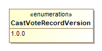

Name | Value
---- | -----
`1.0.0`|Fixed value for the version of this specification.

### *The **ContestSelectionStatus** Enumeration*

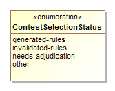

Name | Value
---- | -----
`generated-rules`|To indicate that the ballot selection was generated per contest rules.
`invalidated-rules`|To indicate that the ballot selection was invalidated by the generating device because of contest rules.
`needs-adjudication`|To indicate that the ballot selection was flagged by the generating device for adjudication.
`other`|Used in conjunction with CVRContestSelection::OtherStatus when no other value in this enumeration applies.

### *The **ContestStatus** Enumeration*

Name | Value
---- | -----
`invalidated-rules`|To indicate that the contest has been invalidated by the generating device because of contest rules.
`other`|OtherStatus when no other value in this enumeration applies.
`overvoted`|To indicate that the contest was overvoted.
`undervoted`|To indicate that the contest was undervoted.

### *The **CVRStatus** Enumeration*

Name | Value
---- | -----
`needs-adjudication`|To indicate that the CVR needs to be adjudicated.
`other`|Used in conjunction with CVRSnapshot::OtherStatus when no other value in this enumeration applies.

### *The **CVRType** Enumeration*

Name | Value
---- | -----
`original`|As scanned, no contest rules applied.
`modified`|After contest rules applied.
`interpreted`|Has been adjudicated.

### *The **HashType** Enumeration*

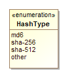

Name | Value
---- | -----
`md6`|To indicate that the MD6 message digest algorithm is being used.
`other`|Used in conjunction with Hash::OtherType when no other value in this enumeration applies.
`sha-256`|To indicate that the SHA 256-bit signature is being used.
`sha-512`|To indicate that the SHA 512-bit (32-byte) signature is being used.

### *The **IdentifierType** Enumeration*

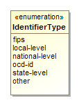

Name | Value
---- | -----
`fips`|To indicate that the identifier is a FIPS code.
`local-level`|To indicate that the identifier is from a local-level scheme, i.e., unique to a county or city.
`national-level`|To indicate that the identifier is from a national-level scheme other than FIPS or OCD-ID.
`ocd-id`|To indicate that the identifier is from the OCD-ID scheme.
`other`|Used in conjunction with Code::OtherType when no other value in this enumeration applies.
`state-level`|To indicate that the identifier is from a state-level scheme, i.e., unique to a particular state.

### *The **IndicationStatus** Enumeration*

Name | Value
---- | -----
`adjudicated`|To indicate that the vote mark was invalidated because of adjudication and is not countable.
`generated-rules`|To indicate that the vote mark was generated by the generating device per contest rules and is countable.
`invalidated-rules`|Used to indicate that the vote mark was invalidated by the generating device because of contest rules and is not countable.
`other`|Used in conjunction with SelectionIndication::OtherStatus when no other value in this enumeration applies.

### *The **ReportingUnitType** Enumeration*

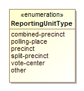

Name | Value
---- | -----
`combined-precinct`|To indicate a combined precinct.
`other`|Used in conjunction with GpUnit::OtherType when no other value in this enumeration applies.
`polling-place`|To indicate a polling place.
`precinct`|To indicate a precinct.
`split-precinct`|To indicate a split-precinct.
`vote-center`|To indicate a vote-center.

### *The **ReportType** Enumeration*

Name | Value
---- | -----
`adjudicated`|To indicate that the report contains adjudications.
`aggregated`|To indicate that the report is an aggregation of device reports.
`originating-device-export`|To indicate that the report is an export from a device such as a scanner.
`other`|Used in conjunction with CastVoteRecordReport::OtherReportType when no other value in this enumeration applies.
`rcv-round`|To indicate that the report is the result of a ranked choice voting round.

### *The **VoteVariation** Enumeration*

Name | Value
---- | -----
`approval`|To indicate approval voting.
`borda`|To indicate the borda count method.
`cumulative`|To indicate cumulative voting.
`majority`|To indicate majority voting.
`n-of-m`|To indicate the N of M voting method.
`one-of-m`|To indicate the 1 of M voting method.
`other`|Used in conjunction with Contest::OtherVoteVariation when no other value in this enumeration applies.
`plurality`|To indicate plurality voting.
`proportional`|To indicate proportional voting.
`range`|To indicate range voting.
`rcv`|To indicate Ranked Choice Voting (RCV).
`super-majority`|To indicate the super majority voting method.

## Classes

### *The **Annotation** Class*

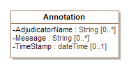

Annotation is used to record annotations made by one or more adjudicators.
[CVRSnapshot](#_17_0_2_4_78e0236_1389366224561_797289_2360) includes Annotation.

Attribute | Multiplicity | Type | Attribute Description
--------- | ------------ | ---- | ---------------------
`AdjudicatorName`|0..*|`string`|The name(s) of the adjudicator(s).
`Message`|0..*|`string`|A message created by the adjudicator(s).
`TimeStamp`|0..1|`dateTime`|The date and time of the annotation.

### *The **BallotMeasureContest** Class*

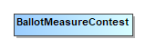

BallotMeasureContest is a subclass of [Contest](#_17_0_2_4_78e0236_1389366251994_876831_2400) and is used to Identify the type of contest as involving one or more candidates. It inherits attributes from [Contest](#_17_0_2_4_78e0236_1389366251994_876831_2400).

### *The **BallotMeasureSelection** Class*

BallotMeasureSelection is a subclass of [ContestSelection](#_17_0_2_4_78e0236_1389372124445_11077_2906) and is used for ballot measures. The voter's selected response to the ballot selection (e.g., "yes" or "no") may be in English or other languages as utilized on the voter's ballot.

Attribute | Multiplicity | Type | Attribute Description
--------- | ------------ | ---- | ---------------------
`Selection`|1|`String`|The voter's selection, i.e., 'yes' or 'no', in English or in other languages as utilized on the voter's ballot.

### *The **Candidate** Class*

Candidate identifies a candidate in a contest on the voter's ballot. [Election](#_17_0_2_4_f71035d_1426101822599_430942_2209) includes instances of Candidate for each candidate in a contest; typically only those candidates who received votes would be included.

Attribute | Multiplicity | Type | Attribute Description
--------- | ------------ | ---- | ---------------------
`Code`|0..*|`Code`|A code or identifier associated with the candidate.
`Name`|0..1|`String`|Candidate's name as listed on the ballot.
`Party`|0..1|`Party`|The party associated with the candidate.

### *The **CandidateContest** Class*

CandidateContest is a subclass of [Contest](#_17_0_2_4_78e0236_1389366251994_876831_2400) and is used to identify the type of contest as involving one or more candidates. It inherits attributes from [Contest](#_17_0_2_4_78e0236_1389366251994_876831_2400).

Attribute | Multiplicity | Type | Attribute Description
--------- | ------------ | ---- | ---------------------
`NumberElected`|0..1|`Integer`|The number of candidates to be elected in the contest.
`PrimaryParty`|0..1|`Party`|The party associated with the contest, if a partisan primary.
`VotesAllowed`|0..1|`Integer`|The number of votes allowed in the contest, e.g., 3 for a 'choose 3 of 5 candidates' contest.

### *The **CandidateSelection** Class*

CandidateSelection is a subclass of [ContestSelection](#_17_0_2_4_78e0236_1389372124445_11077_2906) and is used for candidates, including for write-in candidates.

Attribute | Multiplicity | Type | Attribute Description
--------- | ------------ | ---- | ---------------------
`Candidate`|0..*|`Candidate`|The candidate associated with the contest selection. For contests involving a ticket of multiple candidates, an ordered list of candidates as they appeared on the ballot would be created.
`IsWriteIn`|0..1|`boolean`|A flag to indicate if the candidate selection is associated with a write-in.

### *The **CastVoteRecordReport** Class*

The root class/element; attributes pertain to the status and format of the report and when generated.

CastVoteRecordReport includes multiple instances of [CVR](#_18_0_2_6340208_1532543460307_914551_4600), one per [CVR](#_18_0_2_6340208_1532543460307_914551_4600) or sheet of a multi-page cast vote record. CastVoteRecordReport also includes multiple instances of [Contest](#_17_0_2_4_78e0236_1389366251994_876831_2400), typically only for those contests that were voted so as to reduce file size. The [Contest](#_17_0_2_4_78e0236_1389366251994_876831_2400) instances are later referenced by other classes to link them to contest options that were voted and the indication(s)/mark(s) made.

Attribute | Multiplicity | Type | Attribute Description
--------- | ------------ | ---- | ---------------------
`CVR`|0..*|`CVR`|Used to include instances of CVR classes, one per cast vote record in the report.
`Election`|1..*|`Election`|Used to include the election(s) associated with the CVRs.
`GeneratedDate`|1|`dateTime`|Identifies the time that the election report was generated.
`GpUnit`|1..*|`GpUnit`|Used to include the political geography, i.e., location, for where the cast vote record report was generated and for linking cast vote records to their corresponding precinct or split (or otherwise smallest unit).
`Notes`|0..1|`String`|Notes that can be added as appropriate, presumably by an adjudicator.
`OtherReportType`|0..1|`String`|If [ReportType](#_18_0_5_43401a7_1483727759336_770912_4370) is 'other', this contains the report type.
`Party`|0..*|`Party`|
`ReportGeneratingDevice`|1..*|`ReportingDevice`|Identifies the device used to generate the CVR report.
`ReportingDevice`|1..*|`ReportingDevice`|
`ReportType`|0..*|`ReportType`|The type of report, using the [ReportType](#_18_0_5_43401a7_1483727563257_179426_4343) enumeration.
`Version`|1|`CastVoteRecordVersion`|The version of the CVR specification being used (1.0).

### *The **Code** Class*

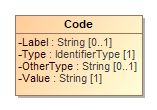

Code is used in [Election](#_17_0_2_4_f71035d_1426101822599_430942_2209), [GpUnit](#_17_0_2_4_78e0236_1389366233346_42391_2380), [Contest](#_17_0_2_4_78e0236_1389366251994_876831_2400), [Candidate](#_17_0_2_4_78e0236_1389366272694_544359_2440), and [Party](#_17_0_2_4_78e0236_1389366278128_412819_2460) to identify an associated code as well as the type of code.

Attribute | Multiplicity | Type | Attribute Description
--------- | ------------ | ---- | ---------------------
`Label`|0..1|`string`|A label associated with the code, used as needed.
`OtherType`|0..1|`string`|If [Type](#_17_0_2_4_f71035d_1430405763078_743585_2433) is 'other', the type of code.
`Type`|1|`IdentifierType`|Used to indicate the type of code, from the [IdentifierType](#_17_0_2_4_f71035d_1425061188508_163854_2613) enumeration.
`Value`|1|`string`|The value of the code, i.e., the identifier.

### *The **Contest** Class*

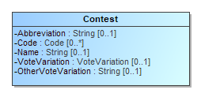

Contest represents a contest on the ballot. CastVoteRecordReport initially includes an instance of Contest for each contest on the ballot.  Other classes can subsequently reference the instances as necessary to link together items on the cast vote record, such as a contest, its voted ballot selection(s), and the mark(s) associated with the selection(s).

ContestSelection has three subclasses, each used for a specific type of ballot selection:   These subclasses inherit Contest's attributes.

 *  PartyContest - used for straight party contests,
 *  BallotMeasureContest - used for contests, and
 *  CandidateContest - used for candidate contests.

Attribute | Multiplicity | Type | Attribute Description
--------- | ------------ | ---- | ---------------------
`Abbreviation`|0..1|`String`|An abbreviation associated with the contest.
`Code`|0..*|`Code`|A code or identifier used for this contest.
`ContestSelection`|1..*|`ContestSelection`|Identifies the ballot selections in the contest.
`Name`|0..1|`String`|Title or name of the contest, e.g., "Governor" or "Question on Legalization of Gambling".
`OtherVoteVariation`|0..1|`String`|If VoteVariation is 'other', the vote variation for this contest.
`VoteVariation`|0..1|`VoteVariation`|The vote variation for this contest, from the VoteVariation enumeration.

### *The **ContestSelection** Class*

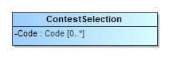

ContestSelection represents a contest selection in a contest.  [Contest](#_17_0_2_4_78e0236_1389366251994_876831_2400) can include an instance of ContestSelection for each contest selection in the contest or, as desired, all contest selections.  

ContestSelection has three subclasses, each used for a specific type of contest selection:

 *  [BallotMeasureSelection](#_17_0_2_4_78e0236_1389372163799_981952_2926) \- used for ballot measures,
 *  [CandidateSelection](#_17_0_2_4_d420315_1392145640524_831493_2562) \- used for candidate selections, and
 *  [PartySelection](#_17_0_2_4_f71035d_1426519980658_594892_2511) \- used for straight party selections.

Instances of [CVRContestSelection](#_18_0_5_43401a7_1474452890357_299022_4292) subsequently link to the contest selections as needed so as to tie together the contest, the contest selection, and the mark(s) made for the contest selection.

ContestSelection contains one attribute, [Code](#_18_5_3_43701b0_1534269642876_463463_5873), that can be used to identify the contest selection and thereby eliminate the need to identify it using the subclasses.

Attribute | Multiplicity | Type | Attribute Description
--------- | ------------ | ---- | ---------------------
`Code`|0..*|`Code`|Code used to identify the contest selection.

### *The **CVR** Class*

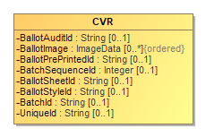

CVR constitutes a cast vote record, generated by a ballot scanning device, containing indications of contests and contest options chosen by the voter, as well as other information for auditing and annotation purposes. Each sheet of a multi-page paper ballot is represented by an individual CVR, e.g., if all sheets of a 5-sheet ballot are scanned, 5 CVRs will be generated. [CastVoteRecordReport](#_17_0_2_4_78e0236_1389366195564_913164_2300) includes multiple instances of CVR as applicable.

Attribute | Multiplicity | Type | Attribute Description
--------- | ------------ | ---- | ---------------------
`BallotAuditId`|0..1|`String`|A unique identifier for this CVR, used to link the CVR with the corresponding audit record, e.g., a paper ballot. This identifier may be impressed on the corresponding audit record as it is scanned, or otherwise associated with the corresponding ballot.
`BallotImage`|0..*|`ImageData`|An image of the ballot sheet created by the scanning device.
`BallotNumber`|0..1|`String`|A unique identifier for the ballot (or sheet of a multi-sheet ballot) that this CVR represents, used if ballots are pre-marked with unique identifiers. If provided, this number would be the same on all CVRs that represent individual sheets from the same multi-sheet ballot. This identifier is not the same as one that may be impressed on the corresponding ballot as it is scanned or otherwise associated with the corresponding ballot; see the Identifier attribute.
`BallotStyleId`|0..1|`String`|An identifier of the ballot style associated with the corresponding ballot.
`CVRSnapshot`|1..*|`CVRSnapshot`|Identifies the repeatable portion of the CVR that links to contest selections and related information.
`Election`|1|`Election`|Used to identify an election with which the CVR is associated.
`GpUnit`|0..1|`GpUnit`|Identifies the smallest unit of geography associated with the corresponding ballot, typically a precinct or split-precinct.
`OriginatingDevice`|0..1|`ReportingDevice`|Identifies the device that created the CVR.
`Party`|0..*|`Party`|Identifies the party associated with a CVR, typically for partisan primaries.
`SequenceNumber`|0..1|`String`|The sequence number for this CVR. This represents the ordinal number that this CVR was processed by the tabulating device.
`SheetNumber`|0..1|`Integer`|A unique number for the ballot (or sheet of a multi-sheet ballot) that this CVR represents, used if ballots are pre-marked with unique numbers. If provided, this number would be the same on all CVRs that represent individual sheets from the same multi-sheet ballot. This number is not the same as one that may be impressed on the corresponding ballot as it is scanned or otherwise associated with the corresponding ballot; see the [BallotAuditId](#_18_0_2_6340208_1469207550920_513772_4736) attribute.

### *The **CVRContest** Class*

CVRContest class is included by [CVRSnapshot](#_17_0_2_4_78e0236_1389366224561_797289_2360) for each contest on the ballot that was voted, that is, whose contest options contain indications that may constitute a vote. CVRContest includes [CVRContestSelection](#_18_0_5_43401a7_1474452890357_299022_4292) for each contest option in the contest containing an indication or write-in.

[CVRSnapshot](#_17_0_2_4_78e0236_1389366224561_797289_2360) can also include CVRContest for every contest on the ballot regardless of whether any of the contest options contain an indication, for cases where the CVR must include all contests that appeared on the ballot.

CVRContest attributes are for including summary information about the contest.

Overvotes plus Undervotes plus TotalVotes must equal the number of votes allowable in the contest, e.g., in a "chose 3 of 5" contest in which the voter chooses only 2, then Overvotes = 0, Undervotes = 1, and TotalVotes = 2, which adds up to the number of votes allowable = 3.

Attribute | Multiplicity | Type | Attribute Description
--------- | ------------ | ---- | ---------------------
`Contest`|1|`Contest`|Used to link to an instance of [Contest](#_17_0_2_4_78e0236_1389366251994_876831_2400) specific to the contest at hand, for the purpose of specifying information about the contest such as its contest identifier.
`CVRContestSelection`|0..*|`CVRContestSelection`|Used to include information about a contest selection in the contest, including the associated indication(s).
`OtherStatus`|0..1|`String`|Used when [CVRContest](#_18_0_2_6340208_1469203058990_306165_4565) is 'other' to include a user-defined status.
`Overvotes`|0..1|`Integer`|The number of votes lost due to overvoting.
`Selections`|0..1|`Integer`|Used to indicate the number of possible contest selections in the contest.
`Status`|0..*|`ContestStatus`|The status of the contest, e.g., overvoted, undervoted, from the [ContestStatus](#_18_0_5_43401a7_1475850124791_123384_4291) enumeration. If no values apply, use 'other' and include a user-defined status in [OtherStatus](#_18_0_5_43401a7_1475856016959_840864_4388).
`Undervotes`|0..1|`Integer`|The number of votes lost due to undervoting.
`WriteIns`|0..1|`Integer`|The total number of write-ins in the contest.

### *The **CVRContestSelection** Class*

CVRContestSelection is used to link those contest options that contain a indication to information about the indication, such as whether the mark constitutes a countable vote, or whether the mark is determined to be marginal, etc. [CVRContest](#_18_0_2_6340208_1469203058990_306165_4565) includes an instance of CVRContestSelection when an indication for the selection is present, and CVRContestSelection then includes [SelectionIndication](#_18_0_2_6340208_1485892992407_492157_4635) for each indication present. To tie the indication to the specific contest selection, CVRContestSelection links to an instance of [ContestSelection](#_17_0_2_4_78e0236_1389372124445_11077_2906) that has previously been included by [Contest](#_17_0_2_4_78e0236_1389366251994_876831_2400).

Since multiple indications per contest option are possible for some voting methods, CVRContestSelection can include multiple instances of [SelectionIndication](#_18_0_2_6340208_1485892992407_492157_4635), one per indication. CVRContestSelection can also be used for the purpose of including, in the CVR, all contest options in the contest regardless of whether indications are present. In this case, CVRContestSelection would not include [SelectionIndication](#_18_0_2_6340208_1485892992407_492157_4635) if no indication is present but would link to the appropriate instance of [ContestSelection](#_17_0_2_4_78e0236_1389372124445_11077_2906).

CVRContestSelection has one subtype, [CVRWriteIn](#_18_0_2_6340208_1485892911278_166697_4594), whose attributes are used to include information about the write-in including the text of the write-in or an image of the write-in.

Attribute | Multiplicity | Type | Attribute Description
--------- | ------------ | ---- | ---------------------
`ContestSelection`|0..1|`ContestSelection`|Used to link to an instance of a contest selection that was previously included by [Contest](#_17_0_2_4_78e0236_1389366251994_876831_2400).
`OtherStatus`|0..1|`String`|Used when [Status](#_18_0_5_43401a7_1475850275266_189599_4334) is 'other' to include a user-defined status.
`Position`|0..1|`Integer`|Used to include the ordinal position of the contest option as it appeared on the ballot.
`Rank`|0..1|`Integer`|For the RCV voting variation, the rank chosen by the voter, for when a contest selection can represent a ranking.
`SelectionIndication`|0..*|`SelectionIndication`|Used to include further information about the indication/mark associated with the contest selection. Depending on the voting method, multiple indications/marks per selection may be possible.
`Status`|0..*|`ContestSelectionStatus`|Contains the status of the contest selection, e.g., 'needs-adjudication' for a contest requiring adjudication, using values from the [ContestSelectionStatus](#_18_0_5_43401a7_1475850153090_186243_4311) enumeration. If no values apply, use 'other' and include a user-defined status in [OtherStatus](#_18_0_5_43401a7_1475855963037_920235_4384).
`TotalNumberVotes`|0..1|`Integer`|For cumulative or range voting variations, contains the total number of votes across all indications/marks.

### *The **CVRSnapshot** Class*

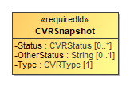

Attribute | Multiplicity | Type | Attribute Description
--------- | ------------ | ---- | ---------------------
`Annotation`|0..*|`Annotation`|Used to include an annotation associated with the CVR snapshot.
`BatchId`|0..1|`String`|The identifier for the batch that includes this CVR.
`BatchSequenceNumber`|0..1|`Integer`|The sequence number of the corresponding paper ballot within a batch.
`CVRContest`|0..*|`CVRContest`|Identifies the contests in the CVR.
`IsCurrent`|1|`boolean`|Identifies whether this snapshot is the tabulatable version.
`OtherStatus`|0..1|`String`|When [Status](#_18_0_2_6340208_1472158928951_402259_4603) is 'other', contains the ballot status.
`Status`|0..*|`CVRStatus`|The status of the CVR.
`Type`|1|`CVRType`|The type of the snapshot, e.g., original.

### *The **CVRWriteIn** Class*

WriteIn is a subclass of [CVRContestSelection](#_18_0_5_43401a7_1474452890357_299022_4292) and is used when the contest selection is a write-in. It inherits attributes from [CVRContestSelection](#_18_0_5_43401a7_1474452890357_299022_4292) and has additional attributes for the image or text of the write-in.

Attribute | Multiplicity | Type | Attribute Description
--------- | ------------ | ---- | ---------------------
`Text`|0..1|`String`|Used for the text of the write-in, typically present when the CVR has been created by electronic ballot marking equipment.
`WriteInImage`|0..1|`ImageData`|Used for an image of the write-in, typically made by a scanner when scanning a paper ballot.

### *The **Election** Class*

Election defines instances of the [Contest](#_17_0_2_4_78e0236_1389366251994_876831_2400) and [Candidate](#_17_0_2_4_78e0236_1389366272694_544359_2440) classes so that they can be later referenced in CVR classes. Election includes an instance of [Contest](#_17_0_2_4_78e0236_1389366251994_876831_2400) for each contest in the election and includes an instance of [Candidate](#_17_0_2_4_78e0236_1389366272694_544359_2440) for each candidate. This is done to utilize file sizes more efficiently; otherwise each CVR would need to define these instances separately and much duplication would occur.

Attribute | Multiplicity | Type | Attribute Description
--------- | ------------ | ---- | ---------------------
`Candidate`|0..*|`Candidate`|Used to establish a collection of candidate definitions that will be referenced by the CVRs. The contests in each CVR will reference the candidate definitions.
`Code`|0..*|`Code`|Used for a code associated with the election, e.g., a precinct identifier if the election scope is a precinct.
`Contest`|1..*|`Contest`|Used for establishing a collection of contest definitions that will be referenced by the CVRs.
`ElectionScope`|1|`GpUnit`|Used to identify the election scope, i.e., the political geography corresponding to the election.
`Name`|0..1|`String`|A text string identifying the election.

### *The **File** Class*

Used to hold the contents of a file or identify a file created by the scanning device. The file generally would contain an image of the scanned ballot or an image of a write-in entered by a voter onto the scanned ballot. SubClass [Image](#_18_0_2_6340208_1485284639720_737438_4549) is used if the file contains an image.

Attribute | Multiplicity | Type | Attribute Description
--------- | ------------ | ---- | ---------------------
`Data`|1|`base64Binary`|Contains the base64 binary contents of the file.
`FileName`|0..1|`string`|Contains the name of the file or an identifier of the file.
`MimeType`|0..1|`string`|The mime type of the file, e.g., image/jpeg.

### *The **GpUnit** Class*

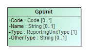

Used for identifying a geographical unit for various purposes, including:

 *  the reporting unit of the report generation device, e.g., a precinct location of a scanner that generates the collection of CVRs,
 *  the geographical scope of the election, or the unit of geography associated with an individual CVR.

[CastVoteRecordReport](#_17_0_2_4_78e0236_1389366195564_913164_2300) includes instances of GpUnit as needed. [Election](#_17_0_2_4_f71035d_1426101822599_430942_2209) references GpUnit as [ElectionScope](#_18_2_43401a7_1450723692857_875635_4654), for the geographical scope of the election.  [CVR](#_18_0_2_6340208_1532543460307_914551_4600) references GpUnit to link a CVR to the smallest political subdivision that the CVR "belongs" to.

Attribute | Multiplicity | Type | Attribute Description
--------- | ------------ | ---- | ---------------------
`Code`|0..*|`Code`|A code associated with the geographical unit.
`Name`|0..1|`String`|Name of the geographical unit.
`OtherType`|0..1|`String`|Used when [Type](#_17_0_2_4_78e0236_1389713376966_77071_2393) is 'other' to include a user-defined type.
`ReportingDevice`|0..*|`ReportingDevice`|The collection of cast vote records associated with the reporting unit and the reporting device.
`Type`|1|`ReportingUnitType`|Contains the type of geographical unit, e.g., precinct, split-precinct, vote center, using values from the [ReportingUnitType](#_17_0_2_4_f71035d_1431607637366_785815_2242) enumeration. If no values apply, use 'other' and include a user-defined type in [OtherType](#_17_0_2_4_f71035d_1426007519161_685921_2510).

### *The **Hash** Class*

Hash is used to specify a hash associated with a file such as an image file of a scanned ballot.

Attribute | Multiplicity | Type | Attribute Description
--------- | ------------ | ---- | ---------------------
`OtherType`|0..1|`string`|If [Type](#_18_0_2_6340208_1485894641846_811323_4646) is 'other', the type of the hash.
`Type`|1|`HashType`|The type of the hash, from the [HashType](#_18_0_2_6340208_1485894679180_11599_4655) enumeration.
`Value`|1|`string`|The hash value, encoded as a string.

### *The **Image** Class*

Used by [File](#_18_0_2_6340208_1485284639717_497586_4548) for a file containing an image, e.g., an image of a write-in on a paper ballot.

### *The **ImageData** Class*

ImageData is used to specify an image file such as for a write-in or the entire ballot.  It works with several other classes, as follows:

 *  [File](#_18_0_2_6340208_1485284639717_497586_4548) with SubClass [Image](#_18_0_2_6340208_1485284639720_737438_4549) – to contain either a filename for an external file or the file contents, and
 *  [Hash](#_18_0_2_6340208_1485894593826_736413_4615) – to contain cryptographic hash function data for the file.

Attribute | Multiplicity | Type | Attribute Description
--------- | ------------ | ---- | ---------------------
`Hash`|0..1|`Hash`|
`Image`|0..1|`Image`|
`Location`|0..1|`anyURI`|A pointer to the location of the image file.
`Signature`|0..1|`Signature`|Either a signature for the embedded image, or a detached signature for the image available at the specified location.

### *The **Mark** Class*

An indication that represents a mark made by a voter on a paper ballot.
It includes [MarkMetric](#_18_0_2_6340208_1488984835132_736302_4685) for assigning a quality metric to the mark.

Attribute | Multiplicity | Type | Attribute Description
--------- | ------------ | ---- | ---------------------
`MarkMetric`|0..*|`MarkMetric`|Included to assign a quality metric to the mark.

### *The **MarkMetric** Class*

[Mark](#_18_0_2_6340208_1532537360373_372867_4552) includes MarkMetric to specify some generic measurement of a voter's mark on a paper ballot. The measurement will be typically assigned by a scanner, such as for mark density or quality, and would be used by the scanner to indicate whether the mark is marginal.

Attribute | Multiplicity | Type | Attribute Description
--------- | ------------ | ---- | ---------------------
`Type`|1|`String`|The type of metric being used to determine quality. The type must be specific enough that the attached value can be accurately verified later, e.g., 'Acme Mark Density' may be a sufficiently specific type.
`Value`|1|`String`|The value of the mark metric, represented as a string.

### *The **Party** Class*

Party is used for describing information about a political party associated with the voter's ballot. [CVR](#_18_0_2_6340208_1532543460307_914551_4600) includes instances of Party as needed, e.g., for a [CVR](#_18_0_2_6340208_1532543460307_914551_4600) corresponding to a ballot in a partisan primary, and [CandidateContest](#_17_0_2_4_78e0236_1389366970084_183781_2806) references Party as needed to link a candidate to their political party.

Attribute | Multiplicity | Type | Attribute Description
--------- | ------------ | ---- | ---------------------
`Abbreviation`|0..1|`String`|Short name for the party, e.g., "DEM".
`Code`|0..*|`Code`|A code associated with the party.
`Name`|0..1|`String`|Official full name of the party, e.g., "Republican".

### *The **PartyContest** Class*

PartyContest is a subclass of [Contest](#_17_0_2_4_78e0236_1389366251994_876831_2400) and is used to identify the type of contest as involving a straight party selection. It inherits attributes from [Contest](#_17_0_2_4_78e0236_1389366251994_876831_2400).

### *The **PartySelection** Class*

PartySelection is a subclass of ContestSelection and is used typically for a ballot selection in a straight-party contest.

Attribute | Multiplicity | Type | Attribute Description
--------- | ------------ | ---- | ---------------------
`Party`|1..*|`Party`|The party associated with the contest selection.

### *The **ReportingDevice** Class*

ReportingDevice is used to specify a voting device as the “political geography” at hand. [CastVoteRecordReport](#_17_0_2_4_78e0236_1389366195564_913164_2300) refers to it as [ReportGeneratingDevice](#_18_0_5_43401a7_1484155960667_232191_4295) and uses it to specify the device that generated the CVR report. [CVR](#_18_0_2_6340208_1532543460307_914551_4600) refers to it as [OriginatingDevice](#_18_5_3_43701b0_1533931125455_124502_5709) to specify the device that generated the CVRs.

Attribute | Multiplicity | Type | Attribute Description
--------- | ------------ | ---- | ---------------------
`Application`|0..1|`String`|The application associated with the reporting device.
`Manufacturer`|0..1|`String`|Manufacturer of the reporting device.
`Model`|0..1|`String`|Manufacturer's model of the reporting device.
`Notes`|0..*|`String`|Additional explanatory notes as applicable.
`SerialNumber`|0..1|`String`|Serial number or other identification that can uniquely identify the reporting device.

### *The **RetentionContest** Class*

RetentionContest is a subclass of [BallotMeasureContest](#_17_0_2_4_78e0236_1389366932057_929676_2783) and is used to identify the type of contest as involving a retention, such as for a judicial retention. While it is similar to [BallotMeasureContest](#_17_0_2_4_78e0236_1389366932057_929676_2783), it contains a link to [Candidate](#_17_0_2_4_78e0236_1389366272694_544359_2440) that [BallotMeasureContest](#_17_0_2_4_78e0236_1389366932057_929676_2783) does not. RetentionContest inherits attributes from [Contest](#_17_0_2_4_78e0236_1389366251994_876831_2400).

Attribute | Multiplicity | Type | Attribute Description
--------- | ------------ | ---- | ---------------------
`Candidate`||`Candidate`|Identifies the candidate in the retention contest.

### *The **SelectionIndication** Class*

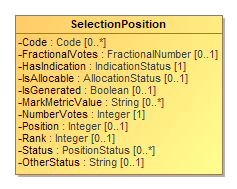

[CVRContestSelection](#_18_0_5_43401a7_1474452890357_299022_4292) includes SelectionIndication to specify a voter's indication/mark in a contest option, and thus, a potential vote. The number of potential SelectionIndications that should be included by CVRContestSelection is, for paper ballots, the same as the number of ovals next to a particular option. There will be usually 1 instance of [SelectionIndication](#_18_0_2_6340208_1485892992407_492157_4635) for plurality voting, but there could be multiple instances for RCV, approval, cumulative, or other vote variations in which a voter can select multiple options per candidate.

[SelectionIndication](#_18_0_2_6340208_1485892992407_492157_4635) contains additional information about the mark to specify whether the mark is countable, as well as information needed for certain voting methods.

Attribute | Multiplicity | Type | Attribute Description
--------- | ------------ | ---- | ---------------------
`IsAllocable`|1|`AllocationType`|Whether this indication should be allocated to the contest option's accumulator.
`NumberVotes`|1|`Integer`|The number of votes represented by the indication, usually 1 but may be more depending on the voting method.
`OtherStatus`|0..1|`String`|Used when [Status](#_18_0_2_6340208_1485892992408_985925_4639) is 'other' to include a user-defined status.
`Position`|0..1|`Integer`|The ordinal position of the indication within the contest option.
`Rank`|0..1|`Integer`|For the RCV voting variation, the rank chosen by the voter, for when a indication can represent a ranking.
`Status`|0..*|`IndicationStatus`|Status of the mark, e.g., "generated-rules" for generated by the machine, from the [IndicationStatus](#_18_0_2_6340208_1485894157707_572874_4551) enumeration. If no values apply, use 'other' and include a user-defined status in OtherStatus.

