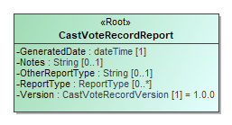

NIST Special Publication 1500-103, Version 1.0

**Cast Vote Records Common Data Format Specification**

**Version 1.0**

Sam Dana

Herb Deutsch

John Dziurlaj

Ian Piper

John Wack

This publication is available free of charge from:  
http://dx.doi.org/10.6028/NIST.SP.1500-103

NIST Special Publication 1500-103, Version 1.0

**Cast Vote Records Common Data Format Specification**

**Version 1.0**

Sam Dana, *Prometheus Computing*

Herb Deutsch, *Election System Software*

John Dziurlaj, *Democracy Fund*

Ian Piper, *Dominion Voting*

John Wack, *Software and Systems Division,*

*Information Technology Laboratory*

This publication is available free of charge from:

<http://dx.doi.org/10.6028/NIST.SP.1500-1>03

February 2019

U. S. Department of Commerce

*Wilbur Ross, Secretary*

National Institute of Standards and Technology

*Walter G. Copan, Under Secretary of Commerce for Standards and
Technology and Director*

National Institute of Standards and Technology (NIST) Special
Publication 1500-103, Version 1.0

91 pages (Fenruary 2019)

NIST Special Publication series 1500 is intended to capture external
perspectives related to NIST standards, measurement, and testing-related
efforts. These external perspectives can come from industry, academia,
government, and others. These reports are intended to document external
perspectives and do not necessarily represent official NIST positions.

Certain commercial entities, equipment, or materials may be identified
in this document in order to describe an experimental procedure or
concept adequately. Such identification is not intended to imply
recommendation or endorsement by NIST, nor is it intended to imply that
the entities, materials, or equipment are necessarily the best available
for the purpose.

There may be references in this publication to other publications
currently under development by NIST in accordance with its assigned
statutory responsibilities. The information in this publication,
including concepts and methodologies, may be used by federal agencies
even before the completion of such companion publications. Thus, until
each publication is completed, current requirements, guidelines, and
procedures, where they exist, remain operative. For planning and
transition purposes, federal agencies may wish to closely follow the
development of these new publications by NIST.

Organizations are encouraged to review all draft publications during
public comment periods and provide feedback to NIST. All NIST
publications are available at
<http://www.nist.gov/publication-portal.cfm>.

National Institute of Standards and Technology

Attn: Software and Systems Division, Information Technology Laboratory

100 Bureau Drive (Mail Stop 8970) Gaithersburg, MD 20899-8930

Email:
[voting@nist.gov](mailto:SP1500comments@nist.gov)

**Reports on Computer Systems Technology**

The Information Technology Laboratory (ITL) at the National Institute of
Standards and Technology (NIST) promotes the U.S. economy and public
welfare by providing technical leadership for the Nation’s measurement
and standards infrastructure. ITL develops tests, test methods,
reference data, proof of concept implementations, and technical analyses
to advance the development and productive use of information technology.
This document reports on ITL’s research, guidance, and outreach efforts
in Information Technology and its collaborative activities with
industry, government, and academic organizations.

**Abstract**

This document is a specification for a common data format for cast vote
records (CVR) produced by vote-capture devices such as ballot scanners.
It supports the interoperable export of CVRs from these devices and the
interoperable import and export of CVRs to/from election management
systems, adjudication systems, and audit systems. The specification
includes examples of XML and JSON usage.

**Keywords**

Common data format (CDF); cast vote record (CVR); JavaScript Object
Notation (JSON); unified markup language (UML); eXtensible Markup
Language (XML).

**  
**

**Acknowledgements**

The authors wish to thank their colleagues of the National Institute of
Standards and Technology VVSG-Interoperability Public Working Group, who
reviewed drafts of this document and contributed to its technical
content. The authors gratefully acknowledge and appreciate the following
contributors for their keen and insightful assistance with developing
this specification:

<table>
<caption>Table 1 Caption</caption>
<thead>
<tr class="header">
<th>
Kenneth Bennett

<em>Office of Registrar-Recorder /County Clerk, Los Angeles</em>
</th>
<th>
Kim Brace

<em>Election Data Services</em>
</th>
<th>
George Gilbert

<em>Ranked Choice Voting Resource Center</em>
</th>
</tr>
</thead>
<tbody>
<tr class="odd">
<td>
Katy Owens Hubler

<em>Democracy Research</em>
</td>
<td>
Jared Marcotte

<em>The Turnout</em>
</td>
<td>
Lauren Massa-Lochridge

<em>llochridge &amp; associates</em>
</td>
</tr>
<tr class="even">
<td>
Neal McBurnnett

<em>ElectionAudits</em>
</td>
<td>
John McCarthy

<em>Verified Voting</em>
</td>
<td>
Jennifer Morrell

<em>Democracy Fund</em>
</td>
</tr>
<tr class="odd">
<td>
Sarah Whitt

<em>Wisconsin Elections Commission</em>
</td>
<td></td>
<td></td>
</tr>
</tbody>
</table>

In addition to the above acknowledgments, the authors also gratefully
acknowledge and appreciate the National Institute of Standards and
Technology's Mary Brady and Benjamin Long for their exceptional
contributions in helping to improve the content of the publication. And
finally, the authors also gratefully acknowledge and appreciate the
significant contributions from individuals and organizations in the
public and private sectors, whose thoughtful and constructive comments
improved the overall quality, thoroughness, and usefulness of this
publication.

**Executive Summary**

This document presents an interoperable, common data format
specification for cast vote records (CVR), which are produced by
vote-capture devices such as ballot scanners. A CVR is an electronic
record of a voter’s selections, with usually one CVR created per sheet
(page) of a ballot. Election results are produced by tabulating the
collection of CVRs, and audits can be done by comparisons of the paper
ballots or paper records of voter selections against the CVRs.

This specification supports three general use cases for CVRs:

1.  Interoperable exports of CVRs from devices such as scanners for
    import into tabulators, election management systems (EMS), or
    auditing systems.

2.  Interoperable exports of aggregated collections of CVRs from
    aggregating devices such as election management systems.

3.  Update of CVRs after adjudication.

The purpose of this specification is to provide an interoperable,
non-proprietary data exchange format in XML and JSON for CVRs so as to
promote greater transparency to voting records produced by vote-capture
devices, and to facilitate the exchange of CVRs with other devices that
operate upon CVRs regardless of device manufacturer.

The specification includes a UML (Unified Markup Language) model and
references XML (eXtensible Markup Language) and JSON (JavaScript Object
Notation) schemas that were created from the UML model.

There are many complex operations performed by voting devices when
voters submit their paper ballots to be scanned. These operations are
mostly invisible to voters but are necessary to determine whether
contest selections have been marked adequately and whether voter intent
is reflected by what is marked on the ballot. This specification
includes the necessary detail to capture theses operations so that CVRs
can be better audited and adjudicated as necessary to include write-in
candidates or other issues.

This specification is geared towards the following audiences:

  - Election officials

  - Voting equipment manufacturers

  - Election analysts and auditors

  - Election-affiliated organizations

  - The public

**Table of Contents**

[Executive Summary 6](#_Toc7687593)

[1 Introduction 10](#introduction)

[1.1 Why this specification is needed
10](#why-this-specification-is-needed)

[1.2 Intended Audience 10](#intended-audience)

[1.3 Document Structure 11](#document-structure)

[1.4 Motivation and Methodology 11](#motivation-and-methodology)

[2 Background: Cast Vote Record Creation, Contents, and Handling
12](#background-cast-vote-record-creation-contents-and-handling)

[2.1 Overview of Cast Vote Records and their Generation
12](#overview-of-cast-vote-records-and-their-generation)

[2.2 Counting Cast Vote Records 13](#counting-cast-vote-records)

[2.3 Adjudication of Cast Vote Records
13](#adjudication-of-cast-vote-records)

[2.4 Auditing Cast Vote Records 14](#auditing-cast-vote-records)

[3 Cast Vote Record UML Model Overview
15](#cast-vote-record-uml-model-overview)

[3.1 CVR Report General Structure 15](#cvr-report-general-structure)

[3.2 Interoperability Considerations
15](#interoperability-considerations)

[3.3 Cast Vote Record Snapshots 18](#cast-vote-record-snapshots)

[3.4 Representing Contest Selections and Selection Positions
19](#representing-contest-selections-and-selection-positions)

[3.4.1 Representing the Facts About a Contest Selection
21](#representing-the-facts-about-a-contest-selection)

[3.4.2 HasIndication and IsAllocable 22](#hasindication-and-isallocable)

[3.4.3 Ranked Choice Voting Example 23](#ranked-choice-voting-example)

[3.4.4 Cumulative Voting Example 24](#cumulative-voting-example)

[3.4.5 Range Voting Example 25](#range-voting-example)

[3.5 Identifiers Within the CVR 27](#identifiers-within-the-cvr)

[3.5.1 A Unique ID for Each CVR 27](#a-unique-id-for-each-cvr)

[3.5.2 An ID for Each Sheet of a Multi-sheet Paper Ballot
27](#an-id-for-each-sheet-of-a-multi-sheet-paper-ballot)

[3.5.3 An ID for Ballots Pre-Printed with a Unique Identifier
27](#an-id-for-ballots-pre-printed-with-a-unique-identifier)

[3.5.4 An ID to Link the CVR to its Corresponding Paper Ballot
28](#an-id-to-link-the-cvr-to-its-corresponding-paper-ballot)

[3.5.5 IDs to Support Batching 28](#ids-to-support-batching)

[3.5.6 IDs via Associations with Other Classes
28](#ids-via-associations-with-other-classes)

[4 Cast Vote Record UML Model Documentation
29](#cast-vote-record-uml-model-documentation)

[4.1 Class Annotation 29](#class-annotation)

[4.2 Class BallotMeasureContest 30](#class-ballotmeasurecontest)

[4.3 Class BallotMeasureSelection 31](#class-ballotmeasureselection)

[4.4 Class Candidate 32](#class-candidate)

[4.5 Class CandidateContest 33](#class-candidatecontest)

[4.6 Class CandidateSelection 34](#class-candidateselection)

[4.7 Class CastVoteRecordReport 35](#class-castvoterecordreport)

[4.8 Class Code 37](#class-code)

[4.9 Class Contest 38](#class-contest)

[4.10 Class ContestSelection 39](#class-contestselection)

[4.11 Class CVR 40](#class-cvr)

[4.12 Class CVRContest 42](#class-cvrcontest)

[4.13 Class CVRContestSelection 43](#class-cvrcontestselection)

[4.14 Class CVRSnapshot 45](#class-cvrsnapshot)

[4.15 Class CVRWriteIn 46](#class-cvrwritein)

[4.16 Class Election 47](#class-election)

[4.17 Class File 48](#class-file)

[4.18 Class FractionalNumber 49](#class-fractionalnumber)

[4.19 Class GpUnit 50](#class-gpunit)

[4.20 Class Hash 51](#class-hash)

[4.21 Class Image 52](#class-image)

[4.22 Class ImageData 53](#class-imagedata)

[4.23 Class Party 54](#class-party)

[4.24 Class PartyContest 55](#class-partycontest)

[4.25 Class PartySelection 56](#class-partyselection)

[4.26 Class ReportingDevice 57](#class-reportingdevice)

[4.27 Class RetentionContest 58](#class-retentioncontest)

[4.28 Class SelectionPosition 59](#class-selectionposition)

[4.29 Enumeration AllocationStatus 61](#enumeration-allocationstatus)

[4.30 Enumeration CastVoteRecordVersion
62](#enumeration-castvoterecordversion)

[4.31 Enumeration ContestSelectionStatus
63](#enumeration-contestselectionstatus)

[4.32 Enumeration ContestStatus 64](#enumeration-conteststatus)

[4.33 Enumeration CVRStatus 65](#enumeration-cvrstatus)

[4.34 Enumeration CVRType 66](#enumeration-cvrtype)

[4.35 Enumeration HashType 67](#enumeration-hashtype)

[4.36 Enumeration IdentifierType 68](#enumeration-identifiertype)

[4.37 Enumeration IndicationStatus 69](#enumeration-indicationstatus)

[4.38 Enumeration PositionStatus 70](#enumeration-positionstatus)

[4.39 Enumeration ReportingUnitType 71](#enumeration-reportingunittype)

[4.40 Enumeration ReportType 72](#enumeration-reporttype)

[4.41 Enumeration VoteVariation 73](#enumeration-votevariation)

[5 Usage Examples 74](#usage-examples)

[5.1 Anatomy of a CVR 74](#anatomy-of-a-cvr)

[5.2 Basic Example 75](#basic-example)

[5.3 SelectionPosition 76](#selectionposition)

[5.3.1 Position and Rank in SelectionPosition
76](#position-and-rank-in-selectionposition)

[5.3.2 Voter Made Marks (Paper Only) 77](#voter-made-marks-paper-only)

[5.3.3 Machine Generated Indications 78](#machine-generated-indications)

[5.4 Handling Overvotes 78](#handling-overvotes)

[5.5 Write-Ins 79](#write-ins)

[5.5.1 Write-In Counter 80](#write-in-counter)

[5.5.2 Adjudication of Write-Ins 80](#adjudication-of-write-ins)

[5.6 CVR Snapshots 80](#cvr-snapshots)

[5.6.1 Current CVR 82](#current-cvr)

[5.7 Ballot Images 82](#ballot-images)

[5.7.1 Storing the Image as a Reference
82](#storing-the-image-as-a-reference)

[5.7.2 Storing the Image Data 82](#storing-the-image-data)

[5.8 Voting Method Support 83](#voting-method-support)

[5.8.1 Rank Choice Voting 83](#rank-choice-voting)

[5.8.2 Cumulative Voting 84](#cumulative-voting)

**List of Appendices**

[Appendix A— Acronyms 86](#acronyms)

[Appendix B— Glossary 87](#glossary)

[Appendix C— References 90](#references)

[Appendix D— File Download Locations 91](#file-download-locations)

# Introduction

This document is a specification for a common data format (CDF) for cast
vote records (CVR) produced by vote-capture devices such as ballot
scanners and subsequently tabulated, adjudicated, and audited by other
voting devices such as election management systems (EMS). The
specification describes a CVR UML (Unified Modeling Language) \[1\]
model and XML (eXtensible Markup Language) \[2\] and JSON (JavaScript
Object Notation) \[3\] schemas that were generated from the model.

Primary features of this specification include:

  - The capability to export raw CVRs representing contest selections
    and other information such as changes made to the CVRs by the
    vote-capturing device because of election or contest rules and
    changes made to the CVRs as a result of adjudication.

  - The capability, for a single election, to contain collections of
    CVRs produced by multiple devices from multiple locations, such as
    voting centers or precincts.

  - A data model in UML that itemizes and defines the data involved in
    CVRs and that is used to derive the XML and JSON schemas.

##  Why this specification is needed

The purpose of this specification is to provide interoperable data
interchange formats in XML and JSON for CVRs to assist election
officials, auditors, and other election analysts in collecting,
aggregating, tabulating, and auditing CVRs from multiple types of
vote-capture devices. An additional purpose is to provide greater
transparency to CVRs and operations performed on them. Advantages of
using this specification include:

  - Interoperable data interchange formats for CVRs to remove reliance
    on proprietary data formats.

  - Capability to use the same interoperable format for CVR creation,
    analysis and update, tabulation, adjudication, and audit.

  - Greater freedom to use devices from different manufacturers for
    operations involving CVRs.

  - Consistent handling of voting variations such as Ranked Choice
    Voting.

  - A UML model that is easily extensible to additional use cases.

## Intended Audience

The intended audience of this specification includes election officials,
voting system designers and developers, and others in the election
community, including the general public. Some background in election
administration and voting equipment is useful in understanding the
material in this specification.

## Document Structure

This specification is laid out as follows:

  - Section 2, Background: Cast Vote Record, contains background
    information about how CVRs get created, their contents, and how they
    are handled in the election process.

  - Section 3, Cast Vote Record UML Model Overview, contains an overview
    of the UML model structure and how it can be used for CVR exports
    and reports.

  - Section 4, Cast Vote Record UML Model Documentation, describes the
    classes and enumerations in greater detail.

  - Section 5, Usage Examples, contains examples of CVR structure using
    XML.

Appendices contain acronyms, definitions, references, and URLs for
downloading the associated JSON and XML schemas.

## Motivation and Methodology

This document was written primarily to assist election officials,
developers, and auditors in handling CVRs as they are created and used.
At the time of writing, voting systems and the data produced do not
interoperate unless they are from the same manufacturer, but even within
a manufacturer’s line of products there is often a lack of
interoperability. This adds more complexity when attempting to integrate
COTs (commercial off-the-shelf) or other manufacturer equipment for
tabulations, adjudications, and audits.

NIST and a community of U.S. election officials, analysts,
manufacturers, and election system technologists analyzed how CVRs are
used within the election process and produced this interoperable CVR
format that can be used regardless of manufacturer. This specification
addresses the following use cases:

1.  Interoperable exports of CVRs from devices such as scanners for
    import into tabulators, EMS, or auditing systems.

2.  Interoperable exports of aggregated collections of CVRs from
    aggregating devices such as election management systems.

3.  Update of CVRs because of adjudication.

JSON and XML schemas were generated from the UML model, so scanners and
other devices can export CVRs in JSON or XML and validate usage against
the schema.

# Background: Cast Vote Record Creation, Contents, and Handling

This section contains a general overview of how CVRs are created, their
contents, and how they are subsequently handled in the election process.

## Overview of Cast Vote Records and their Generation

Simply put, a cast vote record (CVR) is an electronic record of a
voter’s ballot selections, and its primary purpose is to provide a
record of voter selections that can be counted in an efficient manner to
produce election results. A CVR is created by equipment such as a voter
facing scanner in a polling place into which a voter inserts a paper
ballot. CVRs also get created by batch fed scanners used to scan
absentee or other types of ballots that are collected before the
election or that cannot be scanned by polling place scanners for various
reasons. After the polls are closed, the CVRs are collected by election
officials on memory devices and subsequently copied to an election
management system that aggregates and tabulates the votes.

Three primary types of voting devices that create CVRs are:

  - All-electronic voting devices that a voter uses to make ballot
    selections and that create and store a CVR for each ballot.

  - Ballot marking devices (BMDs) that function like all-electronic
    devices but that produce a paper record of the voter’s choices that
    must be subsequently scanned.

  - Voter-facing optical scanners used in polling places and batch-fed
    optical scanners used in central offices to scan paper ballots.

The scanning devices above are sometimes referred to collectively as
“tabulators” because they generally have a tabulation capability, but
this is not always the case.

CVRs may include other information besides voter choices, including:

  - Information on all contests and contest options on the ballot in
    addition to those marked

  - The ballot style associated with the CVR

  - The precinct or location associated with the CVR

  - The equipment that produced the CVR

  - The political party associated with the ballot for partisan
    primaries

  - Images of the entire ballot and images of write-in areas on the
    ballot

  - An identifier that is also printed on the ballot as it is scanned

  - Indications of how the scanner has interpreted various mark.

This specification includes support for the above items.

## Counting Cast Vote Records

To produce a CVR that is countable, the scanner must interpret the
voter’s selections according to the rules of each contest to determine
which selections can be counted. This is true primarily of hand-marked
paper ballot scanners in which voters may write in candidates whose
names were not on the ballot or they may make mistakes that invalidate
their choices such as overvoting in a contest. All-electronic devices
and BMDs guide the voter how to make selections according to the contest
rules, thus the CVRs they create require much less interpretation,
except for write-ins.

When creating a cast vote record, ballot scanners must first interpret
the ballot and detect where voters have made marks and whether those
marks meet manufacturer-specific criteria for validity, that is, whether
a mark is placed in the right location and is sufficiently formed so it
constitutes an intentional ballot selection made by the voter. Each
device in the jurisdiction must also be programmed with election
specific information for the polling place that it will be used in, so
the scanners can apply that polling place’s election rules to the
detected marks. Scanners may perform interpretation based on a number of
different factors, including:

  - A scanner may flag marks as being marginal, that is not meeting the
    criteria for validity, and therefore not counting those marks.

  - Voters may vote for more than the allowable number of options
    (overvote) and the scanner must know not to count *any* of the
    selections made by the voter for that particular contest.

  - Likewise, voters may undervote a contest, and the scanner must
    record that the contest was undervoted. The marked selections are
    still counted.

  - The scanner must be programmed to tabulate the voter marks according
    to the voting method in place for a particular contest.

  - A scanner may create indirect selections in the case of straight
    party voting where a voter can decide to vote for all candidates of
    a particular party by making a single straight-party selection at
    the top of the ballot.

  - A scanner may invalidate voter marks in the case of straight party
    voting where a voter selects the straight party choice but votes for
    the other party in various contests. Depending on local election
    rules, the votes in those contests or the entire ballot could be
    invalidated.

Typically, CVR-generating equipment will export a collection of CVRs
that may also include a tabulated report. This CVR collection may be
copied to a memory device or otherwise transferred to a central
location, where it can be combined with other CVR exports to produce
election results.

## Adjudication of Cast Vote Records

After a CVR collection has been exported, a number of the CVRs may
require additional inspection and adjustment as part of a process known
as adjudication, which may be done on an EMS by election officials.
Write-ins are the most common reason:

1.  On ballots produced by BMDs the write-in names could still be
    spelled differently or incorrectly, and

2.  For scanned paper ballots, either the ballots themselves or the
    images of the write-in areas of the ballot that were made by the
    scanner must be inspected.

There are a number of other reasons why ballots may require
adjudication, such as:

  - The ballot was unreadable by the scanner.

  - The voter may have marked the ballot in ways that are difficult to
    interpret, for example, the voter may have circled the ovals instead
    of filling them in.

  - The scanner detected one or more overvotes.

  - The scanner detected that the entire ballot was blank.

This specification provides the capability to update the CVR with
multiple annotations made by adjudicators, recording the following
items:

  - The adjudicator name(s).

  - Time stamp of when the adjudication(s) was made.

  - The adjudication, i.e., the action taken by the adjudicator(s).

This is discussed in more detail in Section 4.1, Class Annotation.

## Auditing Cast Vote Records

CVRs need to be audited against their paper counterparts so that
election results can be verified to be accurate. This specification
supports auditing by providing the following as options:

  - Support for ballot-level comparison auditing, that is, there is an
    identifier in the CVR that can be linked to an ID printed on the
    corresponding paper ballot.

  - Support to include adjustments to contest selections made by
    adjudicators.

  - Different snapshots of the CVR can be created, one for the original
    scan, one for after election rules have been applied, and others as
    needed for adjudications.

  - Indications of marginal marks, mark quality/density can be
    associated with contest selections.

  - A CVR can include signed/hashed references to an associated image of
    the ballot or images of write-ins made by the voter.

  - Capability to include batch information such as batch IDs and
    sequence within the batch.

# Cast Vote Record UML Model Overview 

This section presents an overview of the CVR UML model, showing how it
is structured and how it can be used for various voting methods. Section
4, Cast Vote Record UML Model Documentation, contains information on
specific classes and enumerations, and Section 5, Usage Examples,
discusses several CVR examples using XML. In general, the JSON and XML
formats closely follow the structure of the UML model. Thus, the
examples of CVR structure in this section apply also to JSON and XML.

The UML class and enumeration names are shown in a different font to
distinguish them from surrounding text. For example, the name of the
root class in the UML model is CastVoteRecordReport.

## CVR Report General Structure

The UML model implements a report of cast vote records exported by a
device that

  - Creates CVRs, such as a scanner or BMD, and/or

  - Processes and generates a report of CVRs such as an EMS.

In the case of an EMS, the report could consist of aggregations of CVRs
from multiple creating devices and, if desired, multiple creating
locations, i.e., polling places. In an election conducted in a large
county, for example, there could be many CVR reports exported from
creating devices (i.e., scanners), and the county could import these
reports into a central EMS and issue potentially one single aggregated
report.

The CVRs in the report can each be associated with the following:

  - The election,

  - Precinct or split-precinct geography that corresponds to the ballot
    style, or

  - Creating device.

As well, the report itself can identify the election(s), where the CVRs
were created and the creating device(s).

Figures 1 and 2 show the classes in the UML model and the enumerations
used in a number of class attributes.

## Interoperability Considerations

A major impediment to interoperability of CVRs across different
manufacturers is that typically, the contest selections in a
manufacturer’s CVR consist of codes and the CVR thus appears as a
structured series of codes and contest votes. To understand the CVR, one
must know what the codes mean and their structure, and this information
is usually opaque and unavailable to others

Figure 1 - CVR UML Model - Classes

Figure 2 - CVR UML Model - Enumerations and Other Classes

(including auditors)\[1\]. An important feature of the UML model is that
it allows for expanded information in the CVR to be included, in a
space-saving manner, to identify contests and contest selections and the
associated indications of marks. While a manufacturer’s codes can still
be included, one can also include interoperable codes and descriptions
so that others can understand the CVR and CVRs can be exchanged across
devices and manufacturers. The UML model also allows for all contests
and contest options, whether selected or not, to be included in the CVR
if desired.

However, it would be inefficient and wasteful of space to repeat static
and identical contest or candidate information in each CVR, and it would
be better to define this static information only once and then point to
it as needed. To effect this, the model treats the static information
about contests, contest options, devices, and political geography as
static *objects* that, once defined, can be linked and connected with
the dynamic contest selection information. A static object in concrete
terms means a definition in XML/JSON for the item consisting solely of
static attributes related to the item, i.e., a contest code ID used in
the election or a contest or candidate name, neither of which will
change within the context of the CVR report.

As shown in Figure 3, the CVR report structure consists of objects
created for the election, the devices, political geography, contests,
and contest options, followed by instances of CVR classes. As stated,
each CVR can optionally include a link to the creating device, the
corresponding ballot-style area, or the election.

## Cast Vote Record Snapshots

Figure 3 shows CVR optionally including one or more instances of
CVRSnapshot. A CVRSnapshot is a record of the voter’s selections at a
particular point in time. There are three types of snapshots, which are
listed in the CVRType enumeration:

  - original – the version created when a marked paper ballot is scanned
    and *before* interpretation of the voter’s selections according to
    contest/election rules.

  - interpreted – the version created after interpretation of the
    voter’s selections recorded in the original version, or the
    version created by a DRE or from a BMD’s encoded voter selections.

  - modified – the version created after modifications have been made to
    the interpreted version as a result of adjudication, e.g., because
    of write-ins on the ballot.

Each instance of the snapshot includes only the contest options and
contest selections that were voted and that are valid for that snapshot.
One of the snapshots must be identified as the snapshot to include in
tabulations. Figure 4 below shows the structure in more detail.

Depending on how this specification may be implemented, all three types
of snapshots could be used in a CVR, or two, or one. For CVRs created by
devices such as a DRE or a BMD that encodes voter selections, there is
no original snapshot, thus using interpreted makes more sense. For
hand-marked paper ballots, use of the original and interpreted snapshots
allows for traceability of all marks detected on the ballot and how the
scanner interpreted them according to mark density values and contest
rules. Generally, the modified snapshot would be created by adjudication
applications so as to provide traceability for adjudications of
voter-made marks or adjudication of write-ins.

## Representing Contest Selections and Selection Positions

As shown in Figure 3 and Figure 4, CVRSnapshot includes CVRContest for
linking contest objects to those contests that were selected by the
voter. CVRContest then includes CVRContestSelection for each contest
selection made by the voter. CVRContestSelection then links contest
object definitions with the voted contest selections, e.g., for linking
a candidate code within a candidate object to the voted selection for
that candidate, thereby associating the code with the voted selection.

CVRContestSelection also includes an important class, SelectionPosition,
shown in Figure 5, for recording information about each selected
position within a contest selection such as, does the position represent
a vote? The name of this class is important, because contest options on
the ballot each have a position, thus each contest selection included in
the CVR must be associated with that position. In practical terms, each
position can be thought of as a bubble on the ballot that can be filled
in by the voter. For example, each contest selection for a candidate in
the Presidential contest will be associated with one position, that
being the bubble next to the candidate. Accordingly, SelectionPosition
will indicate position 1 for the candidate selected in the contest.

Figure 5 - SelectionPosition Class

Other types of contest selections may have multiple positions, such as
for RCV in which each candidate could be considered as a row on a
ballot, with associated rankings for each candidate, each represented as
a bubble on the ballot. In this case, it is important to know the
position of the selected bubble so as to know its associated ranking.
Figure 6 shows an example RCV contest in which there are 3 candidates
and each candidate can be ranked from 1 to 3, thus there are 3 bubbles
for each candidate and three possible positions. In this example,
SelectionPosition will indicate position 1 for Shapiro, 3 for Walsh, and
2 for Kurt:

**Member of County Council at Large**

| Contest Option | 1st   | 2nd   | 3rd   |
| -------------- | ----- | ----- | ----- |
| Ileen Shapiro  | \[x\] | \[ \] | \[ \] |
| Debbie Walsh   | \[ \] | \[ \] | \[x\] |
| Sandra Kurt    | \[ \] | \[x\] | \[ \] |

Figure 6 - RCV Contest with 3 Positions per Selection

### Representing the Facts About a Contest Selection

SelectionPosition is also used to state facts concerning the position(s)
associated with contest selections, such as whether, at a position,
there is an indication of a voter selection in a contest and whether it
is potentially countable. For scanned paper ballots, scanner-resident
software that has been programmed with the appropriate contest rules
typically interprets the voter selections and makes those decisions as
to

  - Whether a voter mark is of sufficient quality to be considered as a
    contest selection, and

  - Whether the contest selection obeys the rules of the contest and can
    be consequently counted as a vote.

However, CVRs also could be simply recorded by a scanner but then
exported to another device where the interpretation takes place.

Thus, in the interests of transparency, the facts that are recorded in
SelectionPosition must be just that: only facts and not reflective of
decisions as to validity of marks and countability of votes. Where
software has made a decision as to the countability of a contest
selection, it is indicated clearly. Using the facts, however, one can
more accurately adjudicate or override the decisions made by software.

Therefore, this specification uses terminology very carefully in its
class, attribute names, and descriptions. Before further consideration
of SelectionPosition, the following glossary terms must be understood.

#### Use of *Mark*

The word *Mark* is used in this specification *only* to mean a
scanner-detectable mark on a paper ballot that requires some associated
measurement of quality to determine whether the mark represents a
tabulatable contest selection. While the mark would presumably have been
made by the voter, a flaw on the ballot could be detected by the scanner
and considered as a mark\[2\], albeit an ambiguous one.

A *mark* is important to differentiate from a machine-made
representation of a contest selection that was made via the voter using
a BMD or DRE. The machine-made representation does not require an
associated measurement of quality; it is either present or not.

The thresholds for mark quality may be set in state or local election
law and thus can vary by jurisdiction. Scanners can include the
measurements in the CVR by first indicating the name or type of the
quality measurement in ReportingDevice.MarkMetricType, and then using,
for each mark, SelectionPosition.MarkMetricValue. to indicate the mark
measurement.

#### Use of Selection Indication

The term *Selection Indication* or *Indication* is used as a broader
term to mean either (a) a mark presumably made by a human or (b) a
machine-made representation of a mark. Selection indications can come
from the following sources:

  - A flaw on the paper ballot detected as a mark made by the voter.

  - A mark made by the voter on the paper ballot; the mark could be
    ambiguous or could meet scanner thresholds for quality.

  - A mark made by a ballot marking device onto a full-face paper
    ballot.

  - An indication made by the voter using a DRE or by a ballot marking
    device using a bar code to represent voter selections.

  - An indication made by the scanner in certain cases as a result of
    applying contest rules to the voter’s indication\[3\].

  - An indication made by an adjudicator.

#### Use of Allocable

*Allocable* is used, then, to indicate whether the selection indication
is potentially countable, that is, whether it can be given over or
*allocated* to a later tabulation process that may count it as a vote if
it meets all tabulation criteria. In most cases, allocable means
countable, but here, *countable* is avoided, as it implies a decision
has been made to count the selection indication.

### HasIndication and IsAllocable

SelectionPosition uses two attributes that act as booleans to show
decisions made by software as to whether selection indications are
allocable. The first, HasIndication, indicates whether software has
decided that there is, indeed, a selection indication that can be
potentially counted. The following table shows the mapping of selection
indications to HasIndication values:

| Selection Indication                      | HasIndication |
| ----------------------------------------- | ------------- |
| machine-readable mark from a paper ballot | yes           |
| machine-generated mark from a DRE or BMD  | yes           |
| marginally machine-readable mark          | unknown       |
| no mark or no mark undetected             | no            |

Table 1 - Selection Indication to HasIndication Mapping

When there is no indication of a selection indication, most likely the
contest selection was not voted but is being included in the CVR.

The second boolean-like attribute, IsAllocable, is used for indicating a
decision made by software as to whether a selection indication is
allocable to the tabulator process for counting as a vote. In effect,
this indicates if there is a vote in a contest selection that could be
counted. When HasIndication has a value of unknown, IsAllocable need not
be included.

### Ranked Choice Voting Example

Figure 7 shows an example RCV (ranked choice voting) contest for
President, in which up to 4 candidates can be selected, each with an
associated rank. In this example, Smith was ranked as 1, Front was
ranked as 3, Hillberry was ranked as 2, but the voter did not rank
James.

**Presidential Contest**

| Contest Option               | 1st   | 2nd   | 3rd   | 4th   |
| ---------------------------- | ----- | ----- | ----- | ----- |
| Jack Smith/Steven Ritz       | \[x\] | \[ \] | \[ \] | \[ \] |
| Layla Front/Robert Brak      | \[ \] | \[ \] | \[x\] | \[ \] |
| James Hillberry/Mark Jafrate | \[ \] | \[x\] | \[ \] | \[ \] |
| Anna James/Mary Kalman       | \[ \] | \[ \] | \[ \] | \[ \] |

Figure 7 - RCV contest with multiple contest selections; one voter mark
per selection

CVRContest will include a CVRContestSelection instance for each of the
three contest selections that were selected, then. Each
CVRContestSelection will include a SelectionPosition instance for the
bubble filled in by the voter (in this case, only one bubble for each
contest selection was filled in; depending on the RCV contest rules,
more than one bubble filled in for a given contest selection may be an
overvote).

A partial example of the structure representing the contest in Figure 7
is as follows:

  - CVRContest:
    
      - Link to the Presidential contest object
    
      - CVRContestSelection:
        
          - Link to candidate object for Jack Smith/Steven Ritz
        
          - Total number of votes represented by the contest selection =
            1
        
          - SelectionPosition:
            
              - Position = 1 (or Rank = 1)
            
              - HasIndication = yes
            
              - IsAllocable = yes
            
              - Number of votes = 1
    
      - CVRContestSelection:
        
          - Link to candidate object for Layla Front/Robert Brak
        
          - Total number of votes represented by the contest selection =
            1
        
          - SelectionPosition:
            
              - Position = 3 (or Rank = 3)
            
              - HasIndication = yes
            
              - IsAllocable = yes
            
              - Number of votes = 1
    
      - CVRContestSelection:
        
          - Link to candidate object for James Hillberry/Mark Jafrate
        
          - Total number of votes represented by the contest selection =
            1
        
          - SelectionPosition:
            
              - Position = 2 (or Rank = 2)
            
              - HasIndication = yes
            
              - IsAllocable = yes
            
              - Number of votes = 1

### Cumulative Voting Example

Figure 8 shows an example for cumulative voting in which multiple voter
marks are allowable for each contest selection, with a total number of
votes (or score) included for each candidate.

Three votes can be allocated across the five candidates, however only
two candidates received

votes, Ford and Hill. Thus, CVRContest will include two instances of
CVRContestSelection, one for Ford and one for Hill. Each
CVRContestSelection includes SelectionPosition for each bubble filled in
to the left of each candidate’s name, for a maximum of three. In this
case, there will be two SelectionPosition instances for Henry Ford and
one for Mary Hill.

A partial example of the structure representing the contest in Figure 8
is as follows:

  - CVRContest:
    
      - Link to contest object for this contest
    
      - CVRContestSelection1:
        
          - Link to candidate object for Henry Ford
        
          - Total number of votes represented by the contest selection =
            2
        
          - SelectionPosition:
            
              - Position = 1
            
              - HasIndication = yes
            
              - IsAllocable = yes
            
              - Number of votes = 1
        
          - SelectionPosition:
            
              - Position = 2
            
              - HasIndication = yes
            
              - IsAllocable = yes
            
              - Number of votes = 1
    
      - CVRContestSelection2:
        
          - Link to candidate object for Mary Hill
        
          - Total number of votes represented by the contest selection =
            2
        
          - SelectionPosition:
            
              - Position = 3
            
              - HasIndication = yes
            
              - IsAllocable = yes
            
              - Number of votes = 1

### Range Voting Example

Lastly, Figure 9 shows an example of a contest using range voting, in
which each candidate receives a score, which is analogous to number of
votes. In this example, one bubble can be filled in for each contest
selection, and each candidate will have an associated score or number of
votes, with the maximum score of 9. The position of the bubble is highly
meaningful, as the bubble in position 1 represents no votes and the
bubble in position 10 represents 9 votes.

Figure 9 - Range Voting contest with multiple contest selections; one
voter mark per selection

A partial example of the structure representing the contest in Figure 9
is as follows:

  - CVRContest:
    
      - Link to contest object for this contest
    
      - CVRContestSelection:
        
          - Link to candidate object for Candidate A
        
          - Total number of votes represented by the contest selection =
            0
        
          - SelectionPosition:
            
              - Position = 1
            
              - HasIndication = yes
            
              - IsAllocable = yes
            
              - Number of votes = 0
    
      - CVRContestSelection:
        
          - Link to candidate object for Candidate B
        
          - Total number of votes represented by the contest selection =
            9
        
          - SelectionPosition:
            
              - Position = 10
            
              - HasIndication = yes
            
              - IsAllocable = yes
            
              - Number of votes = 9
    
      - CVRContestSelection:
        
          - Link to candidate object for Candidate C
        
          - Total number of votes represented by the contest selection =
            7
        
          - SelectionPosition:
            
              - Position = 8
            
              - HasIndication = yes
            
              - IsAllocable = yes
            
              - Number of votes = 7

## Identifiers Within the CVR

The CVR can contain potentially up to ten different identifiers whose
purpose in general is to make CVRs easier to use in tabulation and more
useful in auditing. In particular, the CVR can contain an ID that is
common to its corresponding paper ballot so as to support ballot-level
comparison audits in which paper ballots are compared against their
corresponding CVRs.

Seven of the IDs are attributes of the CVR class because the information
they represent will be different for each CVR. There are three
additional ID-related classes that are linked from the CVR as the result
of associations with BallotStyleUnit, Creating Device, and Election;
these classes contain static information that will be the same for each
CVR. The different types of IDs can grow confusing, thus this section
describes how they are used.

### A Unique ID for Each CVR

First, every CVR, as it is created by a device such as a scanner or BMD,
is assigned a unique ID so that it can be individually referenced. This
ID, CVR::UniqueId, applies to the entire CVR.

### An ID for Each Sheet of a Multi-sheet Paper Ballot

Generally, if a ballot contains multiple sheets, a CVR will be created
for each sheet; for a 3-page ballot, three CVRs will be created. If each
sheet of the ballot contains an indication of the sheet number, e.g.,
sheet 2 contains an indication that it is sheet 2, the creating device
can include this indication within the CVR, using CVR::BallotSheetId.

If the paper ballot is two-sided, a scanner may still consider the
ballot as consisting of one sheet and create just one CVR instead of a
CVR for each side. In this case, CVR::BallotSheetId would apply to both
sides of the ballot.

### An ID for Ballots Pre-Printed with a Unique Identifier

In some cases, paper ballots may be pre-printed with a unique identifier
such as a sequence number. In this case, the scanner can include the
pre-printed identifier in the CVR using CVR::BallotPrePrintedId.

### An ID to Link the CVR to its Corresponding Paper Ballot

For ballot-level comparison audits, there must be a means for pairing a
CVR to its corresponding paper ballot. Scanners may print an ID on a
ballot as it is scanned and then include that ID in CVR::BallotAuditId.

#### An ID to Link the CVR to its Corresponding Ballot Style ID

The CVR can be linked to the ballot style ID that was used in creating
the paper ballot. This ID is contained in CVR::BallotStyleId.

### IDs to Support Batching

Lastly, there are two identifiers both related to batching, that is,
grouping paper ballots as they are scanned into separate batches for the
purposes of auditing by batch. The first identifier,
CVRSnapshot::BatchId, is used to identify the batch. The second
identifier, CVRSnapshot::BatchSequenceId, is used to identify the
position or sequence of the ballot within the batch.

### IDs via Associations with Other Classes

Lastly, the CVR class can be associated with 3 other classes, each class
containing static information related to tabulation and auditing. These
classes are referenced (linked) from each CVR because the information
within each class is entirely static and thus need not be repeated in
each CVR. These classes are:

1.  BallotStyleUnit – contains static information about the political
    geography corresponding to the ballot’s ballot style. Most likely
    the political geography will correspond to a precinct or a precinct
    split.

2.  CreatingDevice – contains static information about the device that
    created the CVR, including the manufacture, model, serial number,
    and the type of mark metric measure used by the device.

3.  Election – contains identifying information about the election,
    including the name and any associated codes.

# Cast Vote Record UML Model Documentation

This section contains documentation and discussion of the features
included in the CVR UML model. As noted previously, this model was used
in deriving the XML and JSON schemas, and the schema usage closely
follows that of the UML model.

The UML classes are described first, followed by the enumerations. Each
description contains an image of the class (from the UML model) and a
table containing details about each of the class’s attributes. To denote
that certain class attributes derive from the class’s associations with
other classes, curly braces are used around those attribute names, e.g.,
if ClassA has an association with ClassB that is named “Automobile”,
then the table of attributes for ClassA would include “{Automobile}” as
one of the attributes.

Class attributes and enumeration values are strictly alphabetically
ordered without exception. The ordering occasionally can be confusing,
e.g., “OtherStatus” comes before “Status” in some classes, but using a
consistent ordering is ultimately simpler.

## Class Annotation

Annotation is used to record annotations made by one or more
adjudicators.

[CVRSnapshot](#class-cvrsnapshot) includes Annotation.

Figure 10 - Class Annotation

| Attribute       | Multiplicity | Type     | Attribute Description                    |
| --------------- | ------------ | -------- | ---------------------------------------- |
| AdjudicatorName | 0..\*        | string   | The name(s) of the adjudicator(s).       |
| Message         | 0..\*        | string   | A message created by the adjudicator(s). |
| TimeStamp       | 0..1         | dateTime | The date and time of the annotation.     |

Table 1 Caption

**  
**

## Class BallotMeasureContest

BallotMeasureContest is a subclass of [Contest](#_Toc7679288) and is
used to identify the type of contest as involving one or more ballot
measures. It inherits attributes from [Contest](#_Toc7679288).

Figure 11 – Class BallotMeasureContest

**  
**

## Class BallotMeasureSelection

BallotMeasureSelection is a subclass of
[ContestSelection](#class-contestselection) and is used for ballot
measures. The voter's selected response to the contest selection (e.g.,
"yes" or "no") may be in English or other languages as utilized on the
voter's ballot.

Figure 12 - BallotMeasureSelection

| Attribute | Multiplicity | Type   | Attribute Description                                                                                           |
| --------- | ------------ | ------ | --------------------------------------------------------------------------------------------------------------- |
| Selection | 1            | String | The voter's selection, i.e., 'yes' or 'no', in English or in other languages as utilized on the voter's ballot. |

Table 1 Caption

**  
**

## Class Candidate

Candidate identifies a candidate in a contest on the voter's ballot.
[Election](#_Toc7679295) includes instances of Candidate for each
candidate in a contest; typically, only those candidates who received
votes would be included.

Figure 13 - Class Candidate

| Attribute | Multiplicity | Type                                        | Attribute Description                               |
| --------- | ------------ | ------------------------------------------- | --------------------------------------------------- |
| Code      | 0..\*        | [Code](#_9d2bbb28c8f74433d1faa7883e83980a)  | A code or identifier associated with the candidate. |
| Name      | 0..1         | String                                      | Candidate's name as listed on the ballot.           |
| {Party}   | 0..1         | [Party](#_3d1e5ffda20d2c609ee94d45da777050) | The party associated with the candidate.            |

Table 1 Caption

**  
**

## Class CandidateContest

CandidateContest is a subclass of [Contest](#_Toc7679288) and is used to
identify the type of contest as involving one or more candidates. It
inherits attributes from [Contest](#_Toc7679288).

Figure 14 - Class CandidateContest

| Attribute      | Multiplicity | Type                                        | Attribute Description                                                                         |
| -------------- | ------------ | ------------------------------------------- | --------------------------------------------------------------------------------------------- |
| NumberElected  | 0..1         | Integer                                     | The number of candidates to be elected in the contest.                                        |
| {PrimaryParty} | 0..1         | [Party](#_3d1e5ffda20d2c609ee94d45da777050) | The party associated with the contest, if a partisan primary.                                 |
| VotesAllowed   | 0..1         | Integer                                     | The number of votes allowed in the contest, e.g., 3 for a 'choose 3 of 5 candidates' contest. |

Table 1 Caption

**  
**

## Class CandidateSelection

CandidateSelection is a subclass of
[ContestSelection](#class-contestselection) and is used for candidates,
including for write-in candidates.

Figure 15 - Class CandidateSelection

| Attribute   | Multiplicity | Type                      | Attribute Description                                                                                                                                                                       |
| ----------- | ------------ | ------------------------- | ------------------------------------------------------------------------------------------------------------------------------------------------------------------------------------------- |
| {Candidate} | 0..\*        | [Candidate](#_Toc7679283) | The candidate associated with the contest selection. For contests involving a ticket of multiple candidates, an ordered list of candidates as they appeared on the ballot would be created. |
| IsWriteIn   | 0..1         | boolean                   | A flag to indicate if the candidate selection is associated with a write-in.                                                                                                                |

Table 1 Caption

**  
**

## Class CastVoteRecordReport

The root class/element; attributes pertain to the status and format of
the report and when created.

CastVoteRecordReport includes multiple instances of [CVR](#class-cvr),
one per [CVR](#class-cvr) or sheet of a multi-page cast vote record.
CastVoteRecordReport also includes multiple instances of
[Contest](#_Toc7679288), typically only for those contests that were
voted so as to reduce file size. The [Contest](#_Toc7679288) instances
are later referenced by other classes to link them to contest options
that were voted and the indication(s)/mark(s) made.

Figure 16 - Class CastVoteRecordReport

| Attribute                                                                            | Multiplicity | Type                                                  | Attribute Description                                                                                                                                                                                                    |
| ------------------------------------------------------------------------------------ | ------------ | ----------------------------------------------------- | ------------------------------------------------------------------------------------------------------------------------------------------------------------------------------------------------------------------------ |
| {CVR}                                                                                | 0..\*        | [CVR](#class-cvr)                                     | Used to include instances of CVR classes, one per cast vote record in the report.                                                                                                                                        |
| {Election}                                                                           | 1..\*        | [Election](#_Toc7679295)                              | Used to include the election(s) associated with the CVRs.                                                                                                                                                                |
| GeneratedDate                                                                        | 1            | dateTime                                              | Identifies the time that the election report was created.                                                                                                                                                                |
| {GpUnit}                                                                             | 1..\*        | [GpUnit](#_Toc7679298)                                | Used to include the political geography, i.e., location, for where the cast vote record report was created and for linking cast vote records to their corresponding precinct or split (or otherwise smallest unit).      |
| Notes                                                                                | 0..1         | String                                                | Notes that can be added as appropriate, presumably by an adjudicator.                                                                                                                                                    |
| OtherReportType                                                                      | 0..1         | String                                                | If [ReportType](#_Toc7679319) is 'other', this contains the report type.                                                                                                                                                 |
| {Party}           | 0..\*        | [Party](#_3d1e5ffda20d2c609ee94d45da777050)           | The party associated with the ballot sheet for a partisan primary.                                                                                                                                                       |
| {ReportGeneratingDevice}                                                             | 1..\*        | [ReportingDevice](#_5d808eebeef3948b3a2036f8a258695f) | Identifies the device used to create the CVR report.                                                                                                                                                                     |
| {ReportingDevice} | 1..\*        | [ReportingDevice](#_5d808eebeef3948b3a2036f8a258695f) | The device creating the report. The reporting device need not necessarily be the creating device, i.e., for an aggregated report, the reporting device could be an EMS used to aggregate and tabulate cast vote records. |
| ReportType                                                                           | 0..\*        | [ReportType](#_Toc7679319)                            | The type of report, using the [ReportType](#_Toc7679319) enumeration.                                                                                                                                                    |
| Version                                                                              | 1            | [CastVoteRecordVersion](#_Toc7679309)                 | The version of the CVR specification being used (1.0).                                                                                                                                                                   |

Table 1 Caption

**  
**

## Class Code

Code is used in [Election](#_Toc7679295), [GpUnit](#_Toc7679298),
[Contest](#_Toc7679288), [Candidate](#_Toc7679283), and
[Party](#_3d1e5ffda20d2c609ee94d45da777050) to identify an associated
code and the type of code.

Figure 17 - Class Code

| Attribute | Multiplicity | Type                           | Attribute Description                                                                   |
| --------- | ------------ | ------------------------------ | --------------------------------------------------------------------------------------- |
| Label     | 0..1         | string                         | A label associated with the code, used as needed.                                       |
| OtherType | 0..1         | string                         | If [Type](#Type) is 'other', the type of code.                                          |
| Type      | 1            | [IdentifierType](#_Toc7679315) | Used to indicate the type of code, from the [IdentifierType](#_Toc7679315) enumeration. |
| Value     | 1            | string                         | The value of the code, i.e., the identifier.                                            |

Table 1 Caption

**  
**

## Class Contest

Contest represents a contest on the ballot. CastVoteRecordReport
initially includes an instance of Contest for each contest on the
ballot. Other classes can subsequently reference the instances as
necessary to link together items on the cast vote record, such as a
contest, its voted contest selection(s), and the mark(s) associated with
the selection(s).

Contest has three subclasses, each used for a specific type of contest:
These subclasses inherit Contest's attributes.

1)  PartyContest - used for straight party contests,

2)  BallotMeasureContest - used for contests, and

3)  CandidateContest - used for candidate contests.

Figure 18 - Class Contest

| Attribute          | Multiplicity | Type                                        | Attribute Description                                                                     |
| ------------------ | ------------ | ------------------------------------------- | ----------------------------------------------------------------------------------------- |
| Abbreviation       | 0..1         | String                                      | An abbreviation associated with the contest.                                              |
| Code               | 0..\*        | [Code](#_9d2bbb28c8f74433d1faa7883e83980a)  | A code or identifier used for this contest.                                               |
| {ContestSelection} | 1..\*        | [ContestSelection](#class-contestselection) | Identifies the contest selections in the contest.                                         |
| Name               | 0..1         | String                                      | Title or name of the contest, e.g., "Governor" or "Question on Legalization of Gambling". |
| OtherVoteVariation | 0..1         | String                                      | If VoteVariation is 'other', the vote variation for this contest.                         |
| VoteVariation      | 0..1         | [VoteVariation](#_Toc7679320)               | The vote variation for this contest, from the VoteVariation enumeration.                  |

Table 1 Caption

**  
**

## Class ContestSelection

ContestSelection represents a contest selection in a contest.
[Contest](#_Toc7679288) can include an instance of ContestSelection for
each contest selection in the contest or, as desired, all contest
selections.

ContestSelection has three subclasses, each used for a specific type of
contest selection:

1)  [BallotMeasureSelection](#_Toc7679282) - used for ballot measures,

2)  [CandidateSelection](#_Toc7679285) - used for candidate selections,
    and

3)  [PartySelection](#_Toc7679304) - used for straight party selections.

Instances of [CVRContestSelection](#class-cvrcontestselection)
subsequently link to the contest selections as needed so as to tie
together the contest, the contest selection, and the mark(s) made for
the contest selection.

ContestSelection contains one attribute,
[Code](#_9d2bbb28c8f74433d1faa7883e83980a), that can be used to identify
the contest selection and thereby eliminate the need to identify it
using the subclasses.

Figure 19 - Class ContestSelection

| Attribute                                                               | Multiplicity | Type                                       | Attribute Description                        |
| ----------------------------------------------------------------------- | ------------ | ------------------------------------------ | -------------------------------------------- |
| Code | 0..\*        | [Code](#_9d2bbb28c8f74433d1faa7883e83980a) | Code used to identify the contest selection. |

Table 1 Caption

**  
**

## Class CVR

CVR constitutes a cast vote record, created by a ballot scanning device,
containing indications of contests and contest options chosen by the
voter, as well as other information for auditing and annotation
purposes. Each sheet of a multi-page paper ballot is represented by an
individual CVR, e.g., if all sheets of a 5-sheet ballot are scanned, 5
CVRs will be created.
[CastVoteRecordReport](#class-castvoterecordreport) includes multiple
instances of CVR as applicable.

Figure 20 - Class CVR

| Attribute                                                                        | Multiplicity | Type                                                  | Attribute Description                                                                                                                                                                                                                                                                                                                                                                                                                                                                                       |
| -------------------------------------------------------------------------------- | ------------ | ----------------------------------------------------- | ----------------------------------------------------------------------------------------------------------------------------------------------------------------------------------------------------------------------------------------------------------------------------------------------------------------------------------------------------------------------------------------------------------------------------------------------------------------------------------------------------------- |
| BallotAuditId | 0..1         | String                                                | A unique identifier for this CVR, used to link the CVR with the corresponding audit record, e.g., a paper ballot. This identifier may be printed on the corresponding audit record as it is scanned, or otherwise associated with the corresponding ballot.                                                                                                                                                                                                                                                 |
| BallotImage                                                                      | 0..\*        | [ImageData](#_Toc7679301)                             | An image of the ballot sheet created by the scanning device.                                                                                                                                                                                                                                                                                                                                                                                                                                                |
| BallotPrePrintedId                                                               | 0..1         | String                                                | A unique identifier for the ballot (or sheet of a multi-sheet ballot) that this CVR represents, used if ballots are pre-marked with unique identifiers. If provided, this number would be the same on all CVRs that represent individual sheets from the same multi-sheet ballot. This identifier is not the same as one that may be printed on the corresponding ballot as it is scanned or otherwise associated with the corresponding ballot; see the BallotAuditId attribute.                           |
| BallotSheetId                                                                    | 0..1         | Integer                                               | A unique number for the ballot (or sheet of a multi-sheet ballot) that this CVR represents, used if ballots are pre-marked with unique numbers. If provided, this number would be the same on all CVRs that represent individual sheets from the same multi-sheet ballot. This number is not the same as one that may be printed on the corresponding ballot as it is scanned or otherwise associated with the corresponding ballot; see the [BallotAuditId](#_f0141c7ccec7ffd3f729d497d07f2e28) attribute. |
| BallotStyleId                                                                    | 0..1         | String                                                | An identifier of the ballot style associated with the corresponding ballot.                                                                                                                                                                                                                                                                                                                                                                                                                                 |
| {BallotStyleUnit}                                                                | 0..1         | [GpUnit](#_Toc7679298)                                | Identifies the smallest unit of geography associated with the corresponding ballot, typically a precinct or split-precinct.                                                                                                                                                                                                                                                                                                                                                                                 |
| BatchId                                                                          | 0..1         | String                                                | The identifier for the batch that includes this CVR.                                                                                                                                                                                                                                                                                                                                                                                                                                                        |
| BatchSequenceId                                                                  | 0..1         | Integer                                               | The sequence number of the corresponding paper ballot within a batch.                                                                                                                                                                                                                                                                                                                                                                                                                                       |
| {CreatingDevice}                                                                 | 0..1         | [ReportingDevice](#_5d808eebeef3948b3a2036f8a258695f) | Identifies the device that created the CVR.                                                                                                                                                                                                                                                                                                                                                                                                                                                                 |
| {CurrentSnapshot}                                                                | 1            | CVRSnapshot                                           | Identifies the snapshot that is currently tabulatable.                                                                                                                                                                                                                                                                                                                                                                                                                                                      |
| {CVRSnapshot}                                                                    | 1..\*        | [CVRSnapshot](#class-cvrsnapshot)                     | Identifies the repeatable portion of the CVR that links to contest selections and related information.                                                                                                                                                                                                                                                                                                                                                                                                      |
| {Election}                                                                       | 1            | [Election](#_Toc7679295)                              | Used to identify an election with which the CVR is associated.                                                                                                                                                                                                                                                                                                                                                                                                                                              |
| {Party}                                                                          | 0..\*        | [Party](#_3d1e5ffda20d2c609ee94d45da777050)           | Identifies the party associated with a CVR, typically for partisan primaries.                                                                                                                                                                                                                                                                                                                                                                                                                               |
| UniqueId                                                                         | 0..1         | String                                                | The sequence number for this CVR. This represents the ordinal number that this CVR was processed by the tabulating device.                                                                                                                                                                                                                                                                                                                                                                                  |

Table 1 Caption

**  
**

## Class CVRContest

CVRContest class is included by [CVRSnapshot](#class-cvrsnapshot) for
each contest on the ballot that was voted, that is, whose contest
options contain indications that may constitute a vote. CVRContest
includes [CVRContestSelection](#class-cvrcontestselection) for each
contest option in the contest containing an indication or write-in.

[CVRSnapshot](#class-cvrsnapshot) can also include CVRContest for every
contest on the ballot regardless of whether any of the contest options
contain an indication, for cases where the CVR must include all contests
that appeared on the ballot.

CVRContest attributes are for including summary information about the
contest.

Overvotes plus Undervotes plus TotalVotes must equal the number of votes
allowable in the contest, e.g., in a "chose 3 of 5" contest in which the
voter chooses only 2, then Overvotes = 0, Undervotes = 1, and TotalVotes
= 2, which adds up to the number of votes allowable = 3.

Figure 21 - Class CVRContest

<table>
<caption>Table 1 Caption</caption>
<thead>
<tr class="header">
<th>Attribute</th>
<th>Multiplicity</th>
<th>Type</th>
<th>Attribute Description</th>
</tr>
</thead>
<tbody>
<tr class="odd">
<td>{Contest}</td>
<td>1</td>
<td><a href="#_Toc7679288">Contest</a></td>
<td>Used to link to an instance of <a href="#_Toc7679288">Contest</a> specific to the contest at hand, for the purpose of specifying information about the contest such as its contest identifier.</td>
</tr>
<tr class="even">
<td>{CVRContestSelection}</td>
<td>0..*</td>
<td><a href="#class-cvrcontestselection">CVRContestSelection</a></td>
<td>Used to include information about a contest selection in the contest, including the associated indication(s).</td>
</tr>
<tr class="odd">
<td>OtherStatus</td>
<td>0..1</td>
<td>String</td>
<td>Used when Status is 'other' to include a user-defined status.</td>
</tr>
<tr class="even">
<td>Overvotes</td>
<td>0..1</td>
<td>Integer</td>
<td>The number of votes lost due to overvoting.</td>
</tr>
<tr class="odd">
<td>Selections</td>
<td>0..1</td>
<td>Integer</td>
<td>Used to indicate the number of possible contest selections in the contest.</td>
</tr>
<tr class="even">
<td>Status</td>
<td>0..*</td>
<td><a href="#_Toc7679311">ContestStatus</a></td>
<td>
The status of the contest, e.g., overvoted, undervoted, from the ContestStatus 

enumeration. If no values apply, use 'other' and include a user-defined status in OtherStatus.
</td>
</tr>
<tr class="odd">
<td>Undervotes</td>
<td>0..1</td>
<td>Integer</td>
<td>The number of votes lost due to undervoting.</td>
</tr>
<tr class="even">
<td>WriteIns</td>
<td>0..1</td>
<td>Integer</td>
<td>The total number of write-ins in the contest.</td>
</tr>
</tbody>
</table>

## Class CVRContestSelection

CVRContestSelection is used to link a contest option indication with
information about the indication, such as whether the indication’s mark
constitutes a countable vote or whether the mark is determined to be
marginal, etc. [CVRContest](#class-cvrcontest) includes an instance of
CVRContestSelection when an indication for the selection is present, and
CVRContestSelection then includes SelectionPosition for each indication
present. To tie the indication to the specific contest selection,
CVRContestSelection links to an instance of
[ContestSelection](#class-contestselection) that has previously been
included by [Contest](#_Toc7679288).

Since multiple indications per contest option are possible for some
voting methods, CVRContestSelection can include multiple instances of
SelectionPosition, one per indication. CVRContestSelection can also be
used for the purpose of including, in the CVR, all contest options in
the contest regardless of whether indications are present. In this case,
CVRContestSelection would not include SelectionPosition if no indication
is present but would link to the appropriate instance of
[ContestSelection](#class-contestselection).

CVRContestSelection has one subtype, [CVRWriteIn](#_Toc7679294), whose
attributes are used to include information about the write-in including
the text of the write-in or an image of the write-in.

Figure 22 - Class CVRContestSelection

| Attribute            | Multiplicity | Type                                        | Attribute Description                                                                                                                                                                                                                                                                    |
| -------------------- | ------------ | ------------------------------------------- | ---------------------------------------------------------------------------------------------------------------------------------------------------------------------------------------------------------------------------------------------------------------------------------------- |
| {ContestSelection}   | 0..1         | [ContestSelection](#class-contestselection) | Used to link to an instance of a contest selection that was previously included by [Contest](#_Toc7679288).                                                                                                                                                                              |
| OptionPosition       | 0..1         | Integer                                     | Used to include the ordinal position of the contest option as it appeared on the ballot.                                                                                                                                                                                                 |
| OtherStatus          | 0..1         | String                                      | Used when [Status](#_2936b54900c66f036b459882af2c4cd3) is 'other' to include a user-defined status.                                                                                                                                                                                      |
| Rank                 | 0..1         | Integer                                     | For the RCV voting variation, the rank chosen by the voter, for when a contest selection can represent a ranking.                                                                                                                                                                        |
| {SelectionPosition}  | 0..\*        | SelectionPosition                           | Used to include further information about the indication/mark associated with the contest selection. Depending on the voting method, multiple indications/marks per selection may be possible.                                                                                           |
| Status               | 0..\*        | [ContestSelectionStatus](#_Toc7679310)      | Contains the status of the contest selection, e.g., 'needs-adjudication' for a contest requiring adjudication, using values from the [ContestSelectionStatus](#_Toc7679310) enumeration. If no values apply, use 'other' and include a user-defined status in [OtherStatus](#IsCurrent). |
| TotalFractionalVotes | 0..1         | [FractionalNumber](#_Toc7679297)            | For cumulative or range and other similar voting variations, contains the total proper fractional number of votes across all indications/marks.                                                                                                                                          |
| TotalNumberVotes     | 0..1         | Integer                                     | For cumulative or range and other similar voting variations, contains the integer total number of votes across all indications/marks.                                                                                                                                                    |

Table 1 Caption

**  
**

## Class CVRSnapshot

CVRSnapshot contains a version of the contest selections for a CVR;
there can be multiple versions of CVRSnapshot within the same CVR.
[Type](#Type) specifies the type of the snapshot, i.e., whether
interpreted by the scanner according to contest rules, modified as a
result of adjudication, or the original, that is, the version initially
scanned before contest rules are applied. CVR includes CVRSnapshot.

Other attributes are repeated in each CVRSnapshot because they may
differ across snapshots, e.g., the contests could be different as well
as other status.

Figure 23 - Class CVRSnapshot

| Attribute                                                                 | Multiplicity | Type                            | Attribute Description                                                                     |
| ------------------------------------------------------------------------- | ------------ | ------------------------------- | ----------------------------------------------------------------------------------------- |
| {Annotation}                                                              | 0..\*        | [Annotation](#class-annotation) | Used to include an annotation associated with the CVR snapshot.                           |
| {CVRContest}                                                              | 0..\*        | [CVRContest](#class-cvrcontest) | Identifies the contests in the CVR.                                                       |
| OtherStatus                    | 0..1         | String                          | When [Status](#_2936b54900c66f036b459882af2c4cd3) is 'other', contains the ballot status. |
| Status | 0..\*        | [CVRStatus](#_Toc7679312)       | The status of the CVR.                                                                    |
| Type                                | 1            | [CVRType](#enumeration-cvrtype) | The type of the snapshot, e.g., original.                                                 |

Table 1 Caption

**  
**

## Class CVRWriteIn

CVRWriteIn is used when the contest selection is a write-in. It has
attributes for the image or text of the write-in.

Figure 24 - Class CVRWriteIn

| Attribute    | Multiplicity | Type                      | Attribute Description                                                                                                      |
| ------------ | ------------ | ------------------------- | -------------------------------------------------------------------------------------------------------------------------- |
| Text         | 0..1         | String                    | Used for the text of the write-in, typically present when the CVR has been created by electronic ballot marking equipment. |
| WriteInImage | 0..1         | [ImageData](#_Toc7679301) | Used for an image of the write-in, typically made by a scanner when scanning a paper ballot.                               |

Table 1 Caption

**  
**

## Class Election

Election defines instances of the [Contest](#_Toc7679288) and
[Candidate](#_Toc7679283) classes so that they can be later referenced
in CVR classes. Election includes an instance of [Contest](#_Toc7679288)
for each contest in the election and includes an instance of
[Candidate](#_Toc7679283) for each candidate. This is done to utilize
file sizes more efficiently; otherwise each CVR would need to define
these instances separately and much duplication would occur.

Figure 25 - Class Election

| Attribute       | Multiplicity | Type                                       | Attribute Description                                                                                                                                           |
| --------------- | ------------ | ------------------------------------------ | --------------------------------------------------------------------------------------------------------------------------------------------------------------- |
| {Candidate}     | 0..\*        | [Candidate](#_Toc7679283)                  | Used to establish a collection of candidate definitions that will be referenced by the CVRs. The contests in each CVR will reference the candidate definitions. |
| Code            | 0..\*        | [Code](#_9d2bbb28c8f74433d1faa7883e83980a) | Used for a code associated with the election, e.g., a precinct identifier if the election scope is a precinct.                                                  |
| {Contest}       | 1..\*        | [Contest](#_Toc7679288)                    | Used for establishing a collection of contest definitions that will be referenced by the CVRs.                                                                  |
| {ElectionScope} | 1            | [GpUnit](#_Toc7679298)                     | Used to identify the election scope, i.e., the political geography corresponding to the election.                                                               |
| Name            | 0..1         | String                                     | A text string identifying the election.                                                                                                                         |

Table 1 Caption

**  
**

## Class File

Used to hold the contents of a file or identify a file created by the
scanning device. The file generally would contain an image of the
scanned ballot or an image of a write-in entered by a voter onto the
scanned ballot. SubClass [Image](#_Toc7679300) is used if the file
contains an image.

Figure 26 - Class File

| Attribute | Multiplicity | Type         | Attribute Description                                       |
| --------- | ------------ | ------------ | ----------------------------------------------------------- |
| Data      | 1            | base64Binary | Contains the base64 binary contents of the file.            |
| FileName  | 0..1         | string       | Contains the name of the file or an identifier of the file. |
| MimeType  | 0..1         | string       | The mime type of the file, e.g., image/jpeg.                |

Table 1 Caption

**  
**

## Class FractionalNumber

A proper fractional value represented using fractional or decimal
notation.

> 

Figure 27 - Class FractionalNumber

| **Attribute** | **Multiplicity** | **Type** | **Attribute Description**                                                     |
| ------------- | ---------------- | -------- | ----------------------------------------------------------------------------- |
| pattern       |                  | String   | Pattern describing the allowed values for a [FractionalNumber](#_Toc7679297). |

Table 1 Caption

**  
**

## Class GpUnit

Used for identifying a geographical unit for various purposes,
including:

  - The reporting unit of the report generation device, e.g., a precinct
    location of a scanner that creates the collection of CVRs,

  - The geographical scope of the election, or the unit of geography
    associated with an individual CVR.

[CastVoteRecordReport](#class-castvoterecordreport) includes instances
of GpUnit as needed. [Election](#_Toc7679295) references GpUnit as
ElectionScope, for the geographical scope of the election.
[CVR](#class-cvr) references GpUnit as BallotStyleUnit to link a CVR to
the smallest political subdivision that uses the same ballot style as
was used for the voter’s ballot.

Figure 28 - Class GpUnit

| Attribute         | Multiplicity | Type                                                  | Attribute Description                                                                                                                                                                                                                   |
| ----------------- | ------------ | ----------------------------------------------------- | --------------------------------------------------------------------------------------------------------------------------------------------------------------------------------------------------------------------------------------- |
| Code              | 0..\*        | [Code](#_9d2bbb28c8f74433d1faa7883e83980a)            | A code associated with the geographical unit.                                                                                                                                                                                           |
| Name              | 0..1         | String                                                | Name of the geographical unit.                                                                                                                                                                                                          |
| OtherType         | 0..1         | String                                                | Used when [Type](#Type) is 'other' to include a user-defined type.                                                                                                                                                                      |
| {ReportingDevice} | 0..\*        | [ReportingDevice](#_5d808eebeef3948b3a2036f8a258695f) | The collection of cast vote records associated with the reporting unit and the reporting device.                                                                                                                                        |
| Type              | 1            | [ReportingUnitType](#_Toc7679318)                     | Contains the type of geographical unit, e.g., precinct, split-precinct, vote center, using values from the [ReportingUnitType](#_Toc7679318) enumeration. If no values apply, use 'other' and include a user-defined type in OtherType. |

Table 1 Caption

**  
**

## Class Hash

Hash is used to specify a hash associated with a file such as an image
file of a scanned ballot.

Figure 29 - Class Hash

| Attribute | Multiplicity | Type                     | Attribute Description                                                |
| --------- | ------------ | ------------------------ | -------------------------------------------------------------------- |
| OtherType | 0..1         | string                   | If [Type](#Type) is 'other', the type of the hash.                   |
| Type      | 1            | [HashType](#_Toc7679314) | The type of the hash, from the [HashType](#_Toc7679314) enumeration. |
| Value     | 1            | string                   | The hash value, encoded as a string.                                 |

Table 1 Caption

**  
**

## Class Image

Used by [File](#_Toc7679296) for a file containing an image, e.g., an
image of a write-in on a paper ballot.

Figure 30 - Class Image

**  
**

## Class ImageData

ImageData is used to specify an image file such as for a write-in or the
entire ballot. It works with several other classes, as follows:

  - [File](#_Toc7679296) with SubClass [Image](#_Toc7679300) – to
    contain either a filename for an external file or the file contents,
    and

  - [Hash](#_Toc7679299) – to contain cryptographic hash function data
    for the file.

Figure 31 - Class ImageData

| Attribute | Multiplicity | Type                  | Attribute Description                                                                                                                                                   |
| --------- | ------------ | --------------------- | ----------------------------------------------------------------------------------------------------------------------------------------------------------------------- |
| {Hash}    | 0..1         | [Hash](#_Toc7679299)  | A hash value for the image data, used for verification comparisons against subsequent copies of the image.                                                              |
| {Image}   | 0..1         | [Image](#_Toc7679300) | The image of an individual ballot sheet created by the scanner, could possibly include both sides of a two-sided ballot sheet depending on the scanner's configuration. |
| Location  | 0..1         | anyURI                | A pointer to the location of the image file.                                                                                                                            |
| Signature | 0..1         | Signature             | Either a signature for the embedded image, or a detached signature for the image available at the specified location.                                                   |

Table 1 Caption

**  
**

## Class Party

Party is used for describing information about a political party
associated with the voter's ballot. [CVR](#class-cvr) includes instances
of Party as needed, e.g., for a [CVR](#class-cvr) corresponding to a
ballot in a partisan primary, and
[CandidateContest](#class-candidatecontest) references Party as needed
to link a candidate to their political party.

Figure 32 - Class Party

| Attribute    | Multiplicity | Type                                       | Attribute Description                                |
| ------------ | ------------ | ------------------------------------------ | ---------------------------------------------------- |
| Abbreviation | 0..1         | String                                     | Short name for the party, e.g., "DEM".               |
| Code         | 0..\*        | [Code](#_9d2bbb28c8f74433d1faa7883e83980a) | A code associated with the party.                    |
| Name         | 0..1         | String                                     | Official full name of the party, e.g., "Republican". |

Table 1 Caption

**  
**

## Class PartyContest

PartyContest is a subclass of [Contest](#_Toc7679288) and is used to
identify the type of contest as involving a straight party selection. It
inherits attributes from [Contest](#_Toc7679288).

Figure 33 - Class PartyContest

**  
**

## Class PartySelection

PartySelection is a subclass of ContestSelection and is used typically
for a contest selection in a straight-party contest.

Figure 34 - Class PartySelection

| Attribute | Multiplicity | Type                                        | Attribute Description                            |
| --------- | ------------ | ------------------------------------------- | ------------------------------------------------ |
| {Party}   | 1..\*        | [Party](#_3d1e5ffda20d2c609ee94d45da777050) | The party associated with the contest selection. |

Table 1 Caption

**  
**

## Class ReportingDevice

ReportingDevice is used to specify a voting device as the “political
geography” at hand. [CastVoteRecordReport](#class-castvoterecordreport)
refers to it as ReportGeneratingDevice and uses it to specify the device
that created the CVR report. [CVR](#class-cvr) refers to it as
CreatingDevice to specify the device that created the CVRs.

Figure 35 - Class ReportingDevice

| Attribute      | Multiplicity | Type                | Attribute Description                                                                                                                                                                                         |
| -------------- | ------------ | ------------------- | ------------------------------------------------------------------------------------------------------------------------------------------------------------------------------------------------------------- |
| Application    | 0..1         | String              | The application associated with the reporting device.                                                                                                                                                         |
| Code           | 0..\*        | [Code](#class-code) | A code associated with the reporting device.                                                                                                                                                                  |
| Manufacturer   | 0..1         | String              | Manufacturer of the reporting device.                                                                                                                                                                         |
| MarkMetricType | 0..1         | String              | The type of metric being used to determine quality. The type must be specific enough that the attached value can be accurately verified later, e.g., 'Acme Mark Density' may be a sufficiently specific type. |
| Model          | 0..1         | String              | Manufacturer's model of the reporting device.                                                                                                                                                                 |
| Notes          | 0..\*        | String              | Additional explanatory notes as applicable.                                                                                                                                                                   |
| SerialNumber   | 0..1         | String              | Serial number or other identification that can uniquely identify the reporting device.                                                                                                                        |

Table 1 Caption

**  
**

## Class RetentionContest

RetentionContest is a subclass of [BallotMeasureContest](#_Toc7679281)
and is used to identify the type of contest as involving a retention,
such as for a judicial retention. While it is similar to
[BallotMeasureContest](#_Toc7679281), it contains a link to
[Candidate](#_Toc7679283) that [BallotMeasureContest](#_Toc7679281) does
not. RetentionContest inherits attributes from [Contest](#_Toc7679288).

Figure 36 - Class RetentionContest

| Attribute   | Multiplicity | Type                      | Attribute Description                              |
| ----------- | ------------ | ------------------------- | -------------------------------------------------- |
| {Candidate} |              | [Candidate](#_Toc7679283) | Identifies the candidate in the retention contest. |

Table 1 Caption

**  
**

## Class SelectionPosition

[CVRContestSelection](#class-cvrcontestselection) includes
SelectionPosition to specify a voter's indication/mark in a contest
option, and thus, a potential vote. The number of potential
SelectionPositions that could be included by CVRContestSelection is the
same as the number of ovals next to a particular option. There will be
usually 1 instance of [SelectionPosition](#class-selectionposition) for
plurality voting, but there could be multiple instances for RCV,
approval, cumulative, or other vote variations in which a voter can
select multiple options per candidate.

[SelectionPosition](#class-selectionposition) contains additional
information about the mark to specify whether the mark is countable, as
well as information needed for certain voting methods. MarkMetricValue
specifies the measurement of a mark on a paper ballot. The measurement
is assigned by the scanner for measurements of mark density or quality
and would be used by the scanner to indicate whether the mark is a valid
voter mark representing a vote or is marginal.

Figure 37 - Class SelectionPosition

<table>
<caption>Table 1 Caption</caption>
<thead>
<tr class="header">
<th>Attribute</th>
<th>Multiplicity</th>
<th>Type</th>
<th>Attribute Description</th>
</tr>
</thead>
<tbody>
<tr class="odd">
<td>Code</td>
<td>0..*</td>
<td>Code</td>
<td>Code used to identify the contest selection position.</td>
</tr>
<tr class="even">
<td>{CVRWriteIn}</td>
<td>0..1</td>
<td>CVRWriteIn</td>
<td>Used to store information regarding a write-in vote.</td>
</tr>
<tr class="odd">
<td>FractionalVotes</td>
<td>0..1</td>
<td>FractionalNumber</td>
<td>The proper fractional number of votes represented by the position.</td>
</tr>
<tr class="even">
<td>HasIndication</td>
<td>1</td>
<td>IndicationStatus</td>
<td>Whether there is a selection indication present.</td>
</tr>
<tr class="odd">
<td>IsAllocable</td>
<td>0..1</td>
<td>AllocationStatus</td>
<td>Whether this indication should be allocated to the contest option's accumulator.</td>
</tr>
<tr class="even">
<td>IsGenerated</td>
<td>0..1</td>
<td>boolean</td>
<td>Whether this indication was generated by election rules, if not present, False is assumed.</td>
</tr>
<tr class="odd">
<td>MarkMetricValue</td>
<td>0..1</td>
<td>String</td>
<td>The value of the mark metric, represented as a string.</td>
</tr>
<tr class="even">
<td>NumberVotes</td>
<td>1</td>
<td>Integer</td>
<td>The number of votes represented by the position, usually 1 but may be more depending on the voting method.</td>
</tr>
<tr class="odd">
<td>OtherStatus</td>
<td>0..1</td>
<td>String</td>
<td>Used when <a href="#_2936b54900c66f036b459882af2c4cd3">Status</a> is 'other' to include a user-defined status.</td>
</tr>
<tr class="even">
<td>Position</td>
<td>0..1</td>
<td>Integer</td>
<td>The ordinal position of the selection position within the contest option.</td>
</tr>
<tr class="odd">
<td>Rank</td>
<td>0..1</td>
<td>Integer</td>
<td>For the RCV voting variation, the rank chosen by the voter, for when a position can represent a ranking.</td>
</tr>
<tr class="even">
<td>Status</td>
<td>0..*</td>
<td><a href="#_Toc7679317">PositionStatus</a></td>
<td>
Status of the position, e.g., "generated-rules" for generated by the machine, from the PositionStatus

enumeration. If no values apply, use 'other' and include a user-defined status in OtherStatus.
</td>
</tr>
</tbody>
</table>

## Enumeration AllocationStatus

Used in SelectionPosition::IsAllocable to indicate whether the

SelectionPosition::NumberVotes should be allocated to the underlying
contest option counter.

Figure 38 – Enumeration AllocationStatus

| Value   | Value Description                                                                    |
| ------- | ------------------------------------------------------------------------------------ |
| no      | To not allocate votes to the contest option’s accumulator.                           |
| unknown | When the decision to allocate votes is unknown, such as when adjudication is needed. |
| yes     | To allocate votes to the contest option’s accumulator.                               |

Table 1 Caption

**  
**

## Enumeration CastVoteRecordVersion

To identify the version of the CVR specification being used, i.e.,
version 1.0.0. This will need to be updated for different versions of
the specification.

Figure 39 – Enumeration CastVoteRecordVersion

| Value | Value Description                                  |
| ----- | -------------------------------------------------- |
| 1.0.0 | Fixed value for the version of this specification. |

Table 1 Caption

**  
**

## Enumeration ContestSelectionStatus

Used in
[CVRContestSelection](#class-cvrcontestselection)::[Status](#_2936b54900c66f036b459882af2c4cd3)
to identify the status of a contest selection in the CVR.

Figure 40 – Enumeration ContestSelectionStatus

| Value              | Value Description                                                                                                                               |
| ------------------ | ----------------------------------------------------------------------------------------------------------------------------------------------- |
| generated-rules    | To indicate that the contest selection was created per contest rules.                                                                           |
| invalidated-rules  | To indicate that the contest selection was invalidated by the creating device because of contest rules.                                         |
| needs-adjudication | To indicate that the contest selection was flagged by the creating device for adjudication.                                                     |
| other              | Used in conjunction with [CVRContestSelection](#class-cvrcontestselection)::[OtherStatus](\\l) when no other value in this enumeration applies. |

Table 1 Caption

**  
**

## Enumeration ContestStatus

Used in
[CVRContest](#class-cvrcontest)::[Status](#_2936b54900c66f036b459882af2c4cd3)
to identify the status of a contest in which contest selection(s) were
made.

Figure 41 – Enumeration ContestStatus

| Value             | Value Description                                                                                                      |
| ----------------- | ---------------------------------------------------------------------------------------------------------------------- |
| invalidated-rules | To indicate that the contest has been invalidated by the creating device because of contest rules.                     |
| not-indicated     | For a CVRContest with no SelectionPosition, i.e. to specify the position contains no marks or other indications.       |
| other             | Used in conjunction with [CVRContest](#class-cvrcontest)::OtherStatus when no other value in this enumeration applies. |
| overvoted         | To indicate that the contest was overvoted.                                                                            |
| undervoted        | To indicate that the contest was undervoted.                                                                           |

Table 1 Caption

**  
**

## Enumeration CVRStatus

Used in
[CVRSnapshot](#class-cvrsnapshot)::[Status](#_2936b54900c66f036b459882af2c4cd3)
to identify the status of the CVR.

Figure 42 - Enumeration CVRStatus

| Value              | Value Description                                                                                                               |
| ------------------ | ------------------------------------------------------------------------------------------------------------------------------- |
| needs-adjudication | To indicate that the CVR needs to be adjudicated.                                                                               |
| other              | Used in conjunction with [CVRSnapshot](#class-cvrsnapshot)::[OtherStatus](\\l) when no other value in this enumeration applies. |

Table 1 Caption

**  
**

## Enumeration CVRType

Used in CVRSnapshot::Type to indicate the type of snapshot.

Figure 43 - Enumeration CVRType

| Value       | Value Description                     |
| ----------- | ------------------------------------- |
| interpreted | Has been adjudicated.                 |
| modified    | After contest rules applied.          |
| original    | As scanned, no contest rules applied. |

Table 1 Caption

**  
**

## Enumeration HashType

Used in [Hash](#_Toc7679299)::[Type](#Type) to indicate the type of hash
being used for an image file.

Figure 44 - Enumeration HashType

| Value   | Value Description                                                                                         |
| ------- | --------------------------------------------------------------------------------------------------------- |
| md6     | To indicate that the MD6 message digest algorithm is being used.                                          |
| other   | Used in conjunction with [Hash](#_Toc7679299)::OtherType when no other value in this enumeration applies. |
| sha-256 | To indicate that the SHA 256-bit signature is being used.                                                 |
| sha-512 | To indicate that the SHA 512-bit (32-byte) signature is being used.                                       |

Table 1 Caption

## Enumeration IdentifierType

Used in [Code](#_9d2bbb28c8f74433d1faa7883e83980a)::[Type](#Type) to
indicate the type of code/identifier being used.

Figure 45 - Enumeration IdentifierType

| Value          | Value Description                                                                                                               |
| -------------- | ------------------------------------------------------------------------------------------------------------------------------- |
| fips           | To indicate that the identifier is a FIPS code.                                                                                 |
| local-level    | To indicate that the identifier is from a local-level scheme, i.e., unique to a county or city.                                 |
| national-level | To indicate that the identifier is from a national-level scheme other than FIPS or OCD-ID.                                      |
| ocd-id         | To indicate that the identifier is from the OCD-ID scheme.                                                                      |
| other          | Used in conjunction with [Code](#_9d2bbb28c8f74433d1faa7883e83980a)::OtherType when no other value in this enumeration applies. |
| state-level    | To indicate that the identifier is from a state-level scheme, i.e., unique to a particular state.                               |

Table 1 Caption

## Enumeration IndicationStatus

Used by SelectionPosition::HasIndication to identify whether a selection
indication is present.

Figure 46 - Enumeration IndicationStatus

| Value   | Value Description                                                                      |
| ------- | -------------------------------------------------------------------------------------- |
| no      | There is no selection indication.                                                      |
| unknown | It is unknown whether there is a selection indication, e.g., used for ambiguous marks. |
| yes     | There is a selection indication present.                                               |

Table 1 Caption

**  
**

## Enumeration PositionStatus

Used in
[SelectionPosition](#class-selectionposition)::[Status](#_2936b54900c66f036b459882af2c4cd3)
to identify the status of a selection indication.

Figure 47 - Enumeration PositionStatus

| Value             | Value Description                                                                                                                           |
| ----------------- | ------------------------------------------------------------------------------------------------------------------------------------------- |
| adjudicated       | Used if the indication was adjudicated.                                                                                                     |
| generated-rules   | Used if the indication was generated by the creating device per contest rules.                                                              |
| invalidated-rules | Used if the indication was invalidated by the creating device because of contest rules.                                                     |
| other             | Used in conjunction with [SelectionPosition](#class-selectionposition)::[OtherStatus](\\l) when no other value in this enumeration applies. |

Table 1 Caption

**  
**

## Enumeration ReportingUnitType

Used in [GpUnit](#_Toc7679298)::[Type](#Type) to indicate a type of
political geography.

Figure 48 - Enumeration ReportingUnitType

| Value             | Value Description                                                                                           |
| ----------------- | ----------------------------------------------------------------------------------------------------------- |
| combined-precinct | To indicate a combined precinct.                                                                            |
| other             | Used in conjunction with [GpUnit](#_Toc7679298)::OtherType when no other value in this enumeration applies. |
| polling-place     | To indicate a polling place.                                                                                |
| precinct          | To indicate a precinct.                                                                                     |
| split-precinct    | To indicate a split-precinct.                                                                               |
| vote-center       | To indicate a vote-center.                                                                                  |

Table 1 Caption

**  
**

## Enumeration ReportType

Used in
[CastVoteRecordReport](#class-castvoterecordreport)::[ReportType](\\l)
to indicate the type of the CVR report.

Figure 49 - Enumeration ReportType

| Value                     | Value Description                                                                                                                              |
| ------------------------- | ---------------------------------------------------------------------------------------------------------------------------------------------- |
| adjudicated               | To indicate that the report contains adjudications.                                                                                            |
| aggregated                | To indicate that the report is an aggregation of device reports.                                                                               |
| originating-device-export | To indicate that the report is an export from a device such as a scanner.                                                                      |
| other                     | Used in conjunction with [CastVoteRecordReport](#class-castvoterecordreport)::OtherReportType when no other value in this enumeration applies. |
| rcv-round                 | To indicate that the report is the result of a ranked choice voting round.                                                                     |

Table 1 Caption

**  
**

## Enumeration VoteVariation

Used in [Contest](#_Toc7679288)::[VoteVariation](\\l) to indicate the
vote variation (vote method) used to tabulate the contest.

Figure 50 - Enumeration VoteVariation

| Value          | Value Description                                                                                                     |
| -------------- | --------------------------------------------------------------------------------------------------------------------- |
| approval       | To indicate approval voting.                                                                                          |
| borda          | To indicate the borda count method.                                                                                   |
| cumulative     | To indicate cumulative voting.                                                                                        |
| majority       | To indicate majority voting.                                                                                          |
| n-of-m         | To indicate the N of M voting method.                                                                                 |
| other          | Used in conjunction with [Contest](#_Toc7679288)::OtherVoteVariation when no other value in this enumeration applies. |
| plurality      | To indicate plurality voting.                                                                                         |
| proportional   | To indicate proportional voting.                                                                                      |
| range          | To indicate range voting.                                                                                             |
| rcv            | To indicate Ranked Choice Voting (RCV).                                                                               |
| super-majority | To indicate the super majority voting method.                                                                         |

Table 1 Caption

# Usage Examples

This section contains examples showing how to use this specification in
various voting scenarios. The examples refer to several XML files whose
locations can be found in Appendix D. Some of the sections use examples
from Section 3 but show them in XML.

## Anatomy of a CVR

This section refers to the file for Example 1.

The CVR specification allows for a wide range of data to be stored in a
CVR, ranging from minimal information about the selected contests and
contest options to expanded information about all contests on the ballot
as well as other items. This section explains the construction of a
minimal 1500-103 instance, containing only the contests and candidates
that were selected by the voter. It contains two CVRs, each indicating a
selection for a candidate in a contest. Each CVR also references an
image of the corresponding scanned ballot.

A 1500-103 instance (in XML or JSON) may contain one or more CVRs, which
in turn must contain one or more CVRSnapshots, each representing a CVR
at specific point in time. The file is divided roughly into two parts:
the CVR elements at the beginning followed by other elements for
defining the election and its contests, candidates, and contest
selections so that the CVR elements can link to them as necessary. Lines
205-244 describe an election containing the contest, candidate, and
contest selection definitions.

The CVR elements link to these items by using identifiers defined in the
contest, candidate, and contest selection's ObjectId attributes. For
example, the contest definition starting on line 228 contains:

\<Contest ObjectId="\_C1" xsi:type="CandidateContest"\>

so that CVR elements can link to this contest definition by using \_C1:

\<ContestId\>\_C1\</ContestId\>

Importantly, *the object identifiers are not the same as the codes that
a jurisdiction may use to identify contests or candidates. The object
identifiers are entirely unique to a CVR report; the exporting
application must add them as it builds the report file. These
identifiers are used only as a means for linking contest, contest
selections, etc., together within the report file.*

Lines 3-204 contain the CVR elements. Each CVR element includes at least
one CVRSnapshot.

Each CVRSnapshot represents a particular type, such as the original
captured from a scanner, or after it has been interpreted (i.e.,
business rules have been applied), or otherwise modified. The

CVRSnapshot element includes one or more CVRContest elements, which link
to the voted contest whose object identifier is \_C1, thereby
identifying that contest within the report file. It then includes
CVRContestSelection, which links to a contest option that was selected
by the voter. Each CVR element also includes an optional sequence number
(SequenceNumber); this isn’t required but could be helpful to auditors.

## Basic Example

This section refers to the file for Example 2.

Consider the following contest:

which can be represented with the following XML fragment:

\<cdf:CVRContest\>

\<cdf:ContestId\>\_5TS\</cdf:ContestId\>

\<cdf:CVRContestSelection\>

\<cdf:ContestSelectionId\>\_1ECP\</cdf:ContestSelectionId\>

\<cdf:Position\>1\</cdf:Position\>

\<cdf:SelectionPosition\>

\<cdf:HasIndication\>yes\</cdf:HasIndication\>

\<cdf:IsAllocable\>yes\</cdf:IsAllocable\>

\<cdf:NumberVotes\>1\</cdf:NumberVotes\>

\</cdf:SelectionPosition\>

\<cdf:TotalNumberVotes\>1\</cdf:TotalNumberVotes\>

\</cdf:CVRContestSelection\>

\<cdf:Position\>1\</cdf:Position\>

\<cdf:TotalNumberVotes\>1\</cdf:TotalNumberVotes\>

...

\</cdf:CVRContest\>

The ContestSelectionId value of \_1ECP represents the reference to the
selected contest option:

\<cdf:Candidate ObjectId="\_1ECP"\>

...

\<cdf:Name\>Connie Pillich\</cdf:Name\>

...

\</cdf:Candidate\>

By dereferencing \_5TS, we can see this does indeed represent a contest
selection of Connie Pillich for Treasurer of State:

\<cdf:Contest xsi:type="cdf:CandidateContest" ObjectId="\_5TS"\>

...

\<cdf:Name\>For Treasurer of State\</cdf:Name\>

\<cdf:VoteVariation\>n-of-m\</cdf:VoteVariation\>

\<cdf:VotesAllowed\>1\</cdf:VotesAllowed\>

\</cdf:Contest\>

## SelectionPosition

Section 3.4 discussed SelectionPosition in detail; this section contains
additional information about usage and examples.

### Position and Rank in SelectionPosition

It is important to know, when tabulating a CVR, the position on the
ballot corresponding to the selection indication. There may be
effectively only one position for those contest options in which one
selection at most is possible, such as for a single candidate. However,
consider the following contest in which three candidates are to be
ranked for a county council position:

**Member of County Council at Large**

| Contest Option | 1st   | 2nd   | 3rd   |
| -------------- | ----- | ----- | ----- |
| Ileen Shapiro  | \[x\] | \[ \] | \[ \] |
| Debbie Walsh   | \[ \] | \[ \] | \[x\] |
| Sandra Kurt    | \[ \] | \[x\] | \[ \] |

Figure 52 - Importance of Position and Rank

Each contest option has three possible choices and each possible
position indicates a ranking. The selection of Sandra Kurt's contest
option corresponds to the following XML fragment:

\<cdf:CVRContestSelection\>

\<cdf:ContestSelectionId\>\_1HSK\</cdf:ContestSelectionId\>

\<cdf:OptionPosition\>3\</cdf:Position\>

\<cdf:SelectionPosition\>

\<cdf:HasIndication\>yes\</cdf:HasIndication\>

\<cdf:IsAllocable\>yes\</cdf:IsAllocable\>

\<cdf:NumberVotes\>1\</cdf:NumberVotes\>

\<cdf:Position\>2\</cdf:Position\>

\</cdf:SelectionPosition\>

\<cdf:TotalNumberVotes\>1\</cdf:TotalNumberVotes\>

\</cdf:CVRContestSelection\>

From the above, Kurt’s (\_1HSK) position on the ballot is third and she
was ranked second. This is represented by setting
CVRContestSelection.SelectionPosition to 3 and
SelectionPosition.OptionPosition to 2. Depending on how the contest
options are structured, SelectionPosition.Rank could be used instead,
e.g., for RCV contests.

### Voter Made Marks (Paper Only)

A mark (made by a voter) may be associated with one or more
MarkMetricValues, which is an implementation dependent measure of a
mark.

When a metric is used, its type (MarkMetricType) must be first specified
by the ReportingDevice playing the role of the CVR's CreatingDevice.

\<cdf:ReportingDevice ObjectId="rd"\>

\<cdf:MarkMetricType\>AJAX\</cdf:MarkMetricType\>

\</cdf:ReportingDevice\>

Thus, the MarkMetricType used is expected to be the same for all marks
originating from the same CreatingDevice. From the above example, we can
see that the mark has a quality measurement of type AJAX (a fictional
quality measurement).

The IsGenerated boolean can be used to indicate whether the indication
is the result of a mark on the ballot or whether it was generated by the
application of contest rules or through adjudication. However, setting
it to false does not confirm that an indication meets scanner-determined
thresholds for mark quality, thus HasIndication is used. It can tell us
if the mark met the threshold or logic of a MarkMetricType to be
considered a selection indication for the contest option (machine
interpretation), or if adjudication resulted in the capture of a
selection (human interpretation).

The following table, repeated from Section 3, shows the mapping of mark
types to HasIndication values:

| Mark type                        | HasIndication |
| -------------------------------- | ------------- |
| machine-readable mark            | yes           |
| marginally machine-readable mark | unknown       |
| machine unreadable mark          | no            |

Figure 53 - Mapping of Mark Types to HasIndication Values

### Machine Generated Indications

If an indication was generated by machine, such as in the indirect
selections of straight party voting, IsGenerated can be set to true.
HasIndication will have, of course, a value of yes.

\<cdf:SelectionPosition\>

\<cdf:HasIndication\>yes\</cdf:HasIndication\>

\<cdf:IsAllocable\>yes\</cdf:IsAllocable\>

\<cdf:IsGenerated\>true\</cdf:IsGenerated\>

\<cdf:NumberVotes\>1\</cdf:NumberVotes\>

\<cdf:Status\>generated-rules\</cdf:Status\>

\</cdf:SelectionPosition\>

## Handling Overvotes

This section only applies to paper ballots.

Consider again the treasurer contest, this time overvoted:

This can be represented with the XML below:

\<cdf:CVRContest\>

\<cdf:ContestId\>\_5TS\</cdf:ContestId\>

\<cdf:CVRContestSelection\>

\<cdf:ContestSelectionId\>\_1ECP\</cdf:ContestSelectionId\>

\<cdf:OptionPosition\>1\</cdf:OptionPosition\>

\<cdf:SelectionPosition\>

\<cdf:HasIndication\>yes\</cdf:HasIndication\>

\<cdf:IsAllocable\>no\</cdf:IsAllocable\>

\<cdf:NumberVotes\>1\</cdf:NumberVotes\>

\</cdf:SelectionPosition\>

\<cdf:TotalNumberVotes\>0\</cdf:TotalNumberVotes\>

\</cdf:CVRContestSelection\>

\<cdf:CVRContestSelection\>

\<cdf:ContestSelectionId\>\_1EJM\</cdf:ContestSelectionId\>

\<cdf:OptionPosition\>2\</cdf:OptionPosition\>

\<cdf:SelectionPosition\>

\<cdf:HasIndication\>yes\</cdf:HasIndication\>

\<cdf:IsAllocable\>no\</cdf:IsAllocable\>

\<cdf:NumberVotes\>1\</cdf:NumberVotes\>

\</cdf:SelectionPosition\>

\<cdf:TotalNumberVotes\>0\</cdf:TotalNumberVotes\>

\</cdf:CVRContestSelection\>

\<cdf:Overvotes\>1\</cdf:Overvotes\>

\<cdf:Undervotes\>0\</cdf:Undervotes\>

\</cdf:CVRContest\>

Note that the indications are still accounted for, even though the votes
will not be allocated to the contest option accumulators for Connie
Pillich nor John Mandel, but instead to the overvote accumulator.

*Where adjudication is warrented, IsAllocable should be set to unknown.*

## Write-Ins

Consider the following plurality contest in which one vote can be
allocated across the 4 possible choices:

The write-in box was selected, and “John Smith” is the candidate name.
This can be represented with the following XML fragment:

\<cdf:CVRContest\>

\<cdf:ContestId\>\_1GO\</cdf:ContestId\>

\<cdf:CVRContestSelection\>

\<cdf:OptionPosition\>4\</cdf:OptionPosition\>

\<cdf:SelectionPosition\>

\<cdf:CVRWriteIn\>

\<cdf:Text\>John Smith\</cdf:Text\>

\</cdf:CVRWriteIn\>

\<cdf:HasIndication\>yes\</cdf:HasIndication\>

\<cdf:IsAllocable\>unknown\</cdf:IsAllocable\>

\<cdf:NumberVotes\>1\</cdf:NumberVotes\>

\</cdf:SelectionPosition\>

\<cdf:Status\>needs-adjudication\</cdf:Status\>

\</cdf:CVRContestSelection\>

\</cdf:CVRContest\>

Note that this fragment is the original CVR from the CreatingDevice and
thus we do not yet know the validity of the write-in (it has not yet
been adjudicated). Still we can say some things about it:

  - The text of the write-in is John Smith, represented using the Text
    element.

  - SelectionPosition represents both the selection of the write-in
    contest option and the write-in itself. Therefore, it is not
    possible for one to be valid but the other not.

If John Smith is determined to be a valid write-in, then the following
may occur:

  - IsAllocable is set to yes

  - CVRContestSelection is linked to the ContestSelection associated
    with the candidate.

Some systems may not be capable of tabulating votes for the candidate
underlying a write-in.

### Write-In Counter

If desired, the CVRContest may contain the number of write-ins, i.e.,
the number of write-in contest options selected. This includes options
that were selected, but no candidate was specified (e.g., a filled oval
with an empty line).

### Adjudication of Write-Ins

Adjudication can accomplish two things:

1.  Determine if the name represents a valid write-in option, i.e., does
    the write-in text represent a valid write-in option?

2.  Determine if the contest selection should be allocated.

(2) is different from (1), in that if it is determined that the write-in
text represents a valid write-in option, it could still be overwritten
by interpretation of voter intent.

## CVR Snapshots

A CVR can be used throughout various points in the election lifecycle:

  - Capture of contest selections

  - Interpretation of contest selections

  - Adjudication of contest selections

  - Other operations

If a downstream system needs to modify the CVR, e.g., to add a
CVRContestSelection as the result of adjudication, a new CVRSnapshot
should be created.

Consider the following XML fragment:

\<cdf:CVRSnapshot ObjectId="css-02"\>

\<cdf:CVRContest\>

\<cdf:ContestId\>\_6RC\</cdf:ContestId\>

\<cdf:CVRContestSelection\>

\<cdf:ContestSelectionId\>\_1FMZ\</cdf:ContestSelectionId\>

\<cdf:OptionPosition\>1\</cdf:OptionPosition\>

\<cdf:SelectionPosition\>

\<cdf:HasIndication\>yes\</cdf:HasIndication\>

\<cdf:IsAllocable\>unknown\</cdf:IsAllocable\>

\<cdf:MarkMetricValue\>76\</cdf:MarkMetricValue\>

\<cdf:NumberVotes\>1\</cdf:NumberVotes\>

\</cdf:SelectionPosition\>

\</cdf:CVRContestSelection\>

\</cdf:CVRContest\>

\<cdf:Status\>needs-adjudication\</cdf:Status\>

\<cdf:Type\>original\</cdf:Type\>

\</cdf:CVRSnapshot\>

This represents a CVR having a single marked contest, in which the
indication is unknown (e.g.the mark is marginal). The Status of the
CVRSnapshot is needs-adjudication so as to flag a downstream system or
process.

Say that an adjudicator determines the mark is a result of the voter
resting their pen on the contest option position, and not voter intent
to make a selection for Mark Zetzer. Thus, HasIndication is set to no,
and a new CVRSnapshot is created recording this action:

...

\<cdf:CVRSnapshot ObjectId="css-03"\>

\<cdf:Annotation\>

\<cdf:AdjudicatorName\>Mark Kennamond\</cdf:AdjudicatorName\>

\<cdf:Message\>Resting Mark, Mark Zetzer\</cdf:Message\>

\<cdf:TimeStamp\>2018-05-16T12:10:09\</cdf:TimeStamp\>

\</cdf:Annotation\>

\<cdf:CVRContest\>

\<cdf:ContestId\>\_6RC\</cdf:ContestId\>

\<cdf:CVRContestSelection\>

\<cdf:ContestSelectionId\>\_1FMZ\</cdf:ContestSelectionId\>

\<cdf:Position\>1\</cdf:Position\>

\<cdf:SelectionPosition\>

\<cdf:HasIndication\>no\</cdf:HasIndication\>

\<cdf:Mark\>

\<cdf:MarkMetricValue\>76\</cdf:MarkMetricValue\>

\</cdf:Mark\>

\<cdf:NumberVotes\>1\</cdf:NumberVotes\>

\</cdf:SelectionPosition\>

\<cdf:TotalNumberVotes\>0\</cdf:TotalNumberVotes\>

\</cdf:CVRContestSelection\>

\</cdf:CVRContest\>

\<cdf:Type\>interpreted\</cdf:Type\>

\</cdf:CVRSnapshot\>

Information about the adjudication is conveyed via the Annotation
element. We can see the name of the adjudicator and the description of
the changes to the CVR. There can be as many Annotation elements as
required to describe the changes made to the CVR.

*Each CVRSnapshot should represent a set of changes to a CVR during a
phase of processing. It is not necessary to create a separate
CVRSnapshot for every adjudication change, however; this is left to the
developer.*

### Current CVR

If a system is looking to tabulate a set of CVRs, it must know for each
CVR, which CVRSnapshot is the currently tabulatable record. This is
achieved by using a CurrentSnapshot reference from CVR to the relevant
CVRSnapshot.

## Ballot Images

If a scanner is capable of capturing raster ballot images, then that
data can be stored alongside the structured CVR. Ballot images can
either be referenced from the CVR as a URI, or stored within it, as
base64 encoded binary.

### Storing the Image as a Reference

\<BallotImage\>

\<Location\>http://192.168.1.1/imageserver/ballot1056.jpeg\</Location\>

\</BallotImage\>

### Storing the Image Data

\<BallotImage\>

\<Image FileName="CVR1\_Ballot.jpg"

MimeType="image/jpeg"\>Q1ZSIEltYWdl\</Image\>

\</BallotImage\>

## Voting Method Support

This specifications supports all major voting methods currently in use
in the United States (plurality, cumulative, N of M, range, RCV). The
following two examples deal with RCV and cumulative.

### Rank Choice Voting

Consider the following RCV contest in which candidates are to be ranked
from 1 to 3:

**Member of County Council at Large**

| Contest Option | 1st   | 2nd   | 3rd   |
| -------------- | ----- | ----- | ----- |
| Ileen Shapiro  | \[ \] | \[x\] | \[ \] |
| Debbie Walsh   | \[x\] | \[ \] | \[ \] |
| Sandra Kurt    | \[ \] | \[ \] | \[x\] |

Figure 56 - RCV Example

This can be represented with the following XML fragment:

\<cdf:CVRContest\>

\<cdf:ContestId\>\_9CC\</cdf:ContestId\>

\<cdf:CVRContestSelection\>

\<cdf:ContestSelectionId\>\_1HIS\</cdf:ContestSelectionId\>

\<cdf:OptionPosition\>1\</cdf:OptionPosition\>

\<cdf:SelectionPosition\>

\<cdf:HasIndication\>yes\</cdf:HasIndication\>

\<cdf:IsAllocable\>yes\</cdf:IsAllocable\>

\<cdf:NumberVotes\>1\</cdf:NumberVotes\>

\<cdf:Rank\>2\</cdf:Rank\>

\</cdf:SelectionPosition\>

\<cdf:TotalNumberVotes\>1\</cdf:TotalNumberVotes\>

\</cdf:CVRContestSelection\>

\<cdf:CVRContestSelection\>

\<cdf:ContestSelectionId\>\_1HDW\</cdf:ContestSelectionId\>

\<cdf:OptionPosition\>2\</cdf:OptionPosition\>

\<cdf:SelectionPosition\>

\<cdf:HasIndication\>yes\</cdf:HasIndication\>

\<cdf:IsAllocable\>yes\</cdf:IsAllocable\>

\<cdf:NumberVotes\>1\</cdf:NumberVotes\>

\<cdf:Rank\>1\</cdf:Rank\>

\</cdf:SelectionPosition\>

\<cdf:TotalNumberVotes\>1\</cdf:TotalNumberVotes\>

\</cdf:CVRContestSelection\>

\<cdf:CVRContestSelection\>

\<cdf:ContestSelectionId\>\_1HSK\</cdf:ContestSelectionId\>

\<cdf:OptionPosition\>3\</cdf:OptionPosition\>

\<cdf:SelectionPosition\>

\<cdf:HasIndication\>yes\</cdf:HasIndication\>

\<cdf:IsAllocable\>yes\</cdf:IsAllocable\>

\<cdf:NumberVotes\>1\</cdf:NumberVotes\>

\<cdf:Rank\>3\</cdf:Rank\>

\</cdf:SelectionPosition\>

\<cdf:TotalNumberVotes\>1\</cdf:TotalNumberVotes\>

\</cdf:CVRContestSelection\>

\<cdf:Undervotes\>0\</cdf:Undervotes\>

\</cdf:CVRContest\>

Each candidate may be ranked using the Rank attribute. The rank may or
may not be the same as the Position.

### Cumulative Voting

Consider the following cumulative contest in which up to 3 votes can be
allocated among the candidates:

**Member of County Council at Large**

| Contest Option | 1st   | 2nd   | 3rd   |
| -------------- | ----- | ----- | ----- |
| Ileen Shapiro  | \[ \] | \[x\] | \[ \] |
| Debbie Walsh   | \[x\] | \[ \] | \[x\] |
| Sandra Kurt    | \[ \] | \[ \] | \[ \] |

Figure 57 - Cumulative Voting Example

In this example, Ileen Shapiro has 1 vote and Debbie Walsh has 2.
Assuming the ballot was hand marked, the following CVR fragment could be
constructed:

\<cdf:CVRContest\>

\<cdf:ContestId\>\_9CC\</cdf:ContestId\>

\<cdf:CVRContestSelection\>

\<cdf:ContestSelectionId\>\_1HIS\</cdf:ContestSelectionId\>

\<cdf:OptionPosition\>1\</cdf:OptionPosition\>

\<cdf:SelectionPosition\>

\<cdf:HasIndication\>yes\</cdf:HasIndication\>

\<cdf:IsAllocable\>yes\</cdf:IsAllocable\>

\<cdf:NumberVotes\>1\</cdf:NumberVotes\>

\<cdf:Position\>2\</cdf:Position\>

\</cdf:SelectionPosition\>

\<cdf:TotalNumberVotes\>1\</cdf:TotalNumberVotes\>

\</cdf:CVRContestSelection\>

\<cdf:CVRContestSelection\>

\<cdf:ContestSelectionId\>\_1HDW\</cdf:ContestSelectionId\>

\<cdf:OptionPosition\>2\</cdf:OptionPosition\>

\<cdf:SelectionPosition\>

\<cdf:HasIndication\>yes\</cdf:HasIndication\>

\<cdf:IsAllocable\>yes\</cdf:IsAllocable\>

\<cdf:NumberVotes\>1\</cdf:NumberVotes\>

\<cdf:Position\>1\</cdf:Position\>

\</cdf:SelectionPosition\>

\<cdf:SelectionPosition\>

\<cdf:HasIndication\>yes\</cdf:HasIndication\>

\<cdf:IsAllocable\>yes\</cdf:IsAllocable\>

\<cdf:NumberVotes\>1\</cdf:NumberVotes\>

\<cdf:Position\>3\</cdf:Position\>

\</cdf:SelectionPosition\>

\<cdf:TotalNumberVotes\>2\</cdf:TotalNumberVotes\>

\</cdf:CVRContestSelection\>

\<cdf:Undervotes\>1\</cdf:Undervotes\>

\</cdf:CVRContest\>

Because the ballot was handmarked and Debbie Walsh received two votes,
she has two SelectionIndications.

If the same vote was cast on a ballot marking device, the CVR could be
simplified somewhat:

\<cdf:CVRContest\>

\<cdf:ContestId\>\_9CC\</cdf:ContestId\>

\<cdf:CVRContestSelection\>

\<cdf:ContestSelectionId\>\_1HIS\</cdf:ContestSelectionId\>

\<cdf:OptionPosition\>1\</cdf:OptionPosition\>

\<cdf:SelectionPosition\>

\<cdf:HasIndication\>yes\</cdf:HasIndication\>

\<cdf:IsAllocable\>yes\</cdf:IsAllocable\>

\<cdf:NumberVotes\>1\</cdf:NumberVotes\>

\</cdf:SelectionPosition\>

\<cdf:TotalNumberVotes\>1\</cdf:TotalNumberVotes\>

\</cdf:CVRContestSelection\>

\<cdf:CVRContestSelection\>

\<cdf:ContestSelectionId\>\_1HDW\</cdf:ContestSelectionId\>

\<cdf:OptionPosition\>2\</cdf:OptionPosition\>

\<cdf:SelectionPosition\>

\<cdf:HasIndication\>yes\</cdf:HasIndication\>

\<cdf:IsAllocable\>yes\</cdf:IsAllocable\>

\<cdf:NumberVotes\>2\</cdf:NumberVotes\>

\</cdf:SelectionPosition\>

\<cdf:TotalNumberVotes\>2\</cdf:TotalNumberVotes\>

\</cdf:CVRContestSelection\>

\<cdf:Undervotes\>0\</cdf:Undervotes\>

\</cdf:CVRContest\>

The representation of the indication for Ilene Shapiro is unchanged, but
Debbie Walsh's votes have been consolidated into a single
SelectionIndication, with a NumberVotes of 2.

###### Acronyms 

Selected acronyms and abbreviations used in this *document* are defined
below.

|      |                             |
| ---- | --------------------------- |
| BMD  | Ballot Marking Device       |
| CDF  | Common Data Format          |
| CVR  | Cast Vote Record            |
| DRE  | Direct Record Electronic    |
| EMS  | Election Management System  |
| ID   | Identifer                   |
| JSON | JavaScript Object Notation  |
| RCV  | Ranked Choice Voting        |
| UML  | Unified Modeling Language   |
| URI  | Uniform Resource Identifier |
| XML  | eXtensible Markup Language  |

Table of acronyms and abbreviations

###### Glossary

Selected terms used throughout this document are defined below. In some
of the definitions, there is ancillary information that is not part of
the definition but helpful in understanding the definition; this
ancillary information is preceded with “*Note:*”.

<table>
<caption>Glossary of terms and their definitions</caption>
<tbody>
<tr class="odd">
<td><strong>Adjudication:</strong></td>
<td>
Process of resolving flagged cast ballots to reflect voter intent. Common reasons for flagging include:

<ul>
<li>
write-ins,
</li>
<li>
overvotes,
</li>
<li>
marginal marks,
</li>
<li>
having no contest selections marked on the entire ballot, or
</li>
<li>
the ballot being unreadable by a scanner.
</li>
</ul></td>
</tr>
<tr class="even">
<td><strong>Batch:</strong></td>
<td>As used in auditing elections, a collection of paper ballots gathered as a group for tabulation or for auditing.</td>
</tr>
<tr class="odd">
<td><strong>Batch fed scanner:</strong></td>
<td>
A ballot processing device that:

<ul>
<li>
accepts stacks of hand-marked or BMD-produced paper ballots and automatically processes them until the stack is empty,
</li>
<li>
is usually used at an election jurisdiction’s central location,
</li>
<li>
is mostly commonly used to process absentee or mail ballots,
</li>
<li>
usually has input and output hoppers for ballots,
</li>
<li>
scans a ballot and rejects it if either unreadable or un-processable,
</li>
<li>
detects, interprets, and validates contest selections,
</li>
<li>
detects and sorts (either digitally or physically) ballots that are unreadable or un-processable, or that contain undeterminable selections, marking exceptions, or write-ins, and
</li>
<li>
tabulates and reports contest results as required.
</li>
</ul>

This unit was previously referred to as central count optical scanner or CCOS.
</td>
</tr>
<tr class="even">
<td></td>
<td></td>
</tr>
<tr class="odd">
<td><strong>Ballot marking device (BMD):</strong></td>
<td>
A device that:

<ul>
<li>
permits contest options to be reviewed on an electronic interface,
</li>
<li>
produces a human-readable paper ballot, and
</li>
<li>
does not make any other lasting record of the voter’s selections.
</li>
</ul></td>
</tr>
<tr class="even">
<td><strong>Cumulative voting:</strong></td>
<td>A voting method used in multi-seat contests where a voter is permitted to distributed allowed selections to 1 or more candidates in whole vote increments. See also proportional voting.</td>
</tr>
<tr class="odd">
<td><strong>DRE:</strong></td>
<td>
A vote-capture device that allows:

<ul>
<li>
electronic presentation of a ballot,
</li>
<li>
electronic selection of valid contest options, and
</li>
<li>
electronic storage of contest selections as individual records. It also provides a summary of these contest selections.
</li>
</ul></td>
</tr>
<tr class="even">
<td><strong>Election management system</strong> <strong>(EMS)</strong>:</td>
<td>
Set of processing functions and databases within a voting system typically used to:

<ul>
<li>
define, develop, and maintain election databases,
</li>
<li>
perform election definition and ballot layout functions,
</li>
<li>
create ballot presentation templates for ballot printers or devices used by voters for ballot markup,
</li>
<li>
count votes,
</li>
<li>
consolidate and report results and maintain audit trails.
</li>
</ul></td>
</tr>
<tr class="odd">
<td><strong>Hash function:</strong></td>
<td>A data processing function, usually using a specified NIST approved cryptographic rule, to produce a fixed-length bit string from a set of data that is variable in both content and length and unique to that specific data. The resultant “hash value” cannot be used to reproduce the original data that it was derived from. It is used as a digital signature to confirm that the data being evaluated is identical to another set of data with the same hash value.</td>
</tr>
<tr class="even">
<td><strong>N-of-M voting</strong>:</td>
<td>Voting variation in which the voter is entitled to allocate a fixed number of votes (N) over a list of M contest options or write-in options, with the constraint that at most 1 vote may be allocated to a given contest option. This usually occurs when multiple seats are concurrently being filled in a governing body such as a city council or school board where candidates run at-large. The voter is not obliged to allocate all N votes. 1-of-M is N-of-M where N = 1.</td>
</tr>
<tr class="odd">
<td><strong>Overvote</strong>:</td>
<td>Occurs when the number of selections made by the voter in a contest is more than the maximum number allowed in a contest.</td>
</tr>
<tr class="even">
<td><strong>Range voting:</strong></td>
<td>A voting method for single-seat elections, in which voters give each candidate a score, the scores are added (or averaged), and the candidate with the highest total is elected.</td>
</tr>
<tr class="odd">
<td><strong>Ranked Coice Voting (RCV):</strong></td>
<td>A set of election methods which allow each voter to rank contest options in order of the voter's preference, in which votes are counted in rounds using a series of runoff tabulations to defeat contest options with the fewest votes, and which elects a winner with a majority of final round votes in a single-winner contest and provides proportional representation in multi-winner contests.</td>
</tr>
<tr class="even">
<td><strong>Schema</strong>:</td>
<td>A file containing definitions of data elements and attributes with rules for usage, e.g., for JSON or XML.</td>
</tr>
<tr class="odd">
<td><strong>Straight party override</strong>:</td>
<td>Explicit voter selection that overrides or supplements the vote selections made by a straight party voting option. Straight party overrides may be subject to state election rules for how they work or whether they are allowed.</td>
</tr>
<tr class="even">
<td><strong>Tabulator</strong>:</td>
<td>A device that counts votes.</td>
</tr>
<tr class="odd">
<td><strong>Undervote</strong>:</td>
<td>Occurs when the number of voter selections in a contest is less than the maximum number allowed for that contest or when no selection is made. The number of undervotes is equal to the number of votes lost, e.g., if no selection is made in a single option contest, the number of votes lost is 1.</td>
</tr>
<tr class="even">
<td><strong>Voter facing scanner:</strong></td>
<td>
A ballot processing device that:

<ul>
<li>
accepts hand-marked or BMD-produced paper ballots one sheet at a time;
</li>
<li>
is usually used for in-person voting;
</li>
<li>
permits election workers to open and close the polls; scans a ballot and rejects it if either unreadable or un-processable; detects, interprets and validates contest selections; notifies the voter of voting exceptions (such as undervotes or overvotes) or unreadable marks; stores accepted ballots in a secure container; sorts or otherwise marks ballots or ballot images that need subsequent human review; and tabulates and reports contest results after polls are closed.
</li>
</ul>

This unit was previously referred to as precinct count optical scanner or PCOS.
</td>
</tr>
<tr class="odd">
<td><strong>Voting method</strong>:</td>
<td>Voting style such as in-person voting, absentee voting, straight party voting, N-of-M voting, cumulative voting, or ranked choice voting.</td>
</tr>
<tr class="even">
<td></td>
<td></td>
</tr>
<tr class="odd">
<td><strong>Write-in option</strong>:</td>
<td>A type of contest option that allows a voter to specify a candidate, usually not already listed as a contest option. Depending on jurisdiction rules, in some cases only previously approved names will be considered as valid write-in contest selections.</td>
</tr>
</tbody>
</table>

###### References

|       |                                                                                                                                                          |
| ----- | -------------------------------------------------------------------------------------------------------------------------------------------------------- |
| \[1\] | Object Management Group (OMG), *UML Specification version 1.1* (OMG document ad/97-08-11) September 22, 2011, <http://omg.org/> \[accessed 02/01/2019\]. |
|       |                                                                                                                                                          |
| \[2\] | W3C, *Extensible Markup Language (XML) 1.0 (Fifth Edition)*, W3C Recommendation, November 26, 2008, <http://www.w3.org/TR/xml/> \[accessed 02/01/2019\]. |
|       |                                                                                                                                                          |
| \[3\] | JavaScript Object Notation, <http://www.ecma-international.org/publications/files/ECMA-ST/ECMA-404.pdf> \[accessed 02/01/2019\].                         |
|       |                                                                                                                                                          |

###### File Download Locations

The files associated with this specification are available for download
from a NIST repository, whose address is:

<https://github.com/usnistgov/CastVoteRecords>

These files are also available from:

<http://vote.nist.gov>

The files include:

  - This specification,

  - UML model,

  - XML and JSON schemas, and

  - Example files.

<!-- end list -->

1.  There were space-savings benefits to using structured codes with
    older devices that had less memory than today’s devices.

2.  For example, a crease in a paper ballot or a smudge that runs
    through a contest option’s oval or checkbox could be detected as a
    human-made mark.

3.  For example, a voter may choose a straight party option, and the
    scanner may, in the CVR, create selection indications for each
    contest according to the straight party contest rules.
