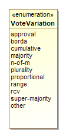
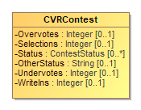
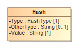
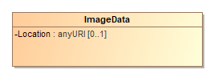
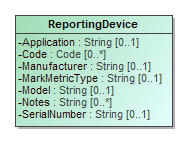

# National Institute of Standards and Technology (NIST) Special Publication 1500-103, Cast Vote Records Common Data Format Specification Version 1.0

**March 2020**

**The following is an excerpt from the SP 1500-103 specification. It contains the specification's executive summary and class documentation.**

The complete publication including JSON and XML schemas is available free of charge from:

<https://github.com/usnistgov/CastVoteRecords>

# Executive Summary

This document presents an interoperable, common data format specification for cast vote records (CVR), which are produced by vote-capture devices such as ballot scanners.  A CVR is an electronic record of a voter’s selections, with usually one CVR created per sheet (page) of a ballot.  Election results are produced by tabulating the collection of CVRs, and audits can be done by comparisons of the paper ballots or paper records of voter selections against the CVRs.

This specification supports three general use cases for CVRs:

- Interoperable exports of CVRs from devices such as scanners for import into tabulators, election management systems (EMS), or auditing systems.
- Interoperable exports of aggregated collections of CVRs from aggregating devices such as election management systems.
- Update of CVRs after adjudication.

The purpose of this specification is to provide an interoperable, non-proprietary data exchange format in JavaScript Object Notation (JSON) and eXtensible Markup Language (XML) for CVRs so as to promote greater transparency to voting records produced by vote-capture devices, and to facilitate the exchange of CVRs with other devices that operate upon CVRs regardless of device manufacturer.

The specification includes a UML (Unified Markup Language) model and references XML (eXtensible Markup Language) and JSON (JavaScript Object Notation) schemas that were created from the UML model.

There are many complex operations performed by voting devices when voters submit their paper ballots to be scanned.  These operations are mostly invisible to voters but are necessary to determine whether contest selections have been marked adequately and whether voter intent is reflected by what is marked on the ballot.  This specification includes the necessary detail to capture these operations so that CVRs can be better audited and adjudicated as necessary to include write-in candidates or other issues.

This specification is geared towards the following audiences:

- Election officials
- Voting equipment manufacturers
- Election analysts and auditors
- Election-affiliated organizations
- The public

# Table of Contents

- Table of Contents
  - Enumerations
    - *The **[AllocationStatus](#_18_5_3_43701b0_1533322047899_321573_5682)** Enumeration*
    - *The **[CastVoteRecordVersion](#_18_0_2_6340208_1488984734564_983877_4662)** Enumeration*
    - *The **[ContestSelectionStatus](#_18_0_5_43401a7_1475850153090_186243_4311)** Enumeration*
    - *The **[ContestStatus](#_18_0_5_43401a7_1475850124791_123384_4291)** Enumeration*
    - *The **[CVRStatus](#_18_0_2_6340208_1472159006307_546162_4628)** Enumeration*
    - *The **[CVRType](#_18_0_2_6340208_1532543997676_592413_4694)** Enumeration*
    - *The **[HashType](#_18_0_2_6340208_1485894679180_11599_4655)** Enumeration*
    - *The **[IdentifierType](#_17_0_2_4_f71035d_1425061188508_163854_2613)** Enumeration*
    - *The **[IndicationStatus](#_19_0_43701b0_1541430872294_37549_5007)** Enumeration*
    - *The **[PositionStatus](#_18_0_2_6340208_1485894157707_572874_4551)** Enumeration*
    - *The **[ReportingUnitType](#_17_0_2_4_f71035d_1431607637366_785815_2242)** Enumeration*
    - *The **[ReportType](#_18_0_5_43401a7_1483727563257_179426_4343)** Enumeration*
    - *The **[VoteVariation](#_18_0_5_43401a7_1483727021192_184103_4291)** Enumeration*
  - Classes
    - *The **[Annotation](#_18_0_5_43401a7_1475856712376_208252_4416)** Class*
    - *The **[BallotMeasureContest](#_17_0_2_4_78e0236_1389366932057_929676_2783)** Class*
    - *The **[BallotMeasureSelection](#_17_0_2_4_78e0236_1389372163799_981952_2926)** Class*
    - *The **[Candidate](#_17_0_2_4_78e0236_1389366272694_544359_2440)** Class*
    - *The **[CandidateContest](#_17_0_2_4_78e0236_1389366970084_183781_2806)** Class*
    - *The **[CandidateSelection](#_17_0_2_4_d420315_1392145640524_831493_2562)** Class*
    - *The **[CastVoteRecordReport](#_17_0_2_4_78e0236_1389366195564_913164_2300)** Class*
    - *The **[Code](#_17_0_2_4_f71035d_1430405712653_451634_2410)** Class*
    - *The **[Contest](#_17_0_2_4_78e0236_1389366251994_876831_2400)** Class*
    - *The **[ContestSelection](#_17_0_2_4_78e0236_1389372124445_11077_2906)** Class*
    - *The **[CVR](#_18_0_2_6340208_1532543460307_914551_4600)** Class*
    - *The **[CVRContest](#_18_0_2_6340208_1469203058990_306165_4565)** Class*
    - *The **[CVRContestSelection](#_18_0_5_43401a7_1474452890357_299022_4292)** Class*
    - *The **[CVRSnapshot](#_17_0_2_4_78e0236_1389366224561_797289_2360)** Class*
    - *The **[CVRWriteIn](#_18_0_2_6340208_1485892911278_166697_4594)** Class*
    - *The **[Election](#_17_0_2_4_f71035d_1426101822599_430942_2209)** Class*
    - *The **[File](#_18_0_2_6340208_1485284639717_497586_4548)** Class*
    - *The **[FractionalNumber](#_19_0_43701b0_1556049559972_974781_5102)** Class*
    - *The **[GpUnit](#_17_0_2_4_78e0236_1389366233346_42391_2380)** Class*
    - *The **[Hash](#_18_0_2_6340208_1485894593826_736413_4615)** Class*
    - *The **[Image](#_18_0_2_6340208_1485284639720_737438_4549)** Class*
    - *The **[ImageData](#_18_0_2_6340208_1485894533655_402033_4588)** Class*
    - *The **[Party](#_17_0_2_4_78e0236_1389366278128_412819_2460)** Class*
    - *The **[PartyContest](#_17_0_2_4_d420315_1393514218965_55008_3144)** Class*
    - *The **[PartySelection](#_17_0_2_4_f71035d_1426519980658_594892_2511)** Class*
    - *The **[ReportingDevice](#_17_0_2_4_78e0236_1389798013459_389380_4178)** Class*
    - *The **[RetentionContest](#_18_0_2_6340208_1425646217522_163181_4554)** Class*
    - *The **[SelectionPosition](#_18_0_2_6340208_1485892992407_492157_4635)** Class*

## Enumerations

### *The **AllocationStatus** Enumeration*

Used in [SelectionPosition](#_18_0_2_6340208_1485892992407_492157_4635)::[IsAllocable](#_18_0_2_6340208_1532546142492_921207_4764) to indicate whether the [SelectionPosition](#_18_0_2_6340208_1485892992407_492157_4635)::[NumberVotes](#_18_0_2_6340208_1485892992408_339917_4637) should be allocated to the underlying contest option counter.

Name | Value
---- | -----
`no`|To not allocate votes to the contest option's accumulator.
`unknown`|When the decision to allocate votes is unknown, such as when the adjudication is needed.
`yes`|To allocate votes to the contest option's accumulator.

### *The **CastVoteRecordVersion** Enumeration*

To identify the version of the CVR specification being used, i.e., version 1.0.0. This will need to be updated for different versions of the specification.

Name | Value
---- | -----
`1.0.0`|Fixed value for the version of this specification.

### *The **ContestSelectionStatus** Enumeration*

Used in [CVRContestSelection](#_18_0_5_43401a7_1474452890357_299022_4292)::[Status](#_18_0_5_43401a7_1475850275266_189599_4334) to identify the status of a contest selection in the CVR.

Name | Value
---- | -----
`generated-rules`|To indicate that the contest selection was generated per contest rules.
`invalidated-rules`|To indicate that the contest selection was invalidated by the generating device because of contest rules.
`needs-adjudication`|To indicate that the contest selection was flagged by the generating device for adjudication.
`other`|Used in conjunction with CVRContestSelection::OtherStatus when no other value in this enumeration applies.

### *The **ContestStatus** Enumeration*

Used in [CVRContest](#_18_0_2_6340208_1469203058990_306165_4565)::[Status](#_18_0_5_43401a7_1475850227700_908488_4330) to identify the status of a contest in which contest selection(s) were made.

Name | Value
---- | -----
`invalidated-rules`|To indicate that the contest has been invalidated by the generating device because of contest rules.
`not-indicated`|For a CVRContest with no SelectionPosition, i.e. to specify the position contains no marks or other indications.
`overvoted`|To indicate that the contest was overvoted.
`undervoted`|To indicate that the contest was undervoted.
`other`|Used in conjunction with CVRContest::OtherStatus when no other value in this enumeration applies.

### *The **CVRStatus** Enumeration*

Used in [CVRSnapshot](#_17_0_2_4_78e0236_1389366224561_797289_2360)::[Status](#_18_0_2_6340208_1472158928951_402259_4603) to identify the status of the CVR.

Name | Value
---- | -----
`needs-adjudication`|To indicate that the CVR needs to be adjudicated.
`other`|Used in conjunction with CVRSnapshot::OtherStatus when no other value in this enumeration applies.

### *The **CVRType** Enumeration*

Used in [CVRSnapshot](#_17_0_2_4_78e0236_1389366224561_797289_2360)::[Type](#_18_0_2_6340208_1532543968111_779654_4689) to indicate the type of snapshot.

Name | Value
---- | -----
`interpreted`|Has been adjudicated.
`modified`|After contest rules applied.
`original`|As scanned, no contest rules applied.

### *The **HashType** Enumeration*

Used in [Hash](#_18_0_2_6340208_1485894593826_736413_4615)::[Type](#_18_0_2_6340208_1485894641846_811323_4646) to indicate the type of hash being used for an image file.

Name | Value
---- | -----
`md6`|To indicate that the MD6 message digest algorithm is being used.
`sha-256`|To indicate that the SHA 256-bit signature is being used.
`sha-512`|To indicate that the SHA 512-bit (32-byte) signature is being used.
`other`|Used in conjunction with Hash::OtherType when no other value in this enumeration applies.

### *The **IdentifierType** Enumeration*

Used in [Code](#_17_0_2_4_f71035d_1430405712653_451634_2410)::[Type](#_17_0_2_4_f71035d_1430405763078_743585_2433) to indicate the type of code/identifier being used.

Name | Value
---- | -----
`fips`|To indicate that the identifier is a FIPS code.
`local-level`|To indicate that the identifier is from a local-level scheme, i.e., unique to a county or city.
`national-level`|To indicate that the identifier is from a national-level scheme other than FIPS or OCD-ID.
`ocd-id`|To indicate that the identifier is from the OCD-ID scheme.
`state-level`|To indicate that the identifier is from a state-level scheme, i.e., unique to a particular state.
`other`|Used in conjunction with Code::OtherType when no other value in this enumeration applies.

### *The **IndicationStatus** Enumeration*

Used in [SelectionPosition](#_18_0_2_6340208_1485892992407_492157_4635)::[HasIndication](#_19_0_43701b0_1541095481007_618279_4996) to identify whether a selection indication is present.

Name | Value
---- | -----
`no`|There is no selection indication.
`unknown`|It is unknown whether there is a selection indication, e.g., used for ambiguous marks.
`yes`|There is a selection indication present.

### *The **PositionStatus** Enumeration*

Used in [SelectionPosition](#_18_0_2_6340208_1485892992407_492157_4635)::[Status](#_18_0_2_6340208_1485892992408_985925_4639) to identify the status of a selection indication.

Name | Value
---- | -----
`adjudicated`|Used if the indication was adjudicated.
`generated-rules`|Used if the indication was generated by the creating device per contest rules.
`invalidated-rules`|Used if the indication was invalidated by the creating device because of contest rules.
`other`|Used in conjunction with SelectionPosition::OtherStatus when no other value in this enumeration applies.

### *The **ReportingUnitType** Enumeration*

Used in [GpUnit](#_17_0_2_4_78e0236_1389366233346_42391_2380)::[Type](#_17_0_2_4_78e0236_1389713376966_77071_2393) to indicate a type of political geography.

Name | Value
---- | -----
`combined-precinct`|To indicate a combined precinct.
`polling-place`|To indicate a polling place.
`precinct`|To indicate a precinct.
`split-precinct`|To indicate a split-precinct.
`vote-center`|To indicate a vote-center.
`other`|Used in conjunction with GpUnit::OtherType when no other value in this enumeration applies.

### *The **ReportType** Enumeration*

Used in [CastVoteRecordReport](#_17_0_2_4_78e0236_1389366195564_913164_2300)::[ReportType](#_18_0_5_43401a7_1483727759336_770912_4370) to indicate the type of the CVR report.

Name | Value
---- | -----
`adjudicated`|To indicate that the report contains adjudications.
`aggregated`|To indicate that the report is an aggregation of device reports.
`originating-device-export`|To indicate that the report is an export from a device such as a scanner.
`rcv-round`|To indicate that the report is the result of a ranked choice voting round.
`other`|Used in conjunction with CastVoteRecordReport::OtherReportType when no other value in this enumeration applies.

### *The **VoteVariation** Enumeration*

Used in [Contest](#_17_0_2_4_78e0236_1389366251994_876831_2400)::[VoteVariation](#_18_0_5_43401a7_1483727343854_246701_4334) to indicate the vote variation (vote method) used to tabulate the contest.

Name | Value
---- | -----
`approval`|To indicate approval voting.
`borda`|To indicate the borda count method.
`cumulative`|To indicate cumulative voting.
`majority`|To indicate majority voting.
`n-of-m`|To indicate the N of M voting method.
`plurality`|To indicate plurality voting.
`proportional`|To indicate proportional voting.
`range`|To indicate range voting.
`rcv`|To indicate Ranked Choice Voting (RCV).
`super-majority`|To indicate the super majority voting method.
`other`|Used in conjunction with Contest::OtherVoteVariation when no other value in this enumeration applies.

## Classes

### *The **Annotation** Class*

[Annotation](#_18_0_5_43401a7_1475856712376_208252_4416) is used to record annotations made by one or more adjudicators.
[CVRSnapshot](#_17_0_2_4_78e0236_1389366224561_797289_2360) includes Annotation.

Attribute | Multiplicity | Type | Attribute Description
--------- | ------------ | ---- | ---------------------
`AdjudicatorName`|0..*|`String`|The name(s) of the adjudicator(s).
`Message`|0..*|`String`|A message created by the adjudicator(s).
`TimeStamp`|0..1|`dateTime`|The date and time of the annotation.

### *The **BallotMeasureContest** Class*

[BallotMeasureContest](#_17_0_2_4_78e0236_1389366932057_929676_2783) is a subclass of [Contest](#_17_0_2_4_78e0236_1389366251994_876831_2400) and is used to identify the type of contest as involving one or more ballot measures. It inherits attributes from [Contest](#_17_0_2_4_78e0236_1389366251994_876831_2400).

### *The **BallotMeasureSelection** Class*

[BallotMeasureSelection](#_17_0_2_4_78e0236_1389372163799_981952_2926) is a subclass of [ContestSelection](#_17_0_2_4_78e0236_1389372124445_11077_2906) and is used for ballot measures. The voter's selected response to the contest selection (e.g., "yes" or "no") may be in English or other languages as utilized on the voter's ballot.

Attribute | Multiplicity | Type | Attribute Description
--------- | ------------ | ---- | ---------------------
`Selection`|1|`String`|The voter's selection, i.e., 'yes' or 'no', in English or in other languages as utilized on the voter's ballot.

### *The **Candidate** Class*

[Candidate](#_17_0_2_4_78e0236_1389366272694_544359_2440) identifies a candidate in a contest on the voter's ballot. [Election](#_17_0_2_4_f71035d_1426101822599_430942_2209) includes instances of [Candidate](#_17_0_2_4_78e0236_1389366272694_544359_2440) for each candidate in a contest; typically, only those candidates who received votes would be included.

Attribute | Multiplicity | Type | Attribute Description
--------- | ------------ | ---- | ---------------------
`Code`|0..*|`Code`|A code or identifier associated with the candidate.
`Name`|0..1|`String`|Candidate's name as listed on the ballot.
`{Party}`|0..1|`Party`|The party associated with the candidate.

### *The **CandidateContest** Class*

[CandidateContest](#_17_0_2_4_78e0236_1389366970084_183781_2806) is a subclass of [Contest](#_17_0_2_4_78e0236_1389366251994_876831_2400) and is used to identify the type of contest as involving one or more candidates. It inherits attributes from [Contest](#_17_0_2_4_78e0236_1389366251994_876831_2400).

Attribute | Multiplicity | Type | Attribute Description
--------- | ------------ | ---- | ---------------------
`NumberElected`|0..1|`Integer`|The number of candidates to be elected in the contest.
`{PrimaryParty}`|0..1|`Party`|The party associated with the contest, if a partisan primary.
`VotesAllowed`|0..1|`Integer`|The number of votes allowed in the contest, e.g., 3 for a 'choose 3 of 5 candidates' contest.

### *The **CandidateSelection** Class*

[CandidateSelection](#_17_0_2_4_d420315_1392145640524_831493_2562) is a subclass of [ContestSelection](#_17_0_2_4_78e0236_1389372124445_11077_2906) and is used for candidates, including for write-in candidates.

Attribute | Multiplicity | Type | Attribute Description
--------- | ------------ | ---- | ---------------------
`{Candidate}`|0..*|`Candidate`|The candidate associated with the contest selection. For contests involving a ticket of multiple candidates, an ordered list of candidates as they appeared on the ballot would be created.
`IsWriteIn`|0..1|`Boolean`|A flag to indicate if the candidate selection is associated with a write-in.

### *The **CastVoteRecordReport** Class*

The root class/element; attributes pertain to the status and format of the report and when created.

[CastVoteRecordReport](#_17_0_2_4_78e0236_1389366195564_913164_2300) includes multiple instances of [CVR](#_18_0_2_6340208_1532543460307_914551_4600), one per [CVR](#_18_0_2_6340208_1532543460307_914551_4600) or sheet of a multi-page cast vote record. [CastVoteRecordReport](#_17_0_2_4_78e0236_1389366195564_913164_2300) also includes multiple instances of [Contest](#_17_0_2_4_78e0236_1389366251994_876831_2400), typically only for those contests that were voted so as to reduce file size. The [Contest](#_17_0_2_4_78e0236_1389366251994_876831_2400) instances are later referenced by other classes to link them to contest options that were voted and the indication(s)/mark(s) made.

Attribute | Multiplicity | Type | Attribute Description
--------- | ------------ | ---- | ---------------------
`{CVR}`|0..*|`CVR`|Used to include instances of [CVR](#_18_0_2_6340208_1532543460307_914551_4600) classes, one per cast vote record in the report.
`{Election}`|1..*|`Election`|Used to include the election(s) associated with the CVRs.
`GeneratedDate`|1|`dateTime`|Identifies the time that the election report was created.
`{GpUnit}`|1..*|`GpUnit`|Used to include the political geography, i.e., location, for where the cast vote record report was created and for linking cast vote records to their corresponding precinct or split (or otherwise smallest unit).
`Notes`|0..1|`String`|Notes that can be added as appropriate, presumably by an adjudicator.
`{Party}`|0..*|`Party`|The party associated with the ballot sheet for a partisan primary.
`{ReportGeneratingDevice}`|1..*|`ReportingDevice`|Identifies the device used to create the CVR report.
`{ReportingDevice}`|1..*|`ReportingDevice`|The device creating the report. The reporting device need not necessarily be the creating device, i.e., for an aggregated report, the reporting device could be an EMS used to aggregate and tabulate cast vote records.
`ReportType`|0..*|`ReportType`|The type of report, using the [ReportType](#_18_0_5_43401a7_1483727563257_179426_4343) enumeration.
`OtherReportType`|0..1|`String`|If [ReportType](#_18_0_5_43401a7_1483727759336_770912_4370) is 'other', this contains the report type.
`Version`|1|`CastVoteRecordVersion`|The version of the CVR specification being used (1.0).

### *The **Code** Class*

[Code](#_17_0_2_4_f71035d_1430405712653_451634_2410) is used in [Election](#_17_0_2_4_f71035d_1426101822599_430942_2209), [GpUnit](#_17_0_2_4_78e0236_1389366233346_42391_2380), [Contest](#_17_0_2_4_78e0236_1389366251994_876831_2400), [Candidate](#_17_0_2_4_78e0236_1389366272694_544359_2440), and [Party](#_17_0_2_4_78e0236_1389366278128_412819_2460) to identify an associated code as well as the type of code.

Attribute | Multiplicity | Type | Attribute Description
--------- | ------------ | ---- | ---------------------
`Label`|0..1|`String`|A label associated with the code, used as needed.
`Type`|1|`IdentifierType`|Used to indicate the type of code, from the [IdentifierType](#_17_0_2_4_f71035d_1425061188508_163854_2613) enumeration.
`OtherType`|0..1|`String`|If [Type](#_17_0_2_4_f71035d_1430405763078_743585_2433) is 'other', the type of code.
`Value`|1|`String`|The value of the code, i.e., the identifier.

### *The **Contest** Class*

[Contest](#_17_0_2_4_78e0236_1389366251994_876831_2400) represents a contest on the ballot. [CastVoteRecordReport](#_17_0_2_4_78e0236_1389366195564_913164_2300) initially includes an instance of [Contest](#_17_0_2_4_78e0236_1389366251994_876831_2400) for each contest on the ballot.  Other classes can subsequently reference the instances as necessary to link together items on the cast vote record, such as a contest, its voted contest selection(s), and the mark(s) associated with the selection(s).

[Contest](#_17_0_2_4_78e0236_1389366251994_876831_2400) has three subclasses, each used for a specific type of contest:   These subclasses inherit Contest's attributes.

 *  [PartyContest](#_17_0_2_4_d420315_1393514218965_55008_3144) \- used for straight party contests,
 *  [BallotMeasureContest](#_17_0_2_4_78e0236_1389366932057_929676_2783) \- used for contests, and
 *  [CandidateContest](#_17_0_2_4_78e0236_1389366970084_183781_2806) \- used for candidate contests.

Attribute | Multiplicity | Type | Attribute Description
--------- | ------------ | ---- | ---------------------
`Abbreviation`|0..1|`String`|An abbreviation associated with the contest.
`Code`|0..*|`Code`|A code or identifier used for this contest.
`{ContestSelection}`|1..*|`ContestSelection`|Identifies the contest selections in the contest.
`Name`|0..1|`String`|Title or name of the contest, e.g., "Governor" or "Question on Legalization of Gambling".
`VoteVariation`|0..1|`VoteVariation`|The vote variation for this contest, from the [VoteVariation](#_18_0_5_43401a7_1483727021192_184103_4291) enumeration.
`OtherVoteVariation`|0..1|`String`|If [VoteVariation](#_18_0_5_43401a7_1483727343854_246701_4334) is 'other', the vote variation for this contest.

### *The **ContestSelection** Class*

[ContestSelection](#_17_0_2_4_78e0236_1389372124445_11077_2906) represents a contest selection in a contest.  [Contest](#_17_0_2_4_78e0236_1389366251994_876831_2400) can include an instance of [ContestSelection](#_17_0_2_4_78e0236_1389372124445_11077_2906) for each contest selection in the contest or, as desired, all contest selections.  

ContestSelection has three subclasses, each used for a specific type of contest selection:

 *  [BallotMeasureSelection](#_17_0_2_4_78e0236_1389372163799_981952_2926) \- used for ballot measures,
 *  [CandidateSelection](#_17_0_2_4_d420315_1392145640524_831493_2562) \- used for candidate selections, and
 *  [PartySelection](#_17_0_2_4_f71035d_1426519980658_594892_2511) \- used for straight party selections.

Instances of [CVRContestSelection](#_18_0_5_43401a7_1474452890357_299022_4292) subsequently link to the contest selections as needed so as to tie together the contest, the contest selection, and the mark(s) made for the contest selection.

[ContestSelection](#_17_0_2_4_78e0236_1389372124445_11077_2906) contains one attribute, [Code](#_18_5_3_43701b0_1534269642876_463463_5873), that can be used to identify the contest selection and thereby eliminate the need to identify it using the subclasses.

Attribute | Multiplicity | Type | Attribute Description
--------- | ------------ | ---- | ---------------------
`Code`|0..*|`Code`|Code used to identify the contest selection.

### *The **CVR** Class*

[CVR](#_18_0_2_6340208_1532543460307_914551_4600) constitutes a cast vote record, generated by a ballot scanning device, containing indications of contests and contest options chosen by the voter, as well as other information for auditing and annotation purposes. Each sheet of a multi-page paper ballot is represented by an individual [CVR](#_18_0_2_6340208_1532543460307_914551_4600), e.g., if all sheets of a 5-sheet ballot are scanned, 5 CVRs will be created. [CastVoteRecordReport](#_17_0_2_4_78e0236_1389366195564_913164_2300) includes multiple instances of [CVR](#_18_0_2_6340208_1532543460307_914551_4600) as applicable.

Attribute | Multiplicity | Type | Attribute Description
--------- | ------------ | ---- | ---------------------
`BallotAuditId`|0..1|`String`|A unique identifier for this CVR, used to link the CVR with the corresponding audit record, e.g., a paper ballot. This identifier may be impressed on the corresponding audit record as it is scanned, or otherwise associated with the corresponding ballot.
`BallotImage`|0..*|`ImageData`|An image of the ballot sheet created by the scanning device.
`BallotPrePrintedId`|0..1|`String`|A unique identifier for the ballot (or sheet of a multi-sheet ballot) that this CVR represents, used if ballots are pre-marked with unique identifiers. If provided, this number would be the same on all CVRs that represent individual sheets from the same multi-sheet ballot. This identifier is not the same as one that may be impressed on the corresponding ballot as it is scanned or otherwise associated with the corresponding ballot; see the [BallotAuditId](#_18_0_2_6340208_1469207550920_513772_4736) attribute.
`BallotSheetId`|0..1|`String`|A unique number for the ballot (or sheet of a multi-sheet ballot) that this CVR represents, used if ballots are pre-marked with unique numbers. If provided, this number would be the same on all CVRs that represent individual sheets from the same multi-sheet ballot. This number is not the same as one that may be impressed on the corresponding ballot as it is scanned or otherwise associated with the corresponding ballot; see the [BallotAuditId](#_18_0_2_6340208_1469207550920_513772_4736) attribute.
`BallotStyleId`|0..1|`String`|An identifier of the ballot style associated with the corresponding ballot.
`{BallotStyleUnit}`|0..1|`GpUnit`|Identifies the smallest unit of geography associated with the corresponding ballot, typically a precinct or split-precinct.
`BatchId`|0..1|`String`|The identifier for the batch that includes this CVR.
`BatchSequenceId`|0..1|`Integer`|The sequence number of the corresponding paper ballot within a batch.
`{CreatingDevice}`|0..1|`ReportingDevice`|Identifies the device that created the CVR.
`{CurrentSnapshot}`|1|`CVRSnapshot`|Identifies the snapshot that is currently tabulatable.
`{CVRSnapshot}`|1..*|`CVRSnapshot`|Identifies the repeatable portion of the CVR that links to contest selections and related information.
`{Election}`|1|`Election`|Used to identify an election with which the CVR is associated.
`{Party}`|0..*|`Party`|Identifies the party associated with a CVR, typically for partisan primaries.
`UniqueId`|0..1|`String`|The sequence number for this CVR. This represents the ordinal number that this CVR was processed by the tabulating device.

### *The **CVRContest** Class*

[CVRContest](#_18_0_2_6340208_1469203058990_306165_4565) class is included by [CVRSnapshot](#_17_0_2_4_78e0236_1389366224561_797289_2360) for each contest on the ballot that was voted, that is, whose contest options contain indications that may constitute a vote. [CVRContest](#_18_0_2_6340208_1469203058990_306165_4565) includes [CVRContestSelection](#_18_0_5_43401a7_1474452890357_299022_4292) for each contest option in the contest containing an indication or write-in.

[CVRSnapshot](#_17_0_2_4_78e0236_1389366224561_797289_2360) can also include [CVRContest](#_18_0_2_6340208_1469203058990_306165_4565) for every contest on the ballot regardless of whether any of the contest options contain an indication, for cases where the CVR must include all contests that appeared on the ballot.

[CVRContest](#_18_0_2_6340208_1469203058990_306165_4565) attributes are for including summary information about the contest.

Overvotes plus Undervotes plus TotalVotes must equal the number of votes allowable in the contest, e.g., in a "chose 3 of 5" contest in which the voter chooses only 2, then Overvotes = 0, Undervotes = 1, and TotalVotes = 2, which adds up to the number of votes allowable = 3.

Attribute | Multiplicity | Type | Attribute Description
--------- | ------------ | ---- | ---------------------
`{Contest}`|1|`Contest`|Used to link to an instance of [Contest](#_17_0_2_4_78e0236_1389366251994_876831_2400) specific to the contest at hand, for the purpose of specifying information about the contest such as its contest identifier.
`{CVRContestSelection}`|0..*|`CVRContestSelection`|Used to include information about a contest selection in the contest, including the associated indication(s).
`Overvotes`|0..1|`Integer`|The number of votes lost due to overvoting.
`Selections`|0..1|`Integer`|Used to indicate the number of possible contest selections in the contest.
`Status`|0..*|`ContestStatus`|The status of the contest, e.g., overvoted, undervoted, from the [ContestStatus](#_18_0_5_43401a7_1475850124791_123384_4291) enumeration. If no values apply, use 'other' and include a user-defined status in [OtherStatus](#_18_0_5_43401a7_1475856016959_840864_4388).
`OtherStatus`|0..1|`String`|Used when [Status](#_18_0_5_43401a7_1475850227700_908488_4330) is 'other' to include a user-defined status.
`Undervotes`|0..1|`Integer`|The number of votes lost due to undervoting.
`WriteIns`|0..1|`Integer`|The total number of write-ins in the contest.

### *The **CVRContestSelection** Class*

[CVRContestSelection](#_18_0_5_43401a7_1474452890357_299022_4292) is used to link a contest option containing an indication with information about the indication, such as whether a mark constitutes a countable vote, or whether a mark is determined to be marginal, etc. [CVRContest](#_18_0_2_6340208_1469203058990_306165_4565) includes an instance of [CVRContestSelection](#_18_0_5_43401a7_1474452890357_299022_4292) when an indication for the selection is present, and [CVRContestSelection](#_18_0_5_43401a7_1474452890357_299022_4292) then includes [SelectionPosition](#_18_0_2_6340208_1485892992407_492157_4635) for each indication present. To tie the indication to the specific contest selection, [CVRContestSelection](#_18_0_5_43401a7_1474452890357_299022_4292) links to an instance of [ContestSelection](#_17_0_2_4_78e0236_1389372124445_11077_2906) that has previously been included by [Contest](#_17_0_2_4_78e0236_1389366251994_876831_2400).

Since multiple indications per contest option are possible for some voting methods, [CVRContestSelection](#_18_0_5_43401a7_1474452890357_299022_4292) can include multiple instances of [SelectionPosition](#_18_0_2_6340208_1485892992407_492157_4635), one per indication. [CVRContestSelection](#_18_0_5_43401a7_1474452890357_299022_4292) can also be used for the purpose of including, in the CVR, all contest options in the contest regardless of whether indications are present. In this case, CVRContestSelection would not include [SelectionPosition](#_18_0_2_6340208_1485892992407_492157_4635) if no indication is present but would link to the appropriate instance of [ContestSelection](#_17_0_2_4_78e0236_1389372124445_11077_2906).

Attribute | Multiplicity | Type | Attribute Description
--------- | ------------ | ---- | ---------------------
`{ContestSelection}`|0..1|`ContestSelection`|Used to link to an instance of a contest selection that was previously included by [Contest](#_17_0_2_4_78e0236_1389366251994_876831_2400).
`OptionPosition`|0..1|`Integer`|Used to include the ordinal position of the contest option as it appeared on the ballot.
`Rank`|0..1|`Integer`|For the RCV voting variation, the rank chosen by the voter, for when a contest selection can represent a ranking.
`{SelectionPosition}`|1..*|`SelectionPosition`|Used to include further information about the indication/mark associated with the contest selection. Depending on the voting method, multiple indications/marks per selection may be possible.
`Status`|0..*|`ContestSelectionStatus`|Contains the status of the contest selection, e.g., 'needs-adjudication' for a contest requiring adjudication, using values from the [ContestSelectionStatus](#_18_0_5_43401a7_1475850153090_186243_4311) enumeration. If no values apply, use 'other' and include a user-defined status in [OtherStatus](#_18_0_5_43401a7_1475855963037_920235_4384).
`OtherStatus`|0..1|`String`|Used when [Status](#_18_0_5_43401a7_1475850275266_189599_4334) is 'other' to include a user-defined status.
`TotalFractionalVotes`|0..1|`FractionalNumber`|For cumulative or range and other similar voting variations, contains the total proper fractional number of votes across all indications/marks.
`TotalNumberVotes`|0..1|`Integer`|For cumulative or range and other similar voting variations, contains the total number of votes across all indications/marks.

### *The **CVRSnapshot** Class*

[CVRSnapshot](#_17_0_2_4_78e0236_1389366224561_797289_2360) contains a version of the contest selections for a CVR; there can be multiple versions of [CVRSnapshot](#_17_0_2_4_78e0236_1389366224561_797289_2360) within the same CVR. Type specifies the type of the snapshot, i.e., whether interpreted by the scanner according to contest rules, modified as a result of adjudication, or the original, that is, the version initially scanned before contest rules are applied. [CVR](#_18_0_2_6340208_1532543460307_914551_4600) includes [CVRSnapshot](#_17_0_2_4_78e0236_1389366224561_797289_2360).

Other attributes are repeated in each [CVRSnapshot](#_17_0_2_4_78e0236_1389366224561_797289_2360) because they may differ across snapshots, e.g., the contests could be different as well as other status.

Attribute | Multiplicity | Type | Attribute Description
--------- | ------------ | ---- | ---------------------
`{Annotation}`|0..*|`Annotation`|Used to include an annotation associated with the CVR snapshot.
`{CVRContest}`|0..*|`CVRContest`|Identifies the contests in the CVR.
`Status`|0..*|`CVRStatus`|The status of the CVR.
`OtherStatus`|0..1|`String`|When [Status](#_18_0_2_6340208_1472158928951_402259_4603) is 'other', contains the ballot status.
`Type`|1|`CVRType`|The type of the snapshot, e.g., original.

### *The **CVRWriteIn** Class*

[CVRWriteIn](#_18_0_2_6340208_1485892911278_166697_4594) is used when the contest selection is a write-in. It has attributes for the image or text of the write-in.

Attribute | Multiplicity | Type | Attribute Description
--------- | ------------ | ---- | ---------------------
`Text`|0..1|`String`|Used for the text of the write-in, typically present when the CVR has been created by electronic ballot marking equipment.
`WriteInImage`|0..1|`ImageData`|Used for an image of the write-in, typically made by a scanner when scanning a paper ballot.

### *The **Election** Class*

[Election](#_17_0_2_4_f71035d_1426101822599_430942_2209) defines instances of the [Contest](#_17_0_2_4_78e0236_1389366251994_876831_2400) and [Candidate](#_17_0_2_4_78e0236_1389366272694_544359_2440) classes so that they can be later referenced in CVR classes. [Election](#_17_0_2_4_f71035d_1426101822599_430942_2209) includes an instance of [Contest](#_17_0_2_4_78e0236_1389366251994_876831_2400) for each contest in the election and includes an instance of [Candidate](#_17_0_2_4_78e0236_1389366272694_544359_2440) for each candidate. This is done to utilize file sizes more efficiently; otherwise each CVR would need to define these instances separately and much duplication would occur.

Attribute | Multiplicity | Type | Attribute Description
--------- | ------------ | ---- | ---------------------
`{Candidate}`|0..*|`Candidate`|Used to establish a collection of candidate definitions that will be referenced by the CVRs. The contests in each CVR will reference the candidate definitions.
`Code`|0..*|`Code`|Used for a code associated with the election, e.g., a precinct identifier if the election scope is a precinct.
`{Contest}`|1..*|`Contest`|Used for establishing a collection of contest definitions that will be referenced by the CVRs.
`{ElectionScope}`|1|`GpUnit`|Used to identify the election scope, i.e., the political geography corresponding to the election.
`Name`|0..1|`String`|A text string identifying the election.

### *The **File** Class*

Used to hold the contents of a file or identify a file created by the scanning device. The file generally would contain an image of the scanned ballot or an image of a write-in entered by a voter onto the scanned ballot. SubClass [Image](#_18_0_2_6340208_1485284639720_737438_4549) is used if the file contains an image.

Attribute | Multiplicity | Type | Attribute Description
--------- | ------------ | ---- | ---------------------
`Data`|1|`base64Binary`|Contains the base64 binary contents of the file.
`FileName`|0..1|`String`|Contains the name of the file or an identifier of the file.
`MimeType`|0..1|`String`|The mime type of the file, e.g., image/jpeg.

### *The **FractionalNumber** Class*

A proper fractional value, represented using fractional or decimal notation.

Attribute | Multiplicity | Type | Attribute Description
--------- | ------------ | ---- | ---------------------
`pattern`||`String`|Pattern describing the allowed values for a [FractionalNumber](#_19_0_43701b0_1556049559972_974781_5102).

### *The **GpUnit** Class*

Used for identifying a geographical unit for various purposes, including:

 *  The reporting unit of the report generation device, e.g., a precinct location of a scanner that generates the collection of CVRs,
 *  The geographical scope of the election, or the unit of geography associated with an individual CVR.

[CastVoteRecordReport](#_17_0_2_4_78e0236_1389366195564_913164_2300) includes instances of [GpUnit](#_17_0_2_4_78e0236_1389366233346_42391_2380) as needed. [Election](#_17_0_2_4_f71035d_1426101822599_430942_2209) references [GpUnit](#_17_0_2_4_78e0236_1389366233346_42391_2380) as [ElectionScope](#_18_2_43401a7_1450723692857_875635_4654), for the geographical scope of the election.  [CVR](#_18_0_2_6340208_1532543460307_914551_4600) CastVoteRecordReport includes instances of GpUnit as needed. Election references GpUnit as ElectionScope, for the geographical scope of the election.  CVR references GpUnit as BallotStyleUnit to link a CVR to the smallest political subdivision that uses the same ballot style as was used for the voter’s ballot.

Attribute | Multiplicity | Type | Attribute Description
--------- | ------------ | ---- | ---------------------
`Code`|0..*|`Code`|A code associated with the geographical unit.
`Name`|0..1|`String`|Name of the geographical unit.
`{ReportingDevice}`|0..*|`ReportingDevice`|The collection of cast vote records associated with the reporting unit and the reporting device.
`Type`|1|`ReportingUnitType`|Contains the type of geographical unit, e.g., precinct, split-precinct, vote center, using values from the [ReportingUnitType](#_17_0_2_4_f71035d_1431607637366_785815_2242) enumeration. If no values apply, use 'other' and include a user-defined type in [OtherType](#_17_0_2_4_f71035d_1426007519161_685921_2510).
`OtherType`|0..1|`String`|Used when [Type](#_17_0_2_4_78e0236_1389713376966_77071_2393) is 'other' to include a user-defined type.

### *The **Hash** Class*

[Hash](#_18_0_2_6340208_1485894593826_736413_4615) is used to specify a hash associated with a file such as an image file of a scanned ballot.

Attribute | Multiplicity | Type | Attribute Description
--------- | ------------ | ---- | ---------------------
`Type`|1|`HashType`|The type of the hash, from the [HashType](#_18_0_2_6340208_1485894679180_11599_4655) enumeration.
`OtherType`|0..1|`String`|If [Type](#_18_0_2_6340208_1485894641846_811323_4646) is 'other', the type of the hash.
`Value`|1|`String`|The hash value, encoded as a string.

### *The **Image** Class*

Used by [File](#_18_0_2_6340208_1485284639717_497586_4548) for a file containing an image, e.g., an image of a write-in on a paper ballot.

### *The **ImageData** Class*

[ImageData](#_18_0_2_6340208_1485894533655_402033_4588) is used to specify an image file such as for a write-in or the entire ballot.  It works with several other classes, as follows:

 *  [File](#_18_0_2_6340208_1485284639717_497586_4548) with SubClass [Image](#_18_0_2_6340208_1485284639720_737438_4549) – to contain either a filename for an external file or the file contents, and
 *  [Hash](#_18_0_2_6340208_1485894593826_736413_4615) – to contain cryptographic hash function data for the file.

Attribute | Multiplicity | Type | Attribute Description
--------- | ------------ | ---- | ---------------------
`{Hash}`|0..1|`Hash`|A hash value for the image data, used for verification comparisons against subsequent copies of the image.
`{Image}`|0..1|`Image`|The image of an individual ballot sheet created by the scanner, could possibly include both sides of a two-sided ballot sheet depending on the scanner's configuration.
`Location`|0..1|`anyURI`|A pointer to the location of the image file.

### *The **Party** Class*

[Party](#_17_0_2_4_78e0236_1389366278128_412819_2460) is used for describing information about a political party associated with the voter's ballot. [CVR](#_18_0_2_6340208_1532543460307_914551_4600) includes instances of [Party](#_17_0_2_4_78e0236_1389366278128_412819_2460) as needed, e.g., for a [CVR](#_18_0_2_6340208_1532543460307_914551_4600) corresponding to a ballot in a partisan primary, and [CandidateContest](#_17_0_2_4_78e0236_1389366970084_183781_2806) references Party as needed to link a candidate to their political party.

Attribute | Multiplicity | Type | Attribute Description
--------- | ------------ | ---- | ---------------------
`Abbreviation`|0..1|`String`|Short name for the party, e.g., "DEM".
`Code`|0..*|`Code`|A code associated with the party.
`Name`|0..1|`String`|Official full name of the party, e.g., "Republican".

### *The **PartyContest** Class*

[PartyContest](#_17_0_2_4_d420315_1393514218965_55008_3144) is a subclass of [Contest](#_17_0_2_4_78e0236_1389366251994_876831_2400) and is used to identify the type of contest as involving a straight party selection. It inherits attributes from [Contest](#_17_0_2_4_78e0236_1389366251994_876831_2400).

### *The **PartySelection** Class*

[PartySelection](#_17_0_2_4_f71035d_1426519980658_594892_2511) is a subclass of [ContestSelection](#_17_0_2_4_78e0236_1389372124445_11077_2906) and is used typically for a contest selection in a straight-party contest.

Attribute | Multiplicity | Type | Attribute Description
--------- | ------------ | ---- | ---------------------
`{Party}`|1..*|`Party`|The party associated with the contest selection.

### *The **ReportingDevice** Class*

[ReportingDevice](#_17_0_2_4_78e0236_1389798013459_389380_4178) is used to specify a voting device as the “political geography” at hand. [CastVoteRecordReport](#_17_0_2_4_78e0236_1389366195564_913164_2300) refers to it as [ReportGeneratingDevice](#_18_0_5_43401a7_1484155960667_232191_4295) and uses it to specify the device that created the CVR report. [CVR](#_18_0_2_6340208_1532543460307_914551_4600) refers to it as [CreatingDevice](#_18_5_3_43701b0_1533931125455_124502_5709) to specify the device that created the CVRs.

Attribute | Multiplicity | Type | Attribute Description
--------- | ------------ | ---- | ---------------------
`Application`|0..1|`String`|The application associated with the reporting device.
`Code`|0..*|`Code`|A code associated with the reporting device.
`Manufacturer`|0..1|`String`|Manufacturer of the reporting device.
`MarkMetricType`|0..1|`String`|The type of metric being used to determine quality. The type must be specific enough that the attached value can be accurately verified later, e.g., 'Acme Mark Density' may be a sufficiently specific type.
`Model`|0..1|`String`|Manufacturer's model of the reporting device.
`Notes`|0..*|`String`|Additional explanatory notes as applicable.
`SerialNumber`|0..1|`String`|Serial number or other identification that can uniquely identify the reporting device.

### *The **RetentionContest** Class*

[RetentionContest](#_18_0_2_6340208_1425646217522_163181_4554) is a subclass of [BallotMeasureContest](#_17_0_2_4_78e0236_1389366932057_929676_2783) and is used to identify the type of contest as involving a retention, such as for a judicial retention. While it is similar to [BallotMeasureContest](#_17_0_2_4_78e0236_1389366932057_929676_2783), it contains a link to [Candidate](#_17_0_2_4_78e0236_1389366272694_544359_2440) that [BallotMeasureContest](#_17_0_2_4_78e0236_1389366932057_929676_2783) does not. [RetentionContest](#_18_0_2_6340208_1425646217522_163181_4554) inherits attributes from [Contest](#_17_0_2_4_78e0236_1389366251994_876831_2400).

Attribute | Multiplicity | Type | Attribute Description
--------- | ------------ | ---- | ---------------------
`{Candidate}`||`Candidate`|Identifies the candidate in the retention contest.

### *The **SelectionPosition** Class*

[CVRContestSelection](#_18_0_5_43401a7_1474452890357_299022_4292) includes [SelectionPosition](#_18_0_2_6340208_1485892992407_492157_4635) to specify a voter's indication/mark in a contest option, and thus, a potential vote. The number of potential SelectionPositions that could be included by [CVRContestSelection](#_18_0_5_43401a7_1474452890357_299022_4292) is the same as the number of ovals next to a particular option. There will be usually 1 instance of [SelectionPosition](#_18_0_2_6340208_1485892992407_492157_4635) for plurality voting, but there could be multiple instances for RCV, approval, cumulative, or other vote variations in which a voter can select multiple options per candidate.

[MarkMetricValue](#_18_0_2_6340208_1488984862414_760136_4710) specifies the measurement of a mark on a paper ballot. The measurement is assigned by the scanner for measurements of mark density or quality and would be used by the scanner to indicate whether the mark is a valid voter mark representing a vote or is marginal.

[SelectionPosition](#_18_0_2_6340208_1485892992407_492157_4635) contains additional information about the mark to specify whether the indication/mark is allocable, as well as information needed for certain voting methods.

[SelectionPosition](#_18_0_2_6340208_1485892992407_492157_4635) includes [CVRWriteIn](#_18_0_2_6340208_1485892911278_166697_4594), whose attributes are used to include information about the write-in including the text of the write-in or an image of the write-in.

Attribute | Multiplicity | Type | Attribute Description
--------- | ------------ | ---- | ---------------------
`Code`|0..*|`Code`|Code used to identify the contest selection position.
`{CVRWriteIn}`|0..1|`CVRWriteIn`|Used to store information regarding a write-in vote.
`FractionalVotes`|0..1|`FractionalNumber`|The proper fractional number of votes represented by the position.
`HasIndication`|1|`IndicationStatus`|Whether there is a selection indication present.
`IsAllocable`|0..1|`AllocationStatus`|Whether this indication should be allocated to the contest option's accumulator.
`IsGenerated`|0..1|`Boolean`|Whether or not the indication was generated, rather than directly made by the voter.
`MarkMetricValue`|0..*|`String`|The value of the mark metric, represented as a string.
`NumberVotes`|1|`Integer`|The number of votes represented by the position, usually 1 but may be more depending on the voting method.
`Position`|0..1|`Integer`|The ordinal position of the selection position within the contest option.
`Rank`|0..1|`Integer`|For the RCV voting variation, the rank chosen by the voter, for when a position can represent a ranking.
`Status`|0..*|`PositionStatus`|Status of the position, e.g., "generated-rules" for generated by the machine, from the [PositionStatus](#_18_0_2_6340208_1485894157707_572874_4551) enumeration. If no values apply, use 'other' and include a user-defined status in OtherStatus.
`OtherStatus`|0..1|`String`|Used when [Status](#_18_0_2_6340208_1485892992408_985925_4639) is 'other' to include a user-defined status.
