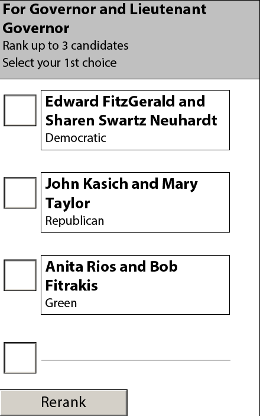

# mCDF Prototype Instructions

## Introduction

The following document provides instructions for using the mCDF prototype PDF. With the prototype, users may make selections on a ballot and view an export of the choices in (CVR) CDF, mCDF, and EML formats.

## Requirements

* Adobe Reader DC or Adobe Acrobat DC.

## Prototype Ballot Overview

The prototype ballot includes examples of contests in which voters are able to vote in ranked-choice, 1-of-m, and n-of-m voting variations. Basic validation is done at the time of input and violations of the vote-for rules for a contest will result in error messages.

When a ballot is complete, it may be validated, causing contests in which the voter has not marked a preference to be highlighted in blue. The ballot may also be exported to CDF, mCDF, and EML formats via a dialog window from which the exported data may be copied.

## Marking Selections On the Ballot

Selection marking is done in two ways dependent on the voting variation used by the contest.

In the case of ranked-choice voting, users may click on the names of the candidates in the order of their preference. Write-in candidates may be recorded in the empty field following the official candidate options. If the user would like to clear their selections to rerank the candidates, they may click the "Rerank" button at the bottom of the contest section.

### Figure 1: Ranked-Choice Contest

In the case of single or multiple choice selection, users may click the radio buttons to the left of the candidate names to indicate their choices. Exceeding the number of selections allowed for a contest will result in an error message.

### Figure 2: Single and Multiple Choice Contests (n-of-m)

## Exporting Ballot Selections

When voting is complete, it may be exported to CVR CDF, mCDF, and EML formats by clicking the "Export CDF" button at the end of the document.

### Figure 3: Exporting Ballot Selections

Clicking the export button will result in a popup window containing options for selecting the export format.

### Figure 4: Selecting Export Format

Making a selection will result in another popup window containing the selection data in the chosen format.

### Figure 5: Selection Data in mCDF Format

## A Note About the mCDF Format and QR Codes

QR Codes generated from mCDF data may contain information about a maximum of ten contests. If the number of contests on a ballot exceeds ten, a separate QR code will be generated containing the remaining selections (NB: This is to show the continuation function of the mCDF and should not be interpreted as a storage limit of the symbology).

QR Code will only appear (on the last page) if the Print button is selected or Ctrl+P is entered, and will be removed from the PDF after printing.

## Other Notes and Limitations

- This prototype uses special features of the Adobe Acrobat / Reader software and will NOT work with other PDF viewers
- The CVR CDF output produces an XML fragment, not a full CVR CDF instance
